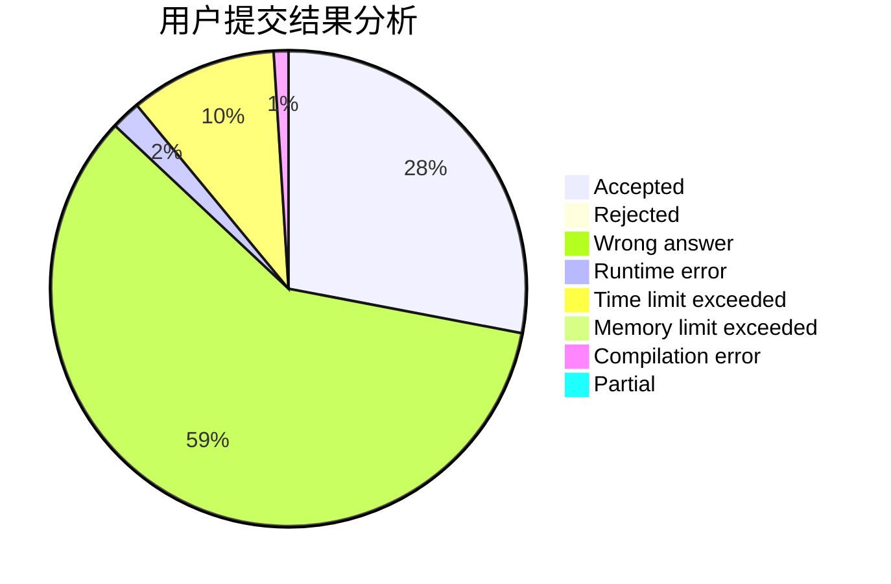
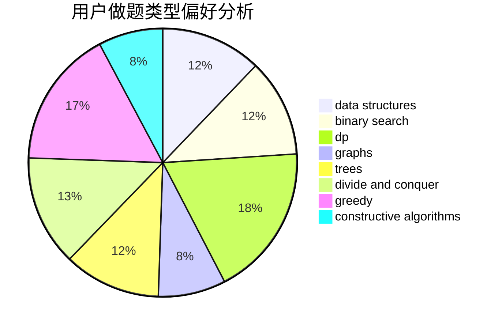
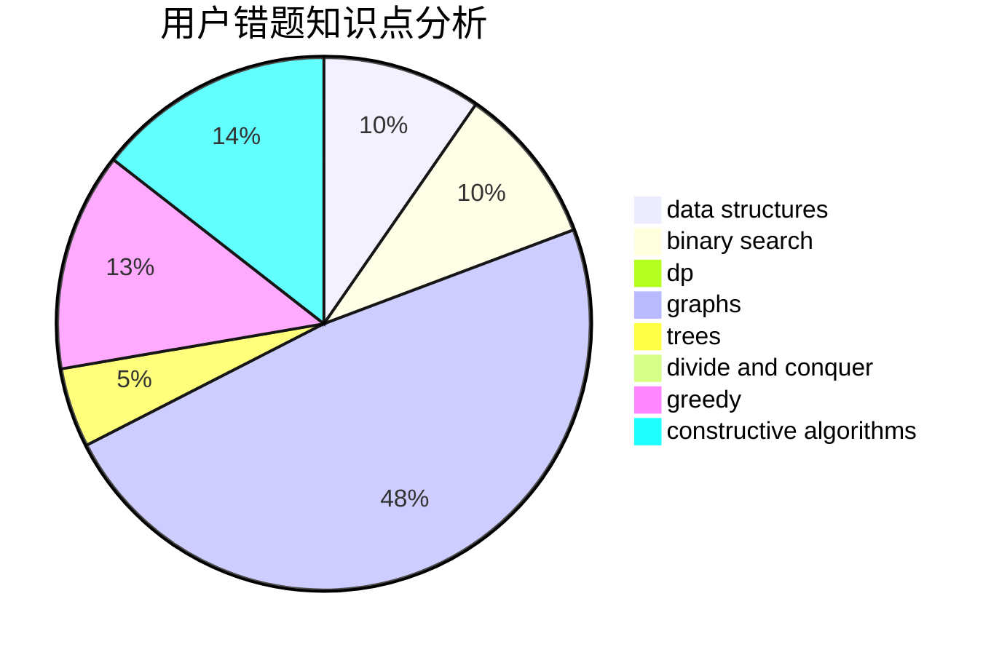

# as_lky

<!-- tabs:start -->

#### **用户提交结果分析**

#### **用户做题类型偏好分析**

#### **用户错题知识点分析**

<!-- tabs:end -->
# 推荐题目
[656A](https://codeforces.com/contest/656/problem/A)		*special problem		  
[205D](https://codeforces.com/contest/205/problem/D)		dsu,graphs,sortings,trees		  
[1356A3](https://codeforces.com/contest/1356A/problem/3)		*special problem		  
[208C](https://codeforces.com/contest/208/problem/C)		dp,
                        graphs,
                        shortest paths		  
[1357A5](https://codeforces.com/contest/1357A/problem/5)		nan		  
[1349F1](https://codeforces.com/contest/1349F/problem/1)		dp,
                        fft,
                        math		  
[698C](https://codeforces.com/contest/698/problem/C)		bitmasks,
                        dp,
                        math,
                        probabilities		  
[1129D](https://codeforces.com/contest/1129/problem/D)		data structures,
                        dp		  
[436B](https://codeforces.com/contest/436/problem/B)		implementation,
                        math		  
[861A](https://codeforces.com/contest/861/problem/A)		dsu,graphs,sortings,trees		  
