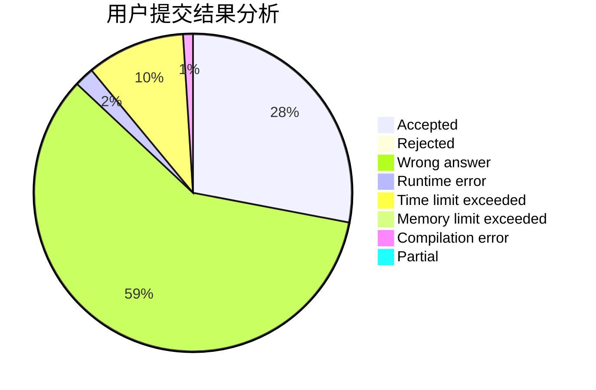
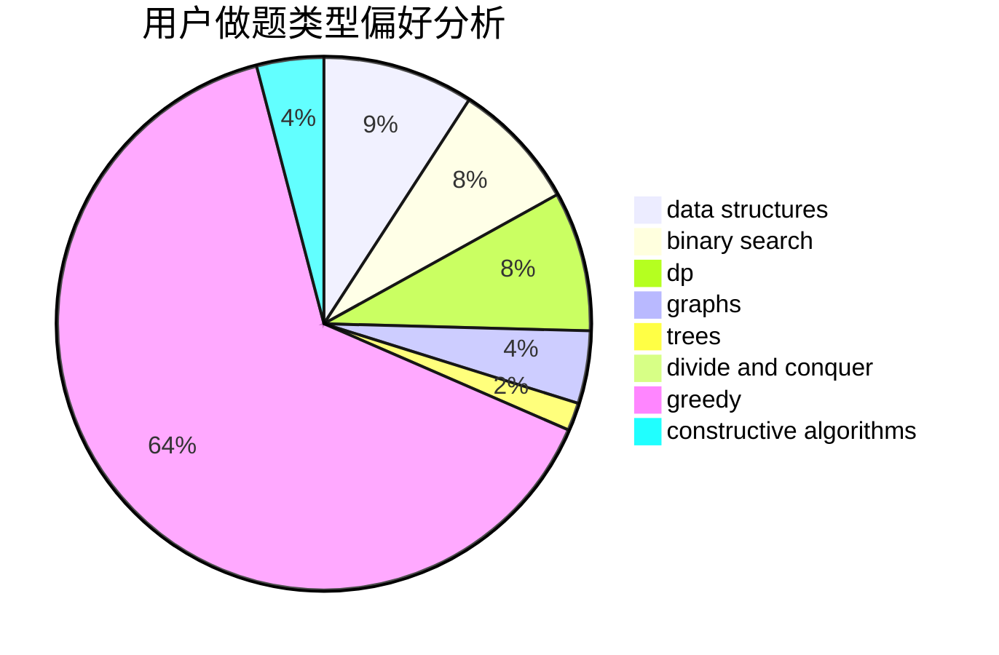
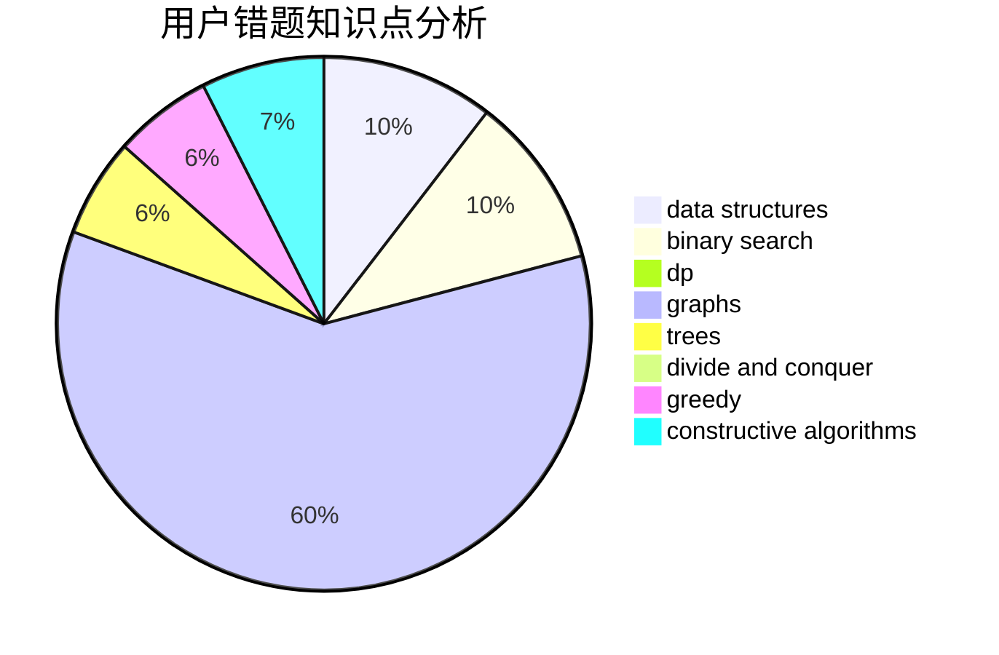

# as_lky

<!-- tabs:start -->

#### **用户提交结果分析**

#### **用户做题类型偏好分析**

#### **用户错题知识点分析**

<!-- tabs:end -->
# 推荐题目
[678C](https://codeforces.com/contest/678/problem/C)		implementation,
                        math,
                        number theory		  
[22A](https://codeforces.com/contest/22/problem/A)		brute force		  
[1363B](https://codeforces.com/contest/1363/problem/B)		implementation,
                        strings		  
[22E](https://codeforces.com/contest/22/problem/E)		dfs and similar,
                        graphs,
                        trees		  
[1364A](https://codeforces.com/contest/1364/problem/A)		brute force,
                        data structures,
                        number theory,
                        two pointers		  
[13571](https://codeforces.com/contest/1357/problem/1)		dsu,graphs,sortings,trees		  
[715A](https://codeforces.com/contest/715/problem/A)		constructive algorithms,
                        math		  
[1131D](https://codeforces.com/contest/1131/problem/D)		dfs and similar,
                        dp,
                        dsu,
                        graphs,
                        greedy		  
[456B](https://codeforces.com/contest/456/problem/B)		math,
                        number theory		  
[879A](https://codeforces.com/contest/879/problem/A)		implementation		  
