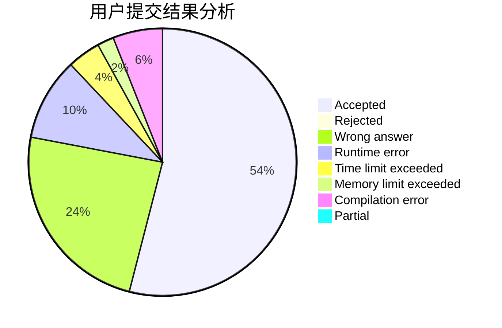
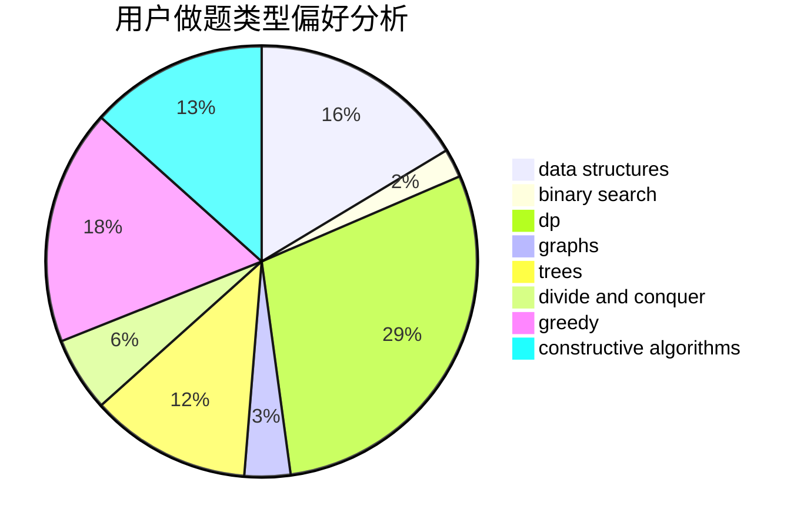
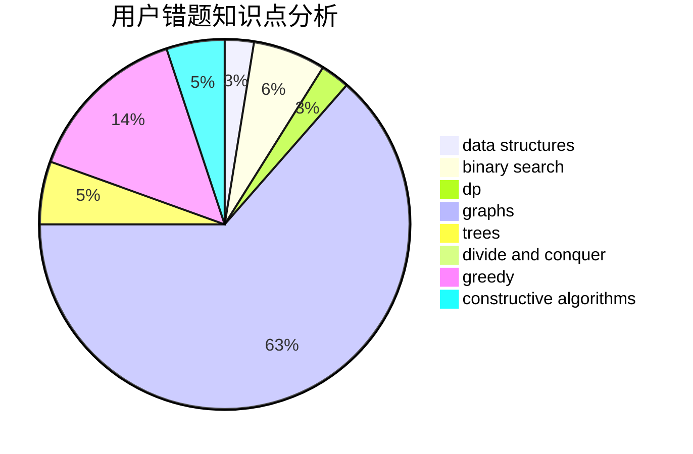

# asd_a

<!-- tabs:start -->

#### **用户提交结果分析**

#### **用户做题类型偏好分析**

#### **用户错题知识点分析**

<!-- tabs:end -->
# 推荐题目
[14791](https://codeforces.com/contest/1479/problem/1)		dsu,graphs,sortings,trees		  
[996F](https://codeforces.com/contest/996/problem/F)		dsu,graphs,sortings,trees		  
[743E](https://codeforces.com/contest/743/problem/E)		binary search,
                        bitmasks,
                        brute force,
                        dp		  
[157C](https://codeforces.com/contest/157/problem/C)		dsu,graphs,sortings,trees		  
[567D](https://codeforces.com/contest/567/problem/D)		binary search,
                        data structures,
                        greedy,
                        sortings		  
[776B](https://codeforces.com/contest/776/problem/B)		constructive algorithms,
                        number theory		  
[152D](https://codeforces.com/contest/152/problem/D)		brute force		  
[911C](https://codeforces.com/contest/911/problem/C)		brute force,
                        constructive algorithms		  
[1466G](https://codeforces.com/contest/1466/problem/G)		combinatorics,
                        divide and conquer,
                        hashing,
                        math,
                        string suffix structures,
                        strings		  
[471A](https://codeforces.com/contest/471/problem/A)		implementation		  
