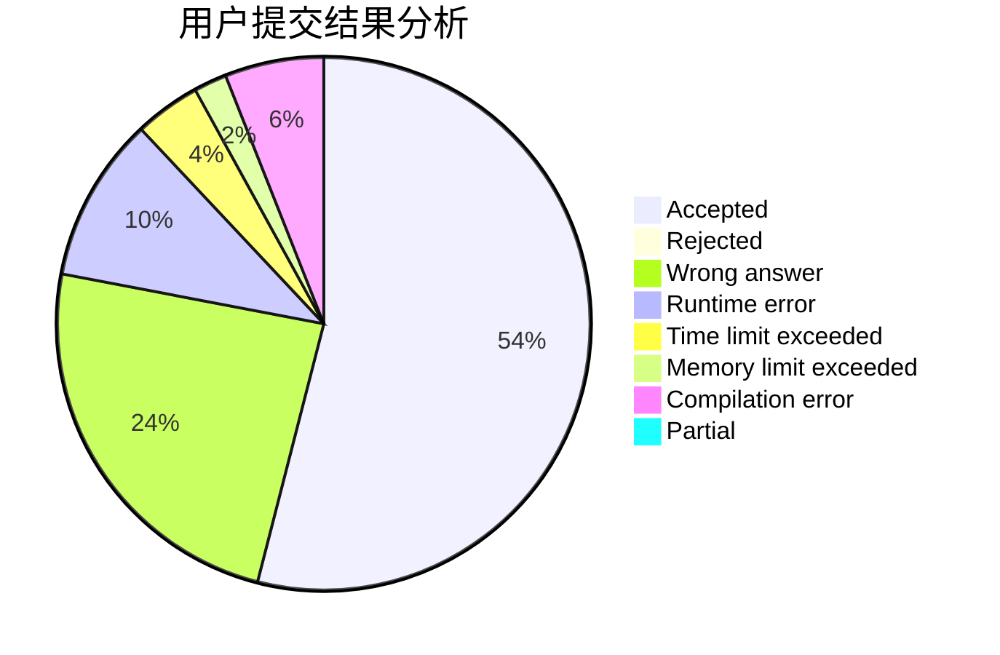
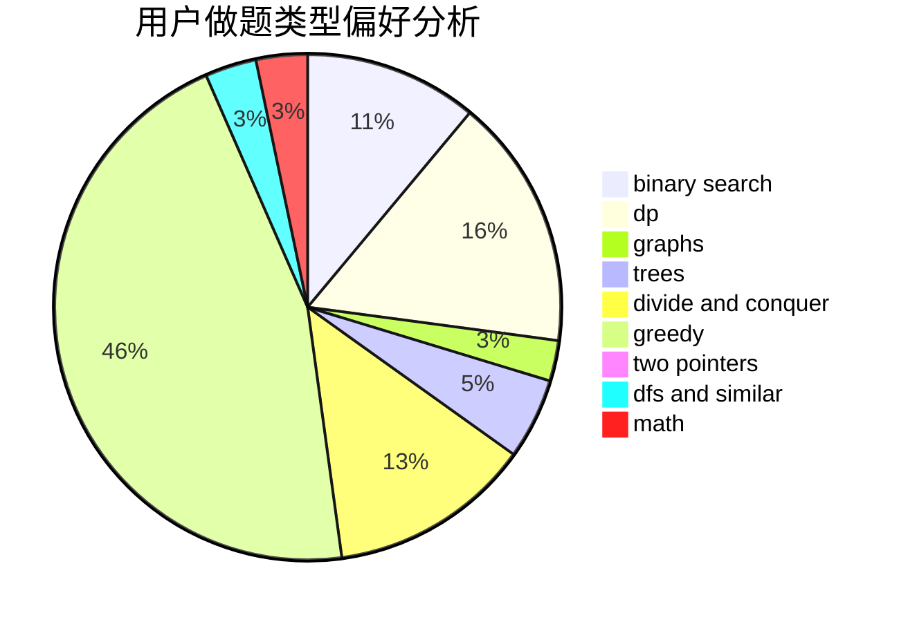

# asd_a

<!-- tabs:start -->

#### **用户提交结果分析**

#### **用户做题类型偏好分析**

<!-- tabs:end -->
# 推荐题目
[14791](https://codeforces.com/contest/1479/problem/1)
[996F](https://codeforces.com/contest/996/problem/F)
[743E](https://codeforces.com/contest/743/problem/E)
[157C](https://codeforces.com/contest/157/problem/C)
[567D](https://codeforces.com/contest/567/problem/D)
[776B](https://codeforces.com/contest/776/problem/B)
[152D](https://codeforces.com/contest/152/problem/D)
[911C](https://codeforces.com/contest/911/problem/C)
[1466G](https://codeforces.com/contest/1466/problem/G)
[471A](https://codeforces.com/contest/471/problem/A)
