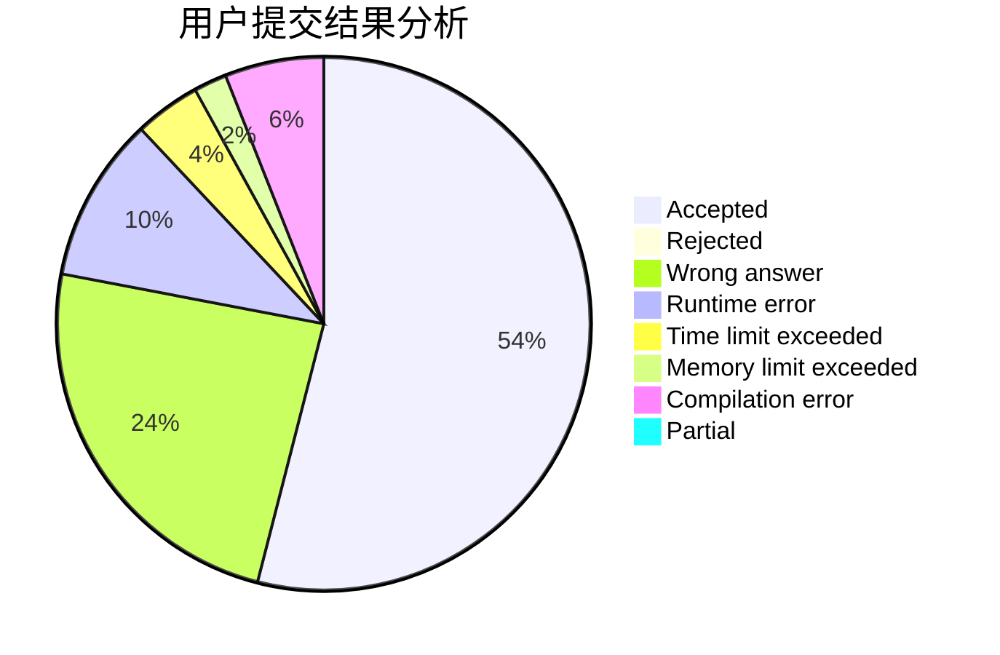
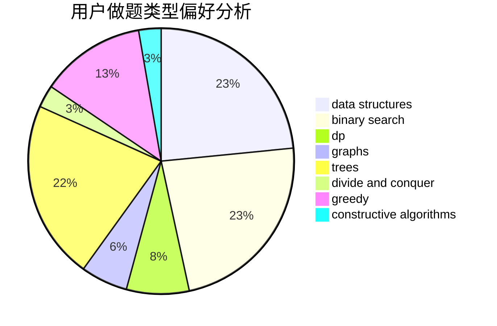
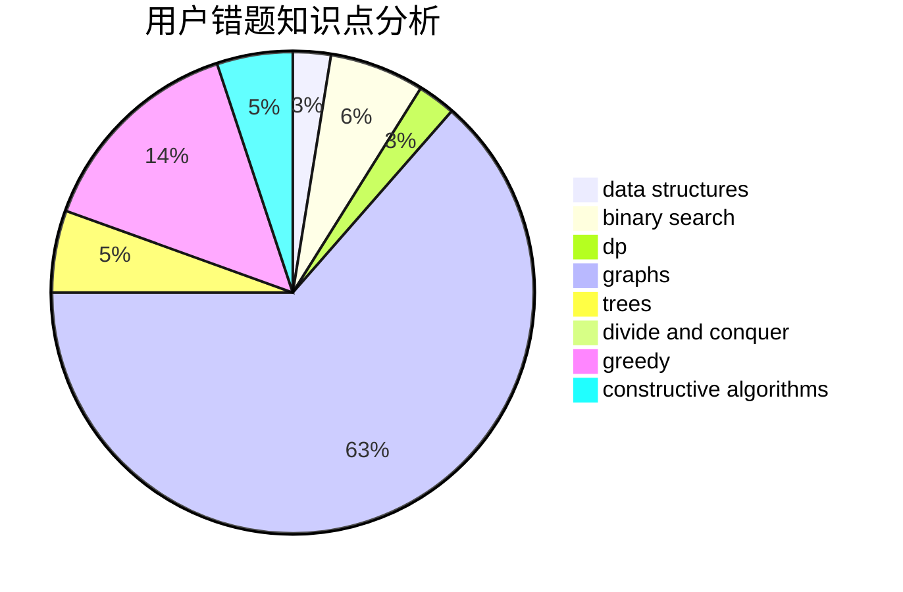

# asd_a

<!-- tabs:start -->

#### **用户提交结果分析**

#### **用户做题类型偏好分析**

#### **用户错题知识点分析**

<!-- tabs:end -->
# 推荐题目
[1470D](https://codeforces.com/contest/1470/problem/D)		constructive algorithms,
                        dfs and similar,
                        graph matchings,
                        graphs,
                        greedy		  
[981E](https://codeforces.com/contest/981/problem/E)		bitmasks,
                        data structures,
                        divide and conquer,
                        dp		  
[725E](https://codeforces.com/contest/725/problem/E)		brute force,
                        greedy		  
[1506B](https://codeforces.com/contest/1506/problem/B)		greedy,
                        implementation		  
[543B](https://codeforces.com/contest/543/problem/B)		constructive algorithms,
                        graphs,
                        shortest paths		  
[756D](https://codeforces.com/contest/756/problem/D)		brute force,
                        combinatorics,
                        dp,
                        string suffix structures		  
[1505C](https://codeforces.com/contest/1505/problem/C)		implementation		  
[893C](https://codeforces.com/contest/893/problem/C)		dfs and similar,
                        graphs,
                        greedy		  
[1457D](https://codeforces.com/contest/1457/problem/D)		dsu,graphs,sortings,trees		  
[44B](https://codeforces.com/contest/44/problem/B)		implementation		  
