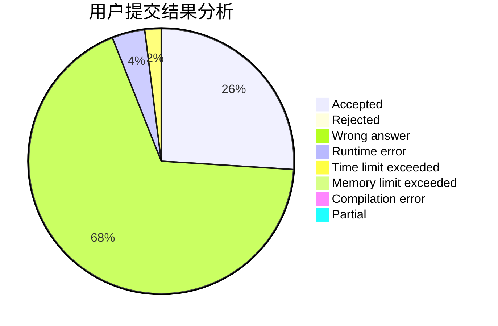
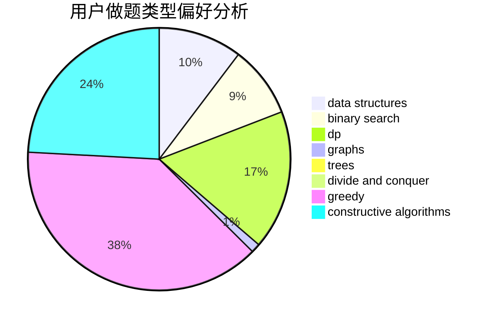
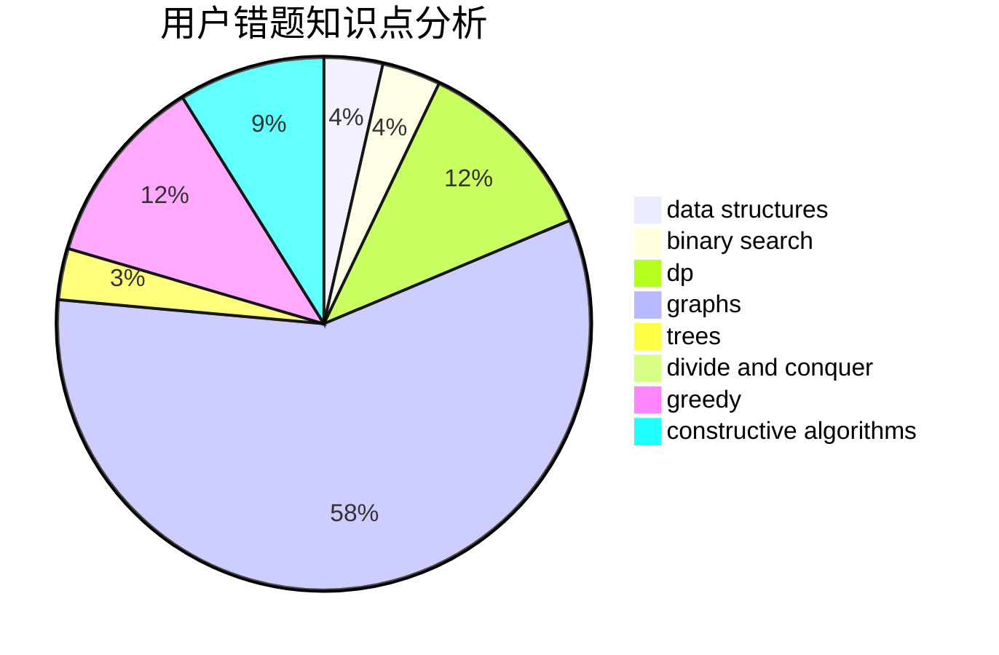

# asjcx
<!-- tabs:start -->
#### **用户提交结果分析**

#### **用户做题类型偏好分析**

#### **用户错题知识点分析**

<!-- tabs:end -->
# 推荐题目
[Polycarp's New Job](http://codeforces.com/problemset/problem/1101/E)		implementation		  
[Underground Lab](https://codeforces.com/contest/781/problem/C)		constructive algorithms,
                        dfs and similar,
                        graphs		  
[The Queue](http://codeforces.com/problemset/problem/767/B)		brute force,
                        greedy		  
[Lucky Year](http://codeforces.com/problemset/problem/808/A)		implementation		  
[Middle of the Contest](http://codeforces.com/problemset/problem/1133/A)		implementation		  
[Turn Off The TV](http://codeforces.com/problemset/problem/863/E)		data structures,
                        sortings		  
[Xenia and Bit Operations](http://codeforces.com/problemset/problem/339/D)		data structures,
                        trees		  
[Stressful Training](http://codeforces.com/problemset/problem/1132/D)		binary search,
                        greedy		  
[Two Bases](http://codeforces.com/problemset/problem/602/A)		brute force,
                        implementation		  
[Sushi for Two](http://codeforces.com/problemset/problem/1138/A)		binary search,
                        greedy,
                        implementation		  
<!-- tabs:start -->
#### **data structures**
[Polycarp's New Job](http://codeforces.com/problemset/problem/863/E)		data structures,
                        sortings		  
[Underground Lab](http://codeforces.com/problemset/problem/339/D)		data structures,
                        trees		  
[The Queue](https://codeforces.com/contest/831/problem/E)		data structures,
                        implementation,
                        sortings		  
[Lucky Year](http://codeforces.com/problemset/problem/720/D)		data structures,
                        dp,
                        sortings		  
[Middle of the Contest](http://codeforces.com/problemset/problem/777/E)		brute force,
                        data structures,
                        dp,
                        greedy,
                        sortings		  
[Turn Off The TV](http://codeforces.com/problemset/problem/1492/C)		binary search,
                        data structures,
                        dp,
                        greedy,
                        two pointers		  
[Xenia and Bit Operations](http://codeforces.com/problemset/problem/1490/G)		binary search,
                        data structures,
                        math		  
[Stressful Training](http://codeforces.com/problemset/problem/1479/D)		binary search,
                        bitmasks,
                        brute force,
                        data structures,
                        probabilities,
                        trees		  
[Two Bases](http://codeforces.com/problemset/problem/1497/A)		brute force,
                        data structures,
                        greedy,
                        sortings		  
[Sushi for Two](http://codeforces.com/problemset/problem/1491/C)		brute force,
                        data structures,
                        dp,
                        greedy,
                        implementation		  
#### **binary search**
[Polycarp's New Job](http://codeforces.com/problemset/problem/1132/D)		binary search,
                        greedy		  
[Underground Lab](http://codeforces.com/problemset/problem/1138/A)		binary search,
                        greedy,
                        implementation		  
[The Queue](http://codeforces.com/problemset/problem/887/E)		binary search,
                        geometry,
                        sortings		  
[Lucky Year](http://codeforces.com/problemset/problem/1156/C)		binary search,
                        greedy,
                        sortings,
                        ternary search,
                        two pointers		  
[Middle of the Contest](http://codeforces.com/problemset/problem/1494/C)		binary search,
                        dp,
                        greedy,
                        implementation,
                        two pointers		  
[Turn Off The TV](http://codeforces.com/problemset/problem/1492/C)		binary search,
                        data structures,
                        dp,
                        greedy,
                        two pointers		  
[Xenia and Bit Operations](http://codeforces.com/problemset/problem/1463/D)		binary search,
                        constructive algorithms,
                        greedy,
                        two pointers		  
[Stressful Training](http://codeforces.com/problemset/problem/1490/G)		binary search,
                        data structures,
                        math		  
[Two Bases](http://codeforces.com/problemset/problem/1479/D)		binary search,
                        bitmasks,
                        brute force,
                        data structures,
                        probabilities,
                        trees		  
[Sushi for Two](http://codeforces.com/problemset/problem/1436/E)		binary search,
                        data structures,
                        two pointers		  
#### **dp**
[Polycarp's New Job](http://codeforces.com/problemset/problem/1252/J)		brute force,
                        dp		  
[Underground Lab](http://codeforces.com/problemset/problem/959/E)		bitmasks,
                        dp,
                        graphs,
                        implementation,
                        math		  
[The Queue](http://codeforces.com/problemset/problem/618/G)		dp,
                        math,
                        matrices,
                        probabilities		  
[Lucky Year](http://codeforces.com/problemset/problem/720/D)		data structures,
                        dp,
                        sortings		  
[Middle of the Contest](http://codeforces.com/problemset/problem/1185/G1)		bitmasks,
                        combinatorics,
                        dp		  
[Turn Off The TV](http://codeforces.com/problemset/problem/261/C)		constructive algorithms,
                        dp,
                        math		  
[Xenia and Bit Operations](http://codeforces.com/problemset/problem/1146/F)		dp,
                        trees		  
[Stressful Training](http://codeforces.com/problemset/problem/1280/D)		dp,
                        greedy,
                        trees		  
[Two Bases](http://codeforces.com/problemset/problem/777/E)		brute force,
                        data structures,
                        dp,
                        greedy,
                        sortings		  
[Sushi for Two](http://codeforces.com/problemset/problem/1494/C)		binary search,
                        dp,
                        greedy,
                        implementation,
                        two pointers		  
#### **graph**
[Polycarp's New Job](https://codeforces.com/contest/781/problem/C)		constructive algorithms,
                        dfs and similar,
                        graphs		  
[Underground Lab](http://codeforces.com/problemset/problem/959/E)		bitmasks,
                        dp,
                        graphs,
                        implementation,
                        math		  
[The Queue](http://codeforces.com/problemset/problem/1510/B)		flows,
                        graph matchings,
                        graphs		  
[Lucky Year](http://codeforces.com/problemset/problem/1487/C)		brute force,
                        constructive algorithms,
                        dfs and similar,
                        graphs,
                        greedy,
                        implementation,
                        math		  
[Middle of the Contest](http://codeforces.com/problemset/problem/1437/C)		dp,
                        flows,
                        graph matchings,
                        greedy,
                        math,
                        sortings		  
[Turn Off The TV](http://codeforces.com/problemset/problem/1470/D)		constructive algorithms,
                        dfs and similar,
                        graph matchings,
                        graphs,
                        greedy		  
[Xenia and Bit Operations](http://codeforces.com/problemset/problem/1476/C)		dp,
                        graphs,
                        greedy		  
[Stressful Training](http://codeforces.com/problemset/problem/1304/D)		constructive algorithms,
                        graphs,
                        greedy,
                        two pointers		  
[Two Bases](http://codeforces.com/problemset/problem/1475/C)		combinatorics,
                        graphs,
                        math		  
[Sushi for Two](http://codeforces.com/problemset/problem/553/E)		dp,
                        fft,
                        graphs,
                        math,
                        probabilities		  
#### **trees**
[Polycarp's New Job](http://codeforces.com/problemset/problem/339/D)		data structures,
                        trees		  
[Underground Lab](http://codeforces.com/problemset/problem/1146/F)		dp,
                        trees		  
[The Queue](http://codeforces.com/problemset/problem/1280/D)		dp,
                        greedy,
                        trees		  
[Lucky Year](http://codeforces.com/problemset/problem/1479/D)		binary search,
                        bitmasks,
                        brute force,
                        data structures,
                        probabilities,
                        trees		  
[Middle of the Contest](http://codeforces.com/problemset/problem/1511/C)		brute force,
                        data structures,
                        implementation,
                        trees		  
[Turn Off The TV](http://codeforces.com/problemset/problem/1499/F)		combinatorics,
                        dfs and similar,
                        dp,
                        trees		  
[Xenia and Bit Operations](http://codeforces.com/problemset/problem/1491/E)		brute force,
                        dfs and similar,
                        divide and conquer,
                        number theory,
                        trees		  
[Stressful Training](http://codeforces.com/problemset/problem/1466/D)		data structures,
                        greedy,
                        sortings,
                        trees		  
[Two Bases](http://codeforces.com/problemset/problem/1495/D)		combinatorics,
                        dfs and similar,
                        graphs,
                        math,
                        shortest paths,
                        trees		  
[Sushi for Two](http://codeforces.com/problemset/problem/1303/G)		data structures,
                        divide and conquer,
                        geometry,
                        trees		  
#### **divide and conquer**
[Polycarp's New Job](http://codeforces.com/problemset/problem/1461/D)		binary search,
                        brute force,
                        data structures,
                        divide and conquer,
                        implementation,
                        sortings		  
[Underground Lab](http://codeforces.com/problemset/problem/1466/G)		combinatorics,
                        divide and conquer,
                        hashing,
                        math,
                        string suffix structures,
                        strings		  
[The Queue](http://codeforces.com/problemset/problem/1490/D)		dfs and similar,
                        divide and conquer,
                        implementation		  
[Lucky Year](https://codeforces.com/contest/1483/problem/C)		data structures,
                        divide and conquer,
                        dp		  
[Middle of the Contest](http://codeforces.com/problemset/problem/1491/E)		brute force,
                        dfs and similar,
                        divide and conquer,
                        number theory,
                        trees		  
[Turn Off The TV](http://codeforces.com/problemset/problem/1303/G)		data structures,
                        divide and conquer,
                        geometry,
                        trees		  
[Xenia and Bit Operations](http://codeforces.com/problemset/problem/1494/D)		constructive algorithms,
                        data structures,
                        dfs and similar,
                        divide and conquer,
                        dsu,
                        greedy,
                        sortings,
                        trees		  
[Stressful Training](http://codeforces.com/problemset/problem/1482/E)		data structures,
                        divide and conquer,
                        dp		  
[Two Bases](http://codeforces.com/problemset/problem/566/C)		dfs and similar,
                        divide and conquer,
                        trees		  
[Sushi for Two](http://codeforces.com/problemset/problem/1428/F)		binary search,
                        data structures,
                        divide and conquer,
                        dp,
                        two pointers		  
#### **greedy**
[Polycarp's New Job](http://codeforces.com/problemset/problem/767/B)		brute force,
                        greedy		  
[Underground Lab](http://codeforces.com/problemset/problem/1132/D)		binary search,
                        greedy		  
[The Queue](http://codeforces.com/problemset/problem/1138/A)		binary search,
                        greedy,
                        implementation		  
[Lucky Year](https://codeforces.com/contest/1086/problem/C)		greedy,
                        implementation,
                        strings		  
[Middle of the Contest](http://codeforces.com/problemset/problem/1156/C)		binary search,
                        greedy,
                        sortings,
                        ternary search,
                        two pointers		  
[Turn Off The TV](http://codeforces.com/problemset/problem/58/B)		greedy		  
[Xenia and Bit Operations](http://codeforces.com/problemset/problem/1280/D)		dp,
                        greedy,
                        trees		  
[Stressful Training](http://codeforces.com/problemset/problem/777/E)		brute force,
                        data structures,
                        dp,
                        greedy,
                        sortings		  
[Two Bases](http://codeforces.com/problemset/problem/1494/C)		binary search,
                        dp,
                        greedy,
                        implementation,
                        two pointers		  
[Sushi for Two](http://codeforces.com/problemset/problem/1450/F)		constructive algorithms,
                        greedy		  
#### **constructive algorithms**
[Polycarp's New Job](https://codeforces.com/contest/781/problem/C)		constructive algorithms,
                        dfs and similar,
                        graphs		  
[Underground Lab](http://codeforces.com/problemset/problem/261/C)		constructive algorithms,
                        dp,
                        math		  
[The Queue](http://codeforces.com/problemset/problem/609/B)		constructive algorithms,
                        implementation		  
[Lucky Year](http://codeforces.com/problemset/problem/1438/A)		constructive algorithms,
                        implementation		  
[Middle of the Contest](http://codeforces.com/problemset/problem/1450/F)		constructive algorithms,
                        greedy		  
[Turn Off The TV](http://codeforces.com/problemset/problem/1493/A)		constructive algorithms,
                        greedy		  
[Xenia and Bit Operations](http://codeforces.com/problemset/problem/1463/D)		binary search,
                        constructive algorithms,
                        greedy,
                        two pointers		  
[Stressful Training](https://codeforces.com/contest/1456/problem/B)		bitmasks,
                        brute force,
                        constructive algorithms		  
[Two Bases](http://codeforces.com/problemset/problem/1492/D)		bitmasks,
                        constructive algorithms,
                        greedy,
                        math		  
[Sushi for Two](https://codeforces.com/contest/1504/problem/D)		constructive algorithms,
                        games,
                        interactive		  
#### **sortings**
[Polycarp's New Job](http://codeforces.com/problemset/problem/863/E)		data structures,
                        sortings		  
[Underground Lab](https://codeforces.com/contest/831/problem/E)		data structures,
                        implementation,
                        sortings		  
[The Queue](http://codeforces.com/problemset/problem/887/E)		binary search,
                        geometry,
                        sortings		  
[Lucky Year](http://codeforces.com/problemset/problem/720/D)		data structures,
                        dp,
                        sortings		  
[Middle of the Contest](http://codeforces.com/problemset/problem/1156/C)		binary search,
                        greedy,
                        sortings,
                        ternary search,
                        two pointers		  
[Turn Off The TV](http://codeforces.com/problemset/problem/777/E)		brute force,
                        data structures,
                        dp,
                        greedy,
                        sortings		  
[Xenia and Bit Operations](https://codeforces.com/contest/1496/problem/C)		geometry,
                        greedy,
                        math,
                        sortings		  
[Stressful Training](http://codeforces.com/problemset/problem/1495/A)		geometry,
                        greedy,
                        math,
                        sortings		  
[Two Bases](http://codeforces.com/problemset/problem/1497/A)		brute force,
                        data structures,
                        greedy,
                        sortings		  
[Sushi for Two](http://codeforces.com/problemset/problem/1427/A)		math,
                        sortings		  
<!-- tabs:end -->
