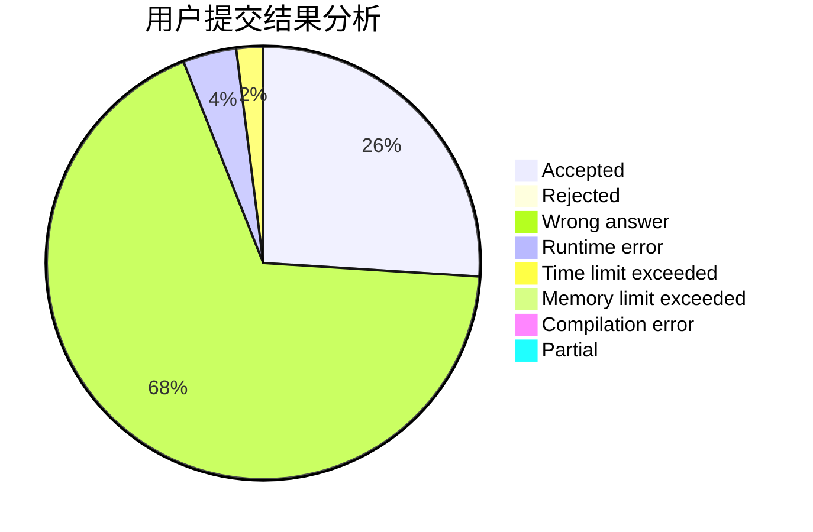
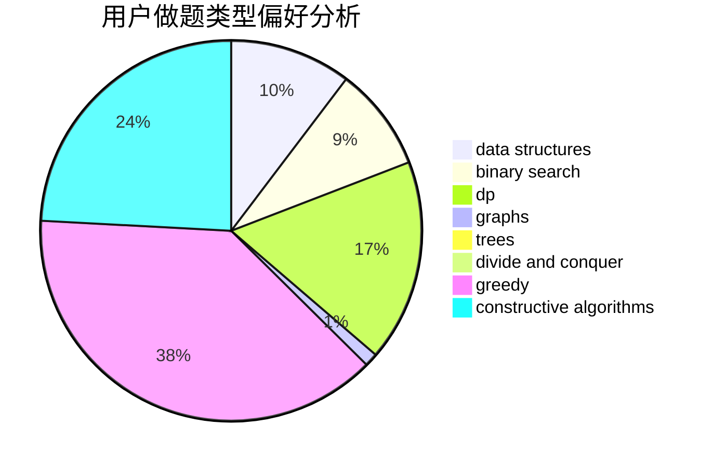
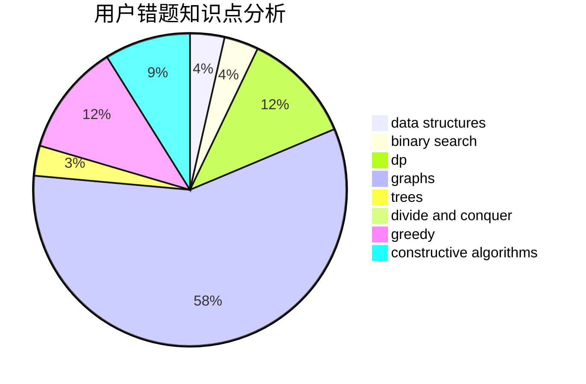

# asjcx

<!-- tabs:start -->

#### **用户提交结果分析**

#### **用户做题类型偏好分析**

#### **用户错题知识点分析**

<!-- tabs:end -->
# 推荐题目
[767B](https://codeforces.com/contest/767/problem/B)		brute force,
                        greedy		  
[1133A](https://codeforces.com/contest/1133/problem/A)		implementation		  
[781C](https://codeforces.com/contest/781/problem/C)		dsu,graphs,sortings,trees		  
[1101E](https://codeforces.com/contest/1101/problem/E)		implementation		  
[808A](https://codeforces.com/contest/808/problem/A)		implementation		  
[1138A](https://codeforces.com/contest/1138/problem/A)		binary search,
                        greedy,
                        implementation		  
[602A](https://codeforces.com/contest/602/problem/A)		brute force,
                        implementation		  
[1347B](https://codeforces.com/contest/1347/problem/B)		dsu,graphs,sortings,trees		  
[1132D](https://codeforces.com/contest/1132/problem/D)		binary search,
                        greedy		  
[261C](https://codeforces.com/contest/261/problem/C)		constructive algorithms,
                        dp,
                        math		  
