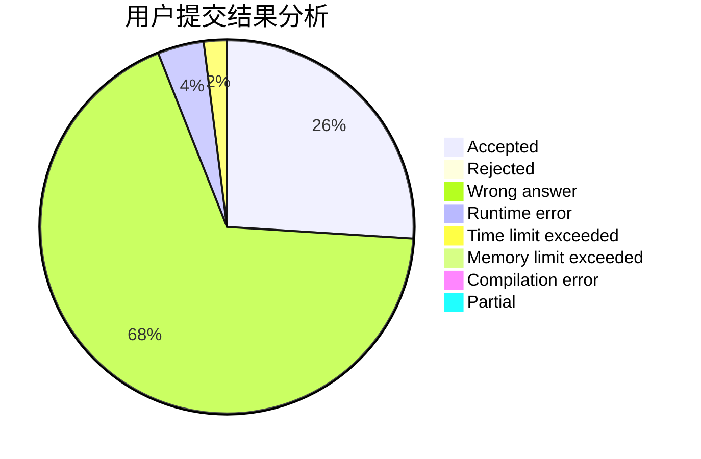
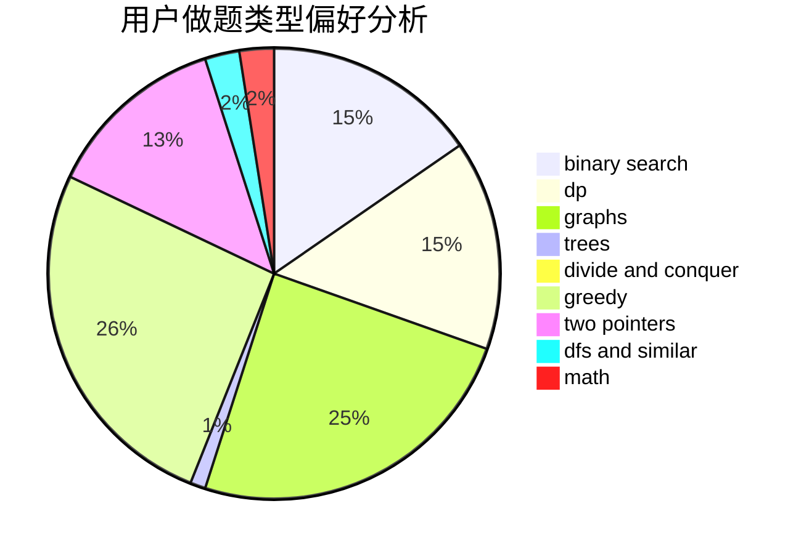

# asjcx

<!-- tabs:start -->

#### **用户提交结果分析**

#### **用户做题类型偏好分析**

<!-- tabs:end -->
# 推荐题目
[786D](https://codeforces.com/contest/786/problem/D)
[1137B](https://codeforces.com/contest/1137/problem/B)
[7A](https://codeforces.com/contest/7/problem/A)
[1102A](https://codeforces.com/contest/1102/problem/A)
[822F](https://codeforces.com/contest/822/problem/F)
[113C](https://codeforces.com/contest/113/problem/C)
[621B](https://codeforces.com/contest/621/problem/B)
[1354A](https://codeforces.com/contest/1354/problem/A)
[1136C](https://codeforces.com/contest/1136/problem/C)
[27A](https://codeforces.com/contest/27/problem/A)
