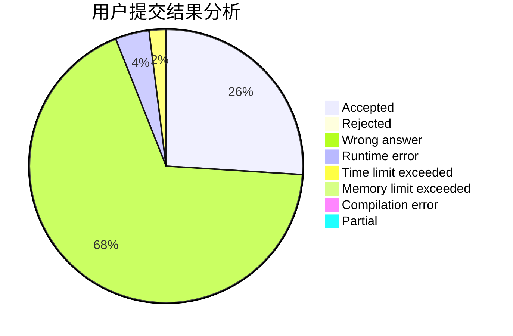
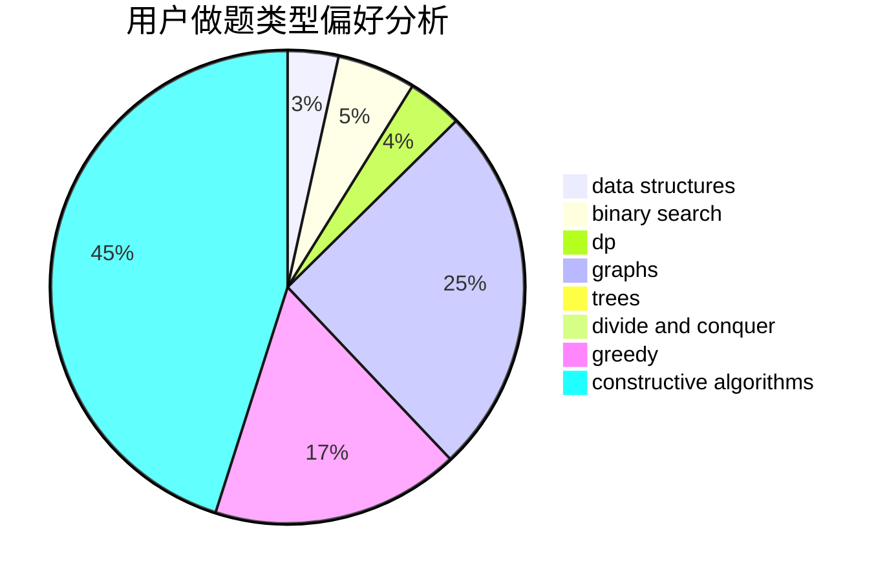
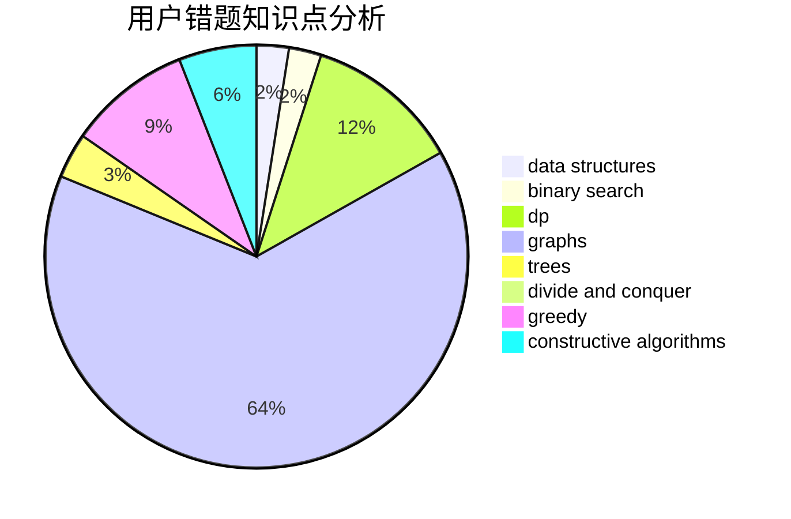

# asjcx

<!-- tabs:start -->

#### **用户提交结果分析**

#### **用户做题类型偏好分析**

#### **用户错题知识点分析**

<!-- tabs:end -->
# 推荐题目
[786D](https://codeforces.com/contest/786/problem/D)		data structures,
                        dfs and similar,
                        hashing,
                        strings,
                        trees		  
[1137B](https://codeforces.com/contest/1137/problem/B)		greedy,
                        hashing,
                        strings		  
[7A](https://codeforces.com/contest/7/problem/A)		brute force,
                        constructive algorithms		  
[1102A](https://codeforces.com/contest/1102/problem/A)		math		  
[822F](https://codeforces.com/contest/822/problem/F)		constructive algorithms,
                        dfs and similar,
                        trees		  
[113C](https://codeforces.com/contest/113/problem/C)		brute force,
                        math,
                        number theory		  
[621B](https://codeforces.com/contest/621/problem/B)		combinatorics,
                        implementation		  
[1354A](https://codeforces.com/contest/1354/problem/A)		math		  
[1136C](https://codeforces.com/contest/1136/problem/C)		constructive algorithms,
                        sortings		  
[27A](https://codeforces.com/contest/27/problem/A)		implementation,
                        sortings		  
