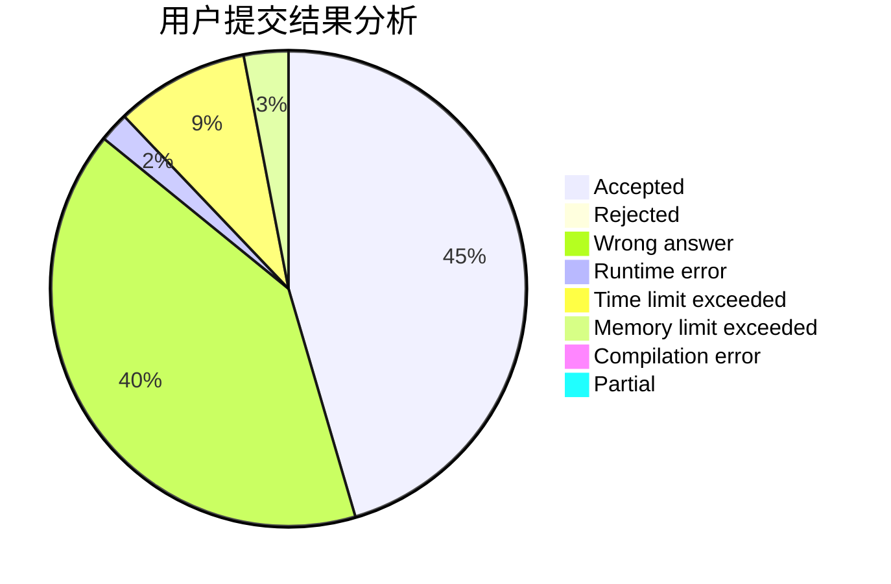
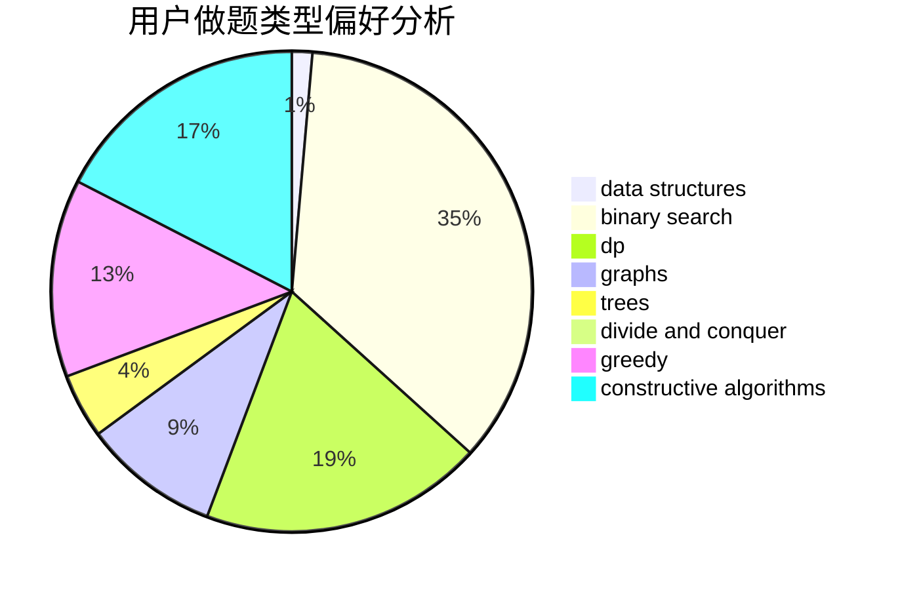
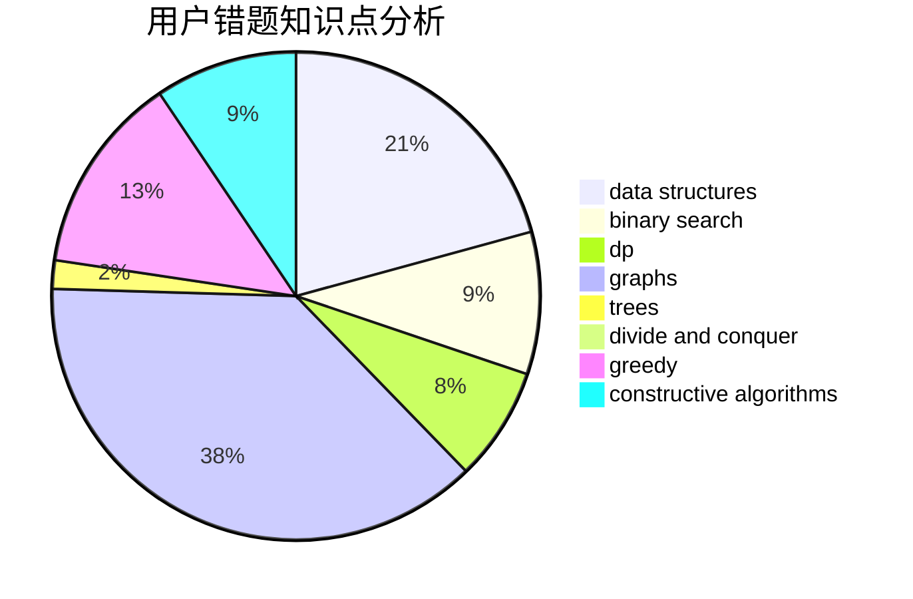

# asklvd

<!-- tabs:start -->

#### **用户提交结果分析**

#### **用户做题类型偏好分析**

#### **用户错题知识点分析**

<!-- tabs:end -->
# 推荐题目
[1097B](https://codeforces.com/contest/1097/problem/B)		bitmasks,
                        brute force,
                        dp		  
[329B](https://codeforces.com/contest/329/problem/B)		dfs and similar,
                        shortest paths		  
[349B](https://codeforces.com/contest/349/problem/B)		data structures,
                        dp,
                        greedy,
                        implementation		  
[766D](https://codeforces.com/contest/766/problem/D)		data structures,
                        dfs and similar,
                        dp,
                        dsu,
                        graphs		  
[1162E](https://codeforces.com/contest/1162/problem/E)		dsu,graphs,sortings,trees		  
[1091H](https://codeforces.com/contest/1091/problem/H)		games		  
[443D](https://codeforces.com/contest/443/problem/D)		dsu,graphs,sortings,trees		  
[268B](https://codeforces.com/contest/268/problem/B)		implementation,
                        math		  
[85D](https://codeforces.com/contest/85/problem/D)		binary search,
                        brute force,
                        data structures,
                        implementation		  
[601A](https://codeforces.com/contest/601/problem/A)		graphs,
                        shortest paths		  
