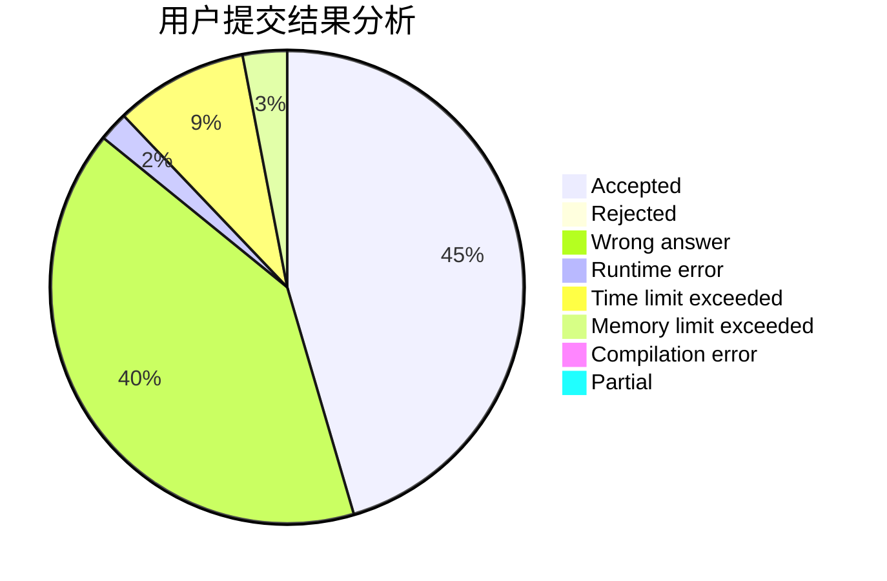
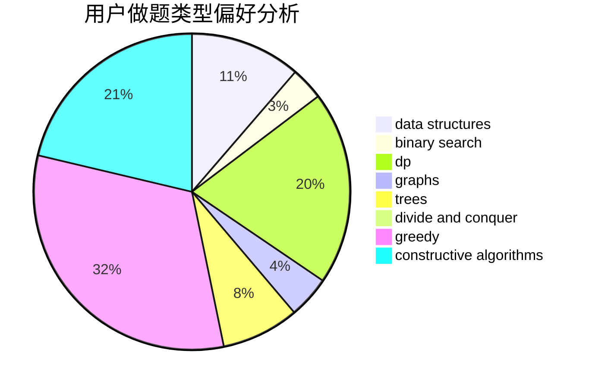
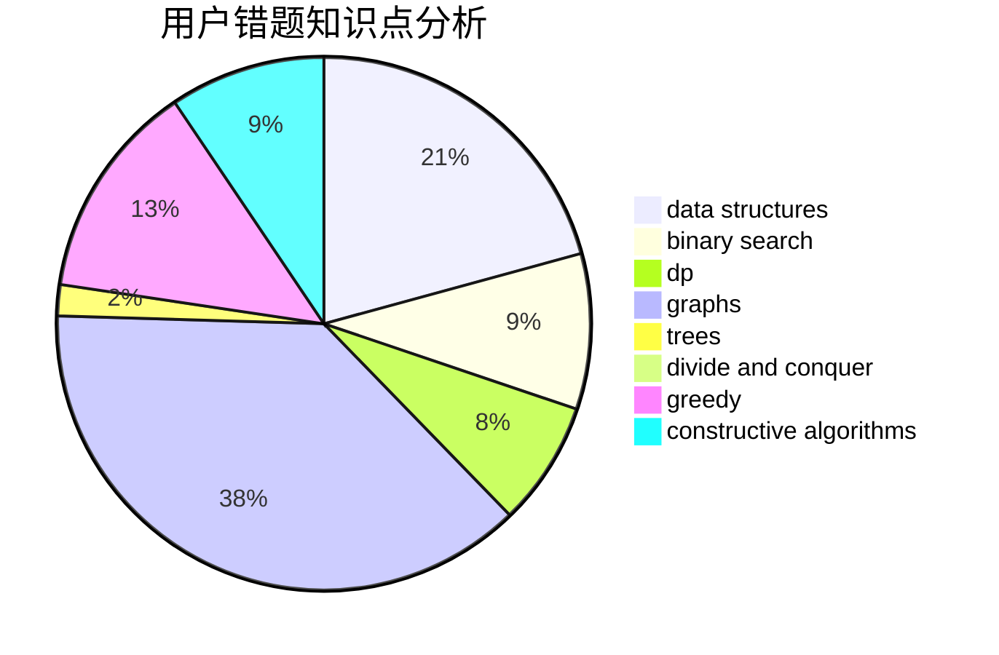

# asklvd

<!-- tabs:start -->

#### **用户提交结果分析**

#### **用户做题类型偏好分析**

#### **用户错题知识点分析**

<!-- tabs:end -->
# 推荐题目
[1096F](https://codeforces.com/contest/1096/problem/F)		dp,
                        math,
                        probabilities		  
[306D](https://codeforces.com/contest/306/problem/D)		constructive algorithms,
                        geometry		  
[319A](https://codeforces.com/contest/319/problem/A)		combinatorics,
                        math		  
[747A](https://codeforces.com/contest/747/problem/A)		brute force,
                        math		  
[115A](https://codeforces.com/contest/115/problem/A)		dfs and similar,
                        graphs,
                        trees		  
[1091E](https://codeforces.com/contest/1091/problem/E)		binary search,
                        data structures,
                        graphs,
                        greedy,
                        implementation,
                        math,
                        sortings		  
[418C](https://codeforces.com/contest/418/problem/C)		dsu,graphs,sortings,trees		  
[248E](https://codeforces.com/contest/248/problem/E)		dp,
                        math,
                        probabilities		  
[840D](https://codeforces.com/contest/840/problem/D)		data structures,
                        probabilities		  
[580E](https://codeforces.com/contest/580/problem/E)		data structures,
                        hashing,
                        strings		  
