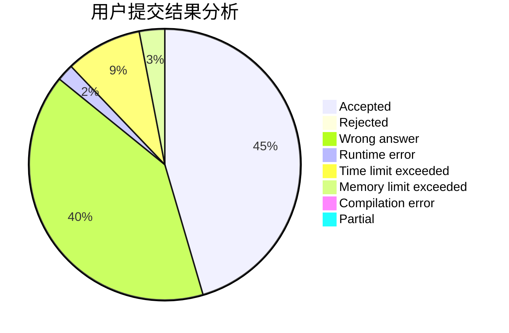
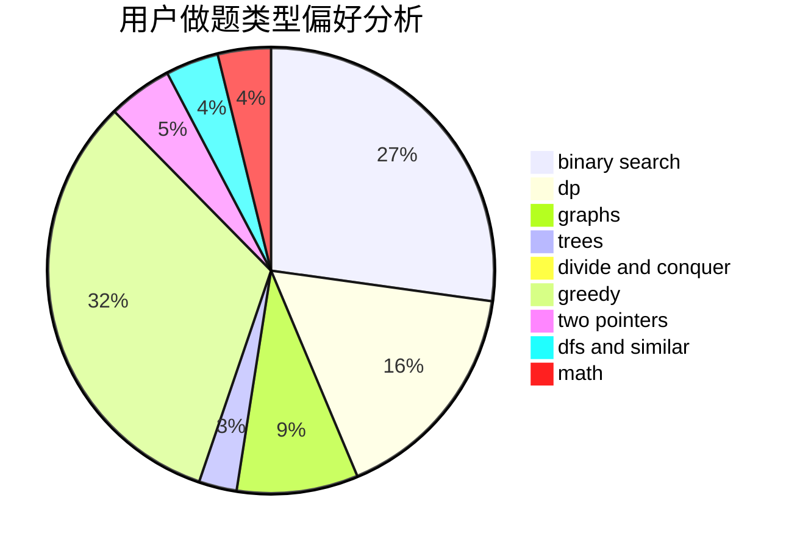

# asklvd

<!-- tabs:start -->

#### **用户提交结果分析**

#### **用户做题类型偏好分析**

<!-- tabs:end -->
# 推荐题目
[1097B](https://codeforces.com/contest/1097/problem/B)
[329B](https://codeforces.com/contest/329/problem/B)
[349B](https://codeforces.com/contest/349/problem/B)
[766D](https://codeforces.com/contest/766/problem/D)
[1162E](https://codeforces.com/contest/1162/problem/E)
[1091H](https://codeforces.com/contest/1091/problem/H)
[443D](https://codeforces.com/contest/443/problem/D)
[268B](https://codeforces.com/contest/268/problem/B)
[85D](https://codeforces.com/contest/85/problem/D)
[601A](https://codeforces.com/contest/601/problem/A)
