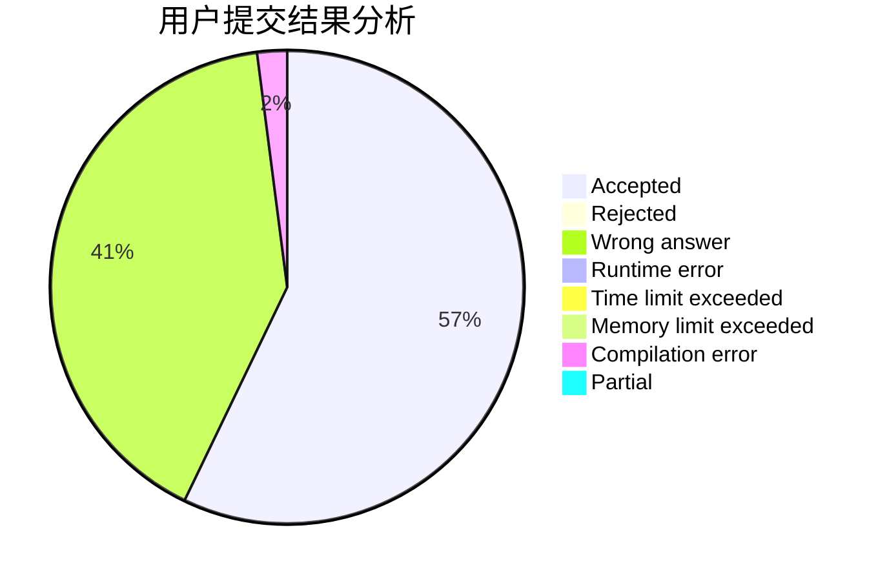
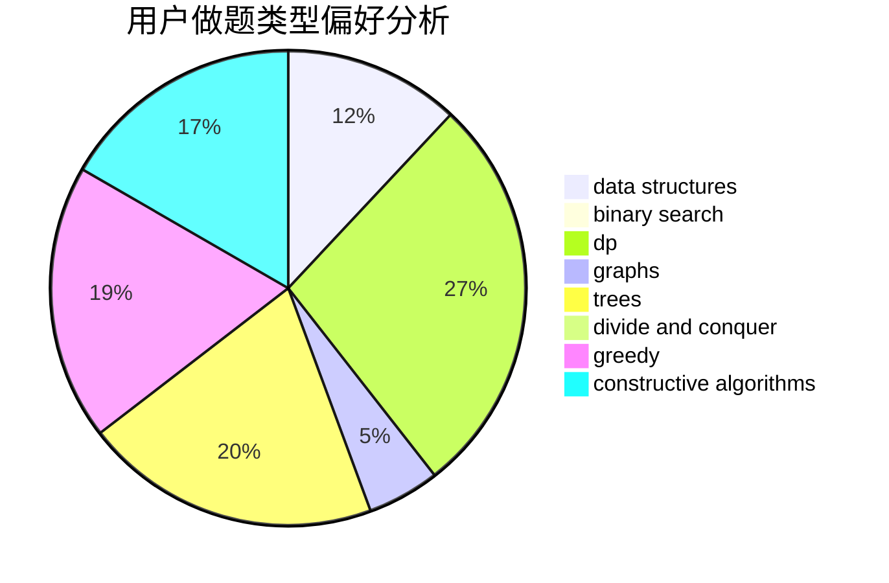
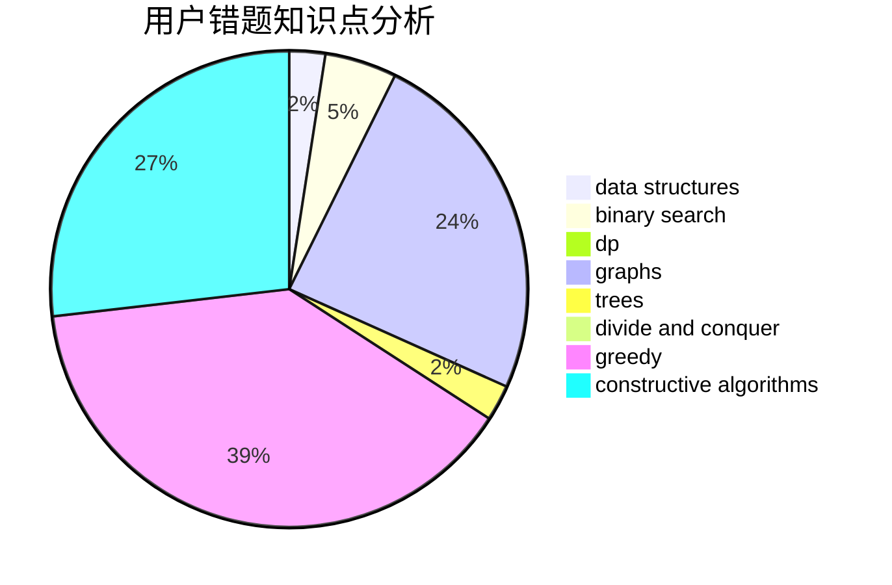

# aspirine

<!-- tabs:start -->

#### **用户提交结果分析**

#### **用户做题类型偏好分析**

#### **用户错题知识点分析**

<!-- tabs:end -->
# 推荐题目
[521A](https://codeforces.com/contest/521/problem/A)		dsu,graphs,sortings,trees		  
[166A](https://codeforces.com/contest/166/problem/A)		binary search,
                        implementation,
                        sortings		  
[1488E](https://codeforces.com/contest/1488/problem/E)		*special problem,
                        data structures,
                        dp		  
[913B](https://codeforces.com/contest/913/problem/B)		implementation,
                        trees		  
[893B](https://codeforces.com/contest/893/problem/B)		brute force,
                        implementation		  
[938A](https://codeforces.com/contest/938/problem/A)		implementation		  
[1234E](https://codeforces.com/contest/1234/problem/E)		math		  
[219C](https://codeforces.com/contest/219/problem/C)		brute force,
                        dp,
                        greedy		  
[960G](https://codeforces.com/contest/960/problem/G)		combinatorics,
                        dp,
                        fft,
                        math		  
[566A](https://codeforces.com/contest/566/problem/A)		dfs and similar,
                        strings,
                        trees		  
