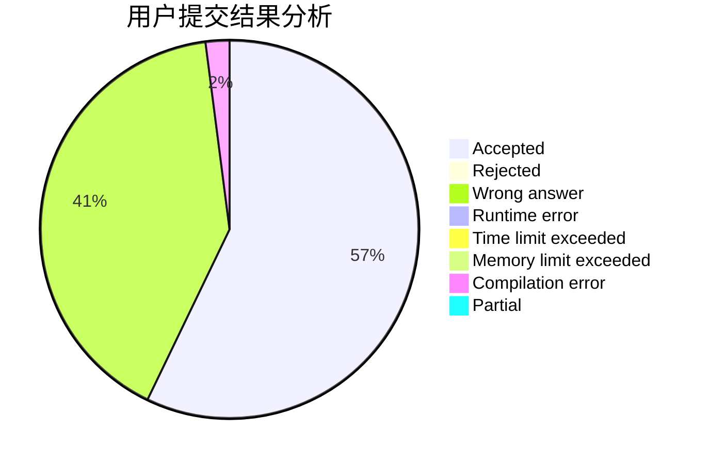
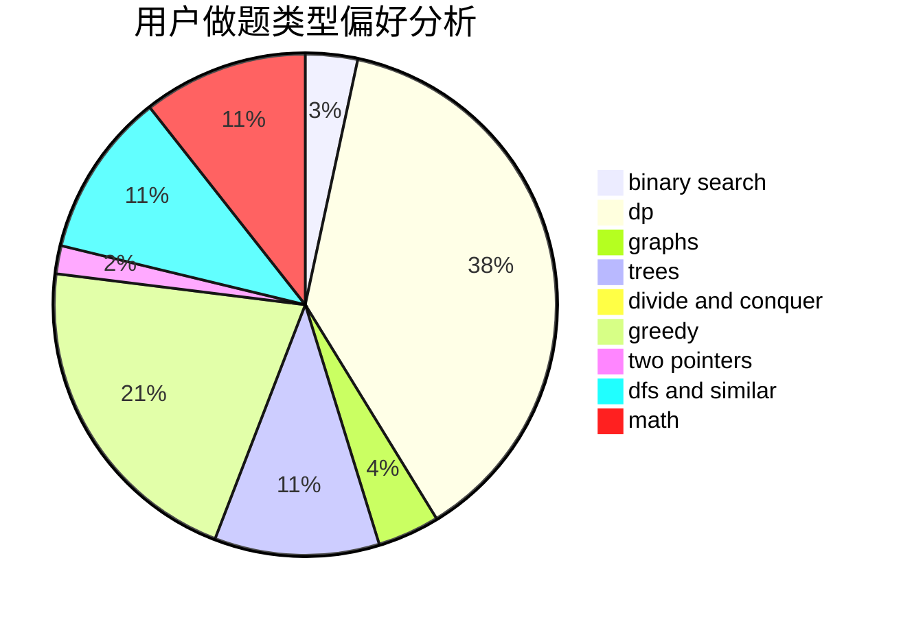

# aspirine

<!-- tabs:start -->

#### **用户提交结果分析**

#### **用户做题类型偏好分析**

<!-- tabs:end -->
# 推荐题目
[521A](https://codeforces.com/contest/521/problem/A)
[166A](https://codeforces.com/contest/166/problem/A)
[1488E](https://codeforces.com/contest/1488/problem/E)
[913B](https://codeforces.com/contest/913/problem/B)
[893B](https://codeforces.com/contest/893/problem/B)
[938A](https://codeforces.com/contest/938/problem/A)
[1234E](https://codeforces.com/contest/1234/problem/E)
[219C](https://codeforces.com/contest/219/problem/C)
[960G](https://codeforces.com/contest/960/problem/G)
[566A](https://codeforces.com/contest/566/problem/A)
