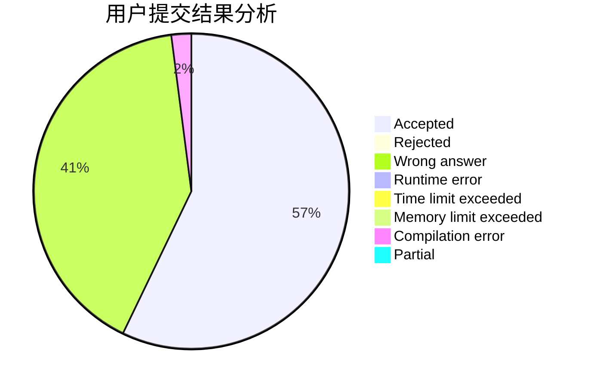
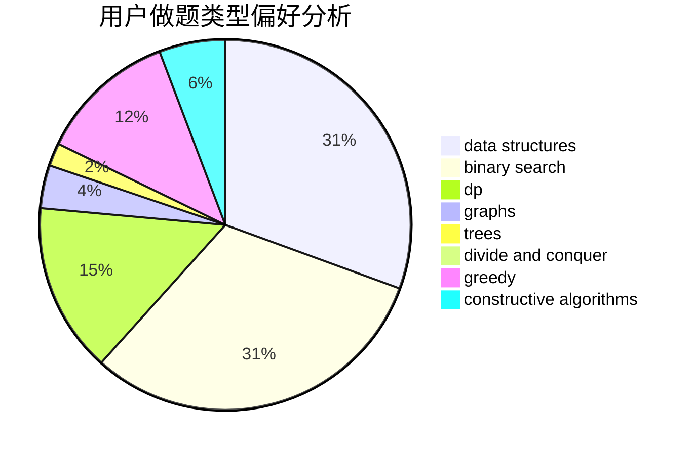
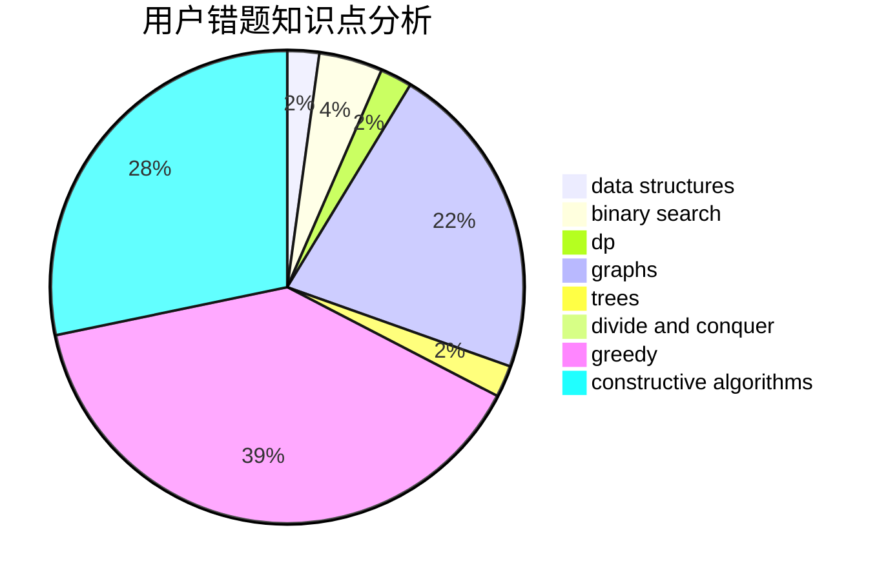

# aspirine

<!-- tabs:start -->

#### **用户提交结果分析**

#### **用户做题类型偏好分析**

#### **用户错题知识点分析**

<!-- tabs:end -->
# 推荐题目
[500A](https://codeforces.com/contest/500/problem/A)		dfs and similar,
                        graphs,
                        implementation		  
[1510I](https://codeforces.com/contest/1510/problem/I)		greedy,
                        interactive,
                        math,
                        probabilities		  
[1480A](https://codeforces.com/contest/1480/problem/A)		games,
                        greedy,
                        strings		  
[895D](https://codeforces.com/contest/895/problem/D)		combinatorics,
                        math,
                        strings		  
[871E](https://codeforces.com/contest/871/problem/E)		graphs,
                        greedy,
                        trees		  
[917C](https://codeforces.com/contest/917/problem/C)		combinatorics,
                        dp,
                        matrices		  
[1227A](https://codeforces.com/contest/1227/problem/A)		math		  
[197D](https://codeforces.com/contest/197/problem/D)		dsu,graphs,sortings,trees		  
[939D](https://codeforces.com/contest/939/problem/D)		dfs and similar,
                        dsu,
                        graphs,
                        greedy,
                        strings		  
[540A](https://codeforces.com/contest/540/problem/A)		implementation		  
