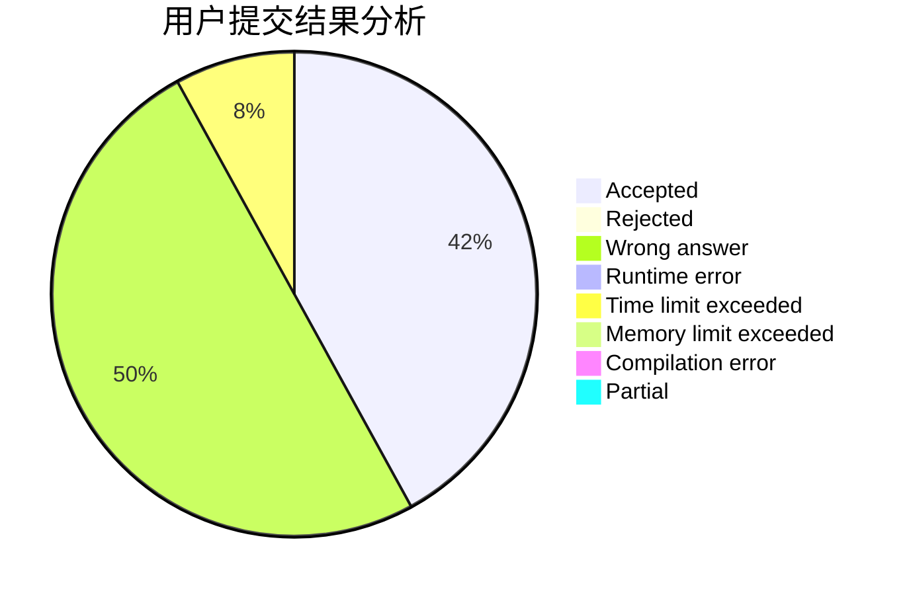
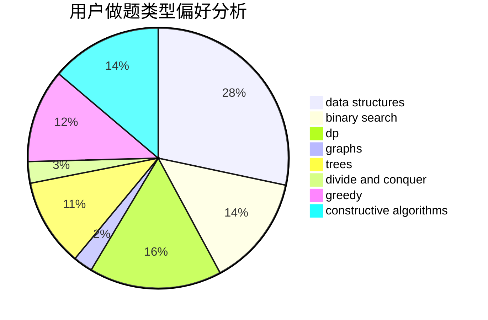
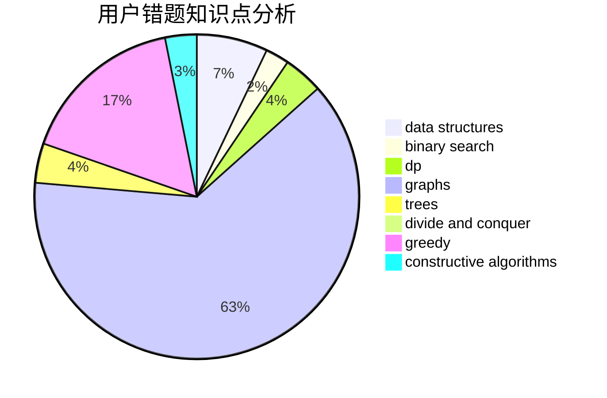

# AmeTxx

<!-- tabs:start -->

#### **用户提交结果分析**

#### **用户做题类型偏好分析**

#### **用户错题知识点分析**

<!-- tabs:end -->
# 推荐题目
[1358B](https://codeforces.com/contest/1358/problem/B)		greedy,
                        sortings		  
[1348C](https://codeforces.com/contest/1348/problem/C)		constructive algorithms,
                        greedy,
                        sortings,
                        strings		  
[313C](https://codeforces.com/contest/313/problem/C)		constructive algorithms,
                        greedy,
                        implementation,
                        sortings		  
[312B](https://codeforces.com/contest/312/problem/B)		math,
                        probabilities		  
[1246A](https://codeforces.com/contest/1246/problem/A)		dsu,graphs,sortings,trees		  
[313E](https://codeforces.com/contest/313/problem/E)		constructive algorithms,
                        data structures,
                        dsu,
                        greedy		  
[158A](https://codeforces.com/contest/158/problem/A)		*special problem,
                        implementation		  
[1491F](https://codeforces.com/contest/1491/problem/F)		binary search,
                        constructive algorithms,
                        interactive		  
[1430G](https://codeforces.com/contest/1430/problem/G)		bitmasks,
                        dfs and similar,
                        dp,
                        flows,
                        graphs,
                        math		  
[261C](https://codeforces.com/contest/261/problem/C)		constructive algorithms,
                        dp,
                        math		  
