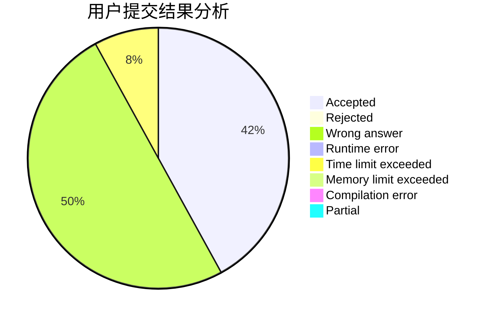
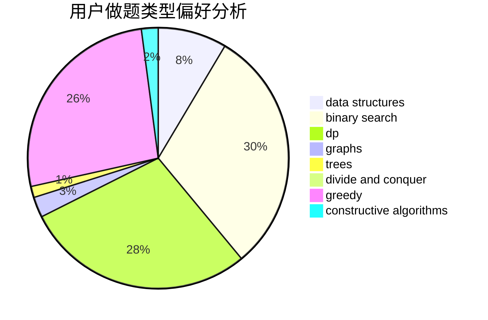
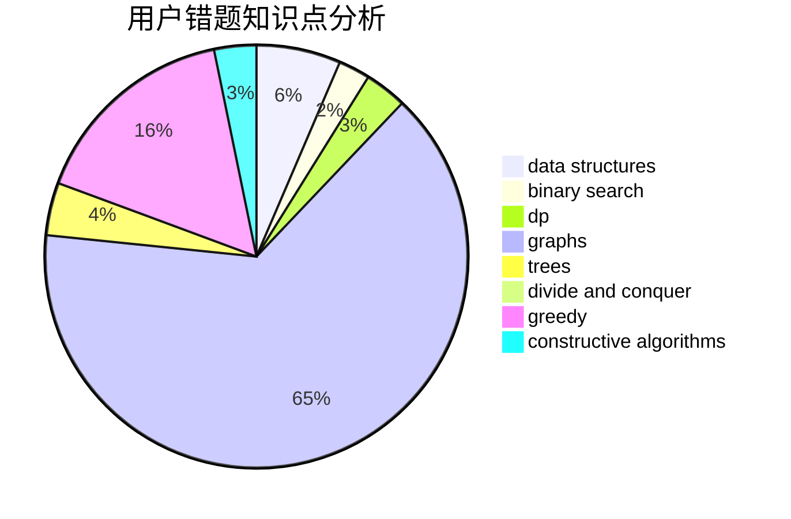

# AmeTxx

<!-- tabs:start -->

#### **用户提交结果分析**

#### **用户做题类型偏好分析**

#### **用户错题知识点分析**

<!-- tabs:end -->
# 推荐题目
[1366D](https://codeforces.com/contest/1366/problem/D)		constructive algorithms,
                        math,
                        number theory		  
[1355A](https://codeforces.com/contest/1355/problem/A)		brute force,
                        implementation,
                        math		  
[337C](https://codeforces.com/contest/337/problem/C)		binary search,
                        greedy,
                        math,
                        matrices,
                        number theory		  
[337A](https://codeforces.com/contest/337/problem/A)		greedy		  
[1250I](https://codeforces.com/contest/1250/problem/I)		binary search,
                        brute force,
                        greedy,
                        shortest paths		  
[338D](https://codeforces.com/contest/338/problem/D)		chinese remainder theorem,
                        math,
                        number theory		  
[17C](https://codeforces.com/contest/17/problem/C)		dp		  
[14C](https://codeforces.com/contest/14/problem/C)		brute force,
                        constructive algorithms,
                        geometry,
                        implementation,
                        math		  
[1439E](https://codeforces.com/contest/1439/problem/E)		bitmasks,
                        data structures,
                        games,
                        trees		  
[27A](https://codeforces.com/contest/27/problem/A)		implementation,
                        sortings		  
