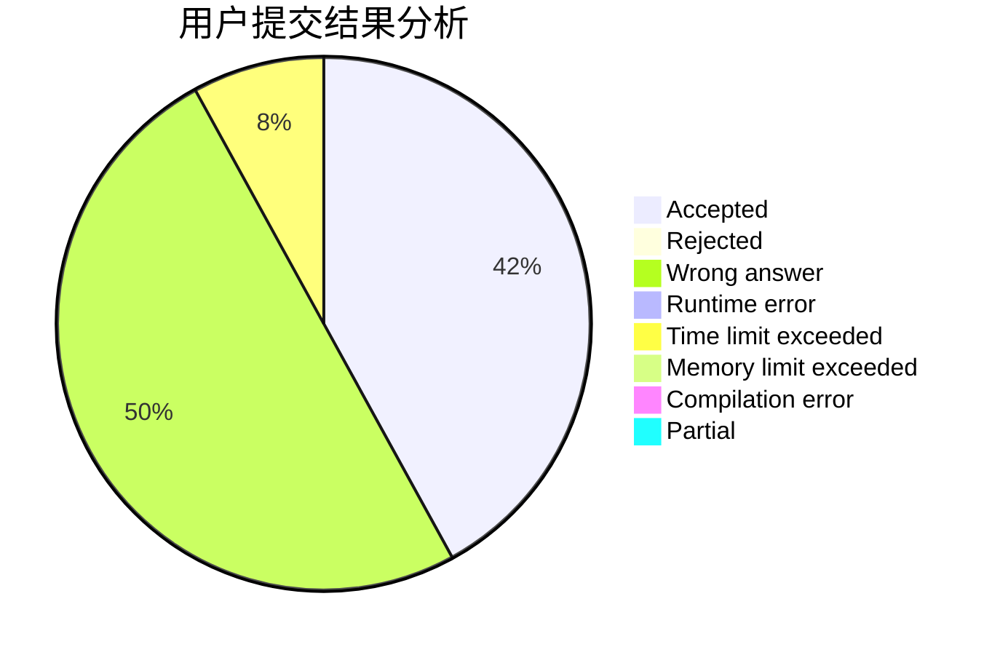
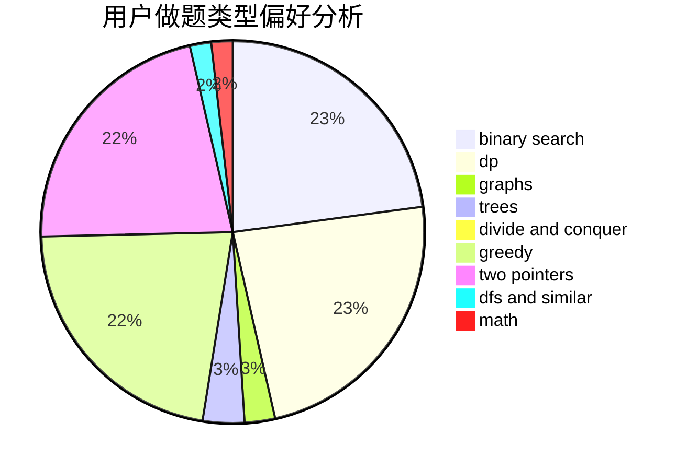

# AmeTxx

<!-- tabs:start -->

#### **用户提交结果分析**

#### **用户做题类型偏好分析**

<!-- tabs:end -->
# 推荐题目
[1366D](https://codeforces.com/contest/1366/problem/D)
[1355A](https://codeforces.com/contest/1355/problem/A)
[337C](https://codeforces.com/contest/337/problem/C)
[337A](https://codeforces.com/contest/337/problem/A)
[1250I](https://codeforces.com/contest/1250/problem/I)
[338D](https://codeforces.com/contest/338/problem/D)
[17C](https://codeforces.com/contest/17/problem/C)
[14C](https://codeforces.com/contest/14/problem/C)
[1439E](https://codeforces.com/contest/1439/problem/E)
[27A](https://codeforces.com/contest/27/problem/A)
