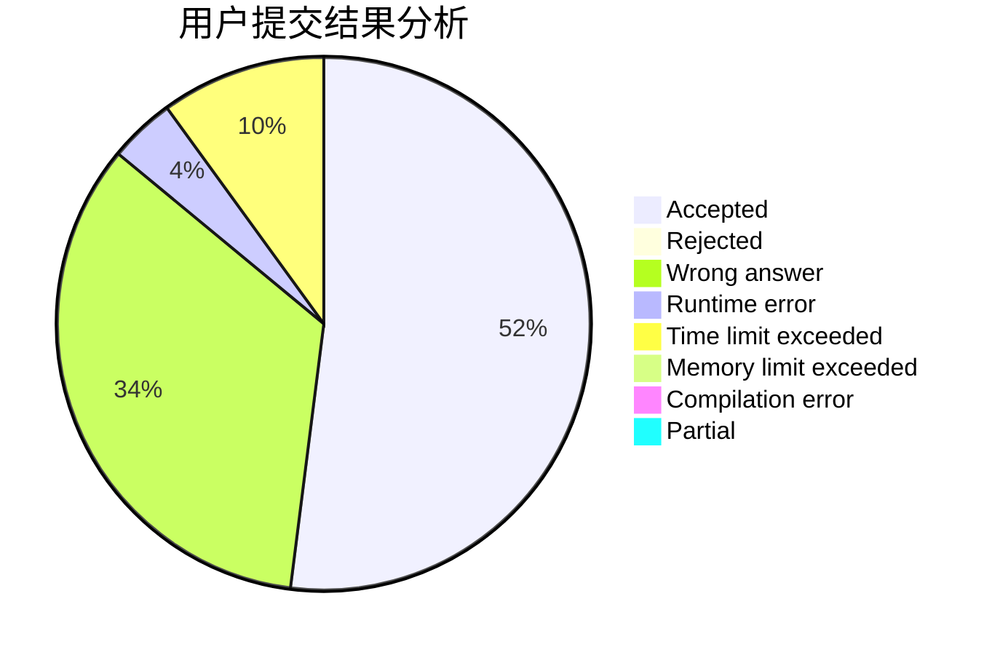
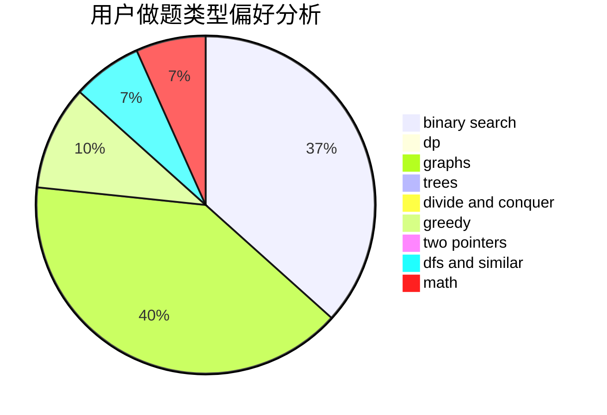

# ast123

<!-- tabs:start -->

#### **用户提交结果分析**

#### **用户做题类型偏好分析**

<!-- tabs:end -->
# 推荐题目
[512C](https://codeforces.com/contest/512/problem/C)
[1020D](https://codeforces.com/contest/1020/problem/D)
[802N](https://codeforces.com/contest/802/problem/N)
[478B](https://codeforces.com/contest/478/problem/B)
[1248A](https://codeforces.com/contest/1248/problem/A)
[1490C](https://codeforces.com/contest/1490/problem/C)
[1497B](https://codeforces.com/contest/1497/problem/B)
[1491C](https://codeforces.com/contest/1491/problem/C)
[1484C](https://codeforces.com/contest/1484/problem/C)
[1480A](https://codeforces.com/contest/1480/problem/A)
