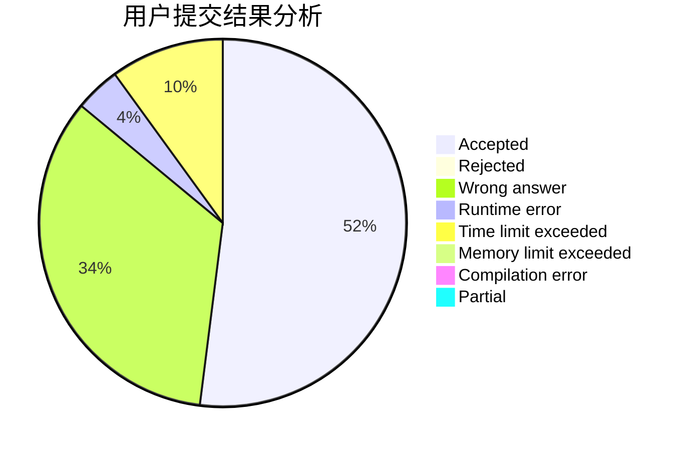
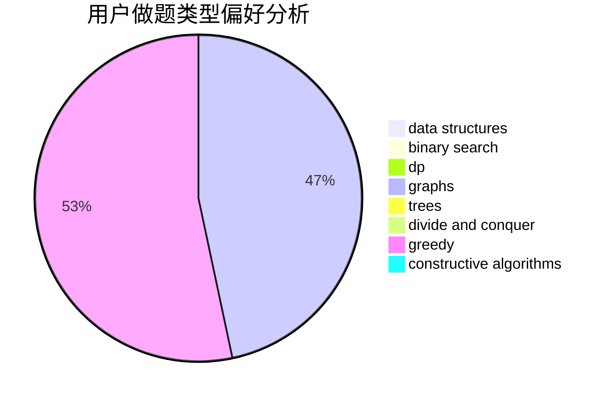
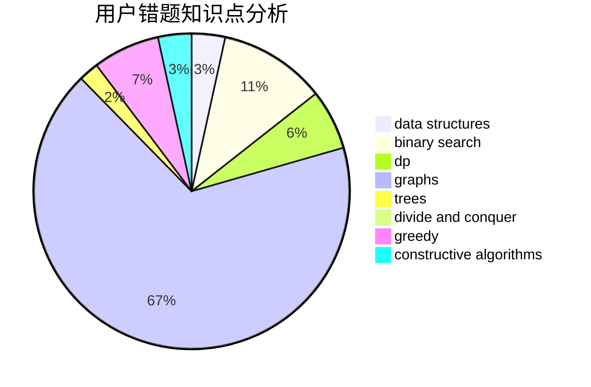

# ast123

<!-- tabs:start -->

#### **用户提交结果分析**

#### **用户做题类型偏好分析**

#### **用户错题知识点分析**

<!-- tabs:end -->
# 推荐题目
[492A](https://codeforces.com/contest/492/problem/A)		implementation		  
[1020A](https://codeforces.com/contest/1020/problem/A)		math		  
[786C](https://codeforces.com/contest/786/problem/C)		data structures,
                        divide and conquer		  
[459C](https://codeforces.com/contest/459/problem/C)		combinatorics,
                        constructive algorithms,
                        math		  
[1243B1](https://codeforces.com/contest/1243B/problem/1)		strings		  
[1482E](https://codeforces.com/contest/1482/problem/E)		data structures,
                        divide and conquer,
                        dp		  
[1489D](https://codeforces.com/contest/1489/problem/D)		dsu,graphs,sortings,trees		  
[1483E](https://codeforces.com/contest/1483/problem/E)		dsu,graphs,sortings,trees		  
[1475F](https://codeforces.com/contest/1475/problem/F)		2-sat,
                        brute force,
                        constructive algorithms		  
[1472A](https://codeforces.com/contest/1472/problem/A)		greedy,
                        math		  
