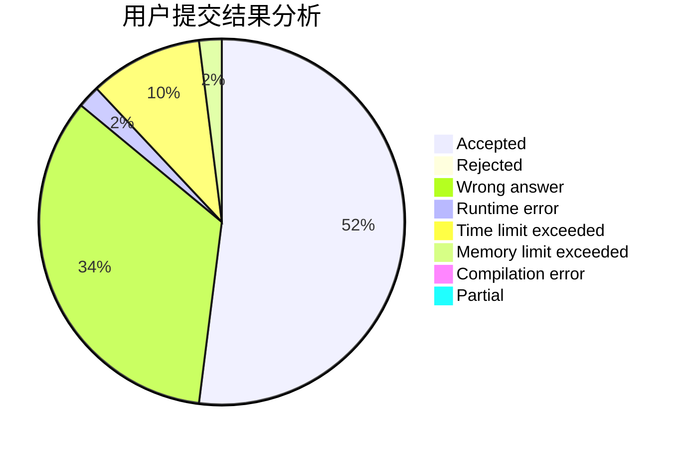
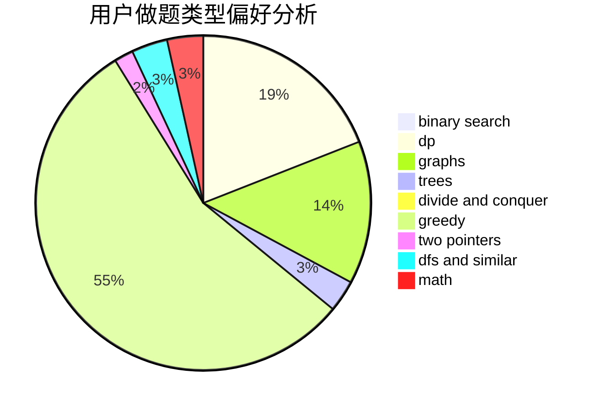

# auto_mowu_machine

<!-- tabs:start -->

#### **用户提交结果分析**

#### **用户做题类型偏好分析**

<!-- tabs:end -->
# 推荐题目
[1383B](https://codeforces.com/contest/1383/problem/B)
[1092E](https://codeforces.com/contest/1092/problem/E)
[916B](https://codeforces.com/contest/916/problem/B)
[13352](https://codeforces.com/contest/1335/problem/2)
[1312A](https://codeforces.com/contest/1312/problem/A)
[1109E](https://codeforces.com/contest/1109/problem/E)
[514D](https://codeforces.com/contest/514/problem/D)
[494A](https://codeforces.com/contest/494/problem/A)
[11292](https://codeforces.com/contest/1129/problem/2)
[1131G](https://codeforces.com/contest/1131/problem/G)
