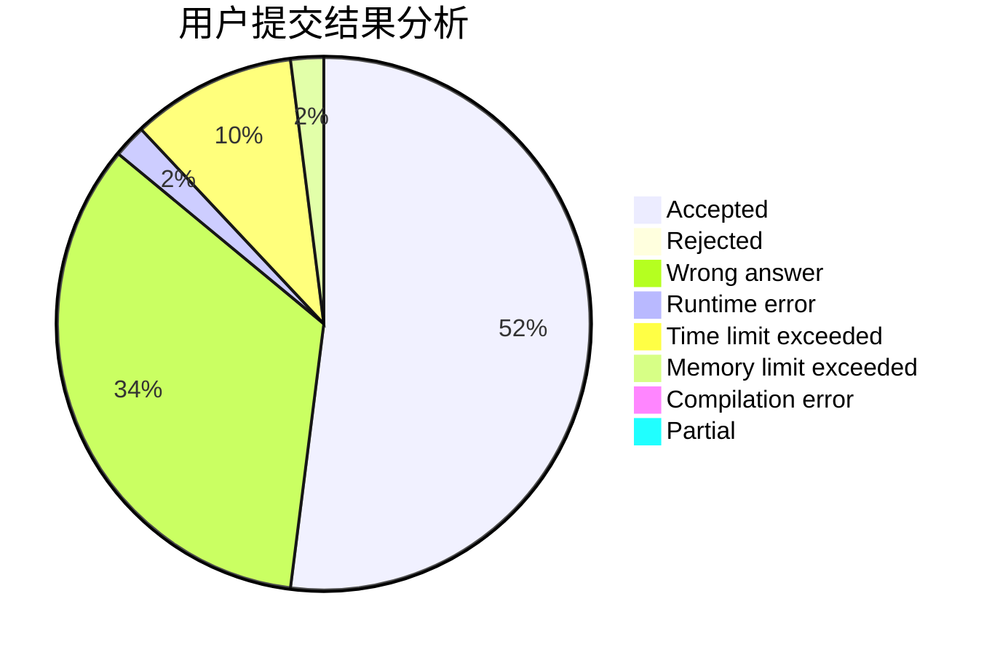
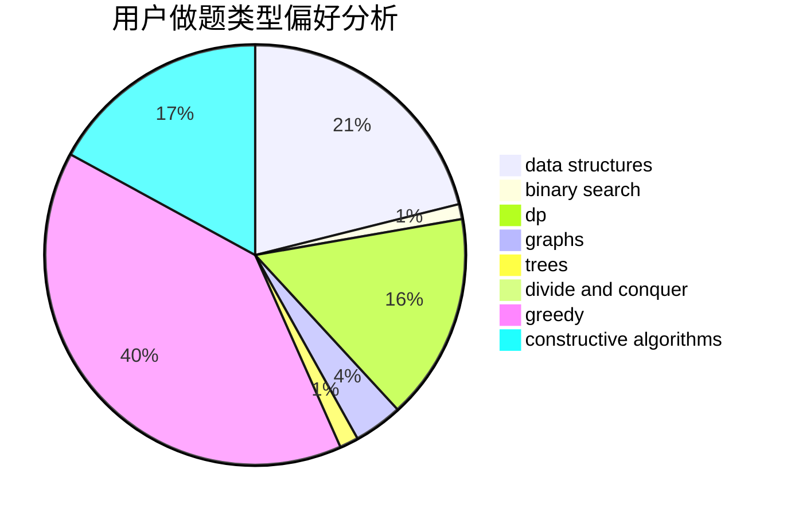
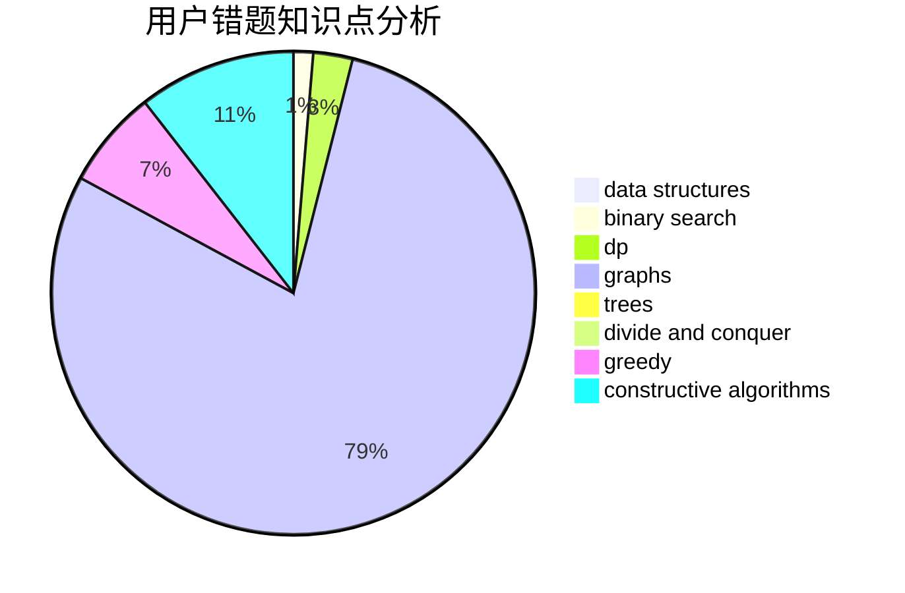

# auto_mowu_machine

<!-- tabs:start -->

#### **用户提交结果分析**

#### **用户做题类型偏好分析**

#### **用户错题知识点分析**

<!-- tabs:end -->
# 推荐题目
[1374C](https://codeforces.com/contest/1374/problem/C)		greedy,
                        strings		  
[1092B](https://codeforces.com/contest/1092/problem/B)		sortings		  
[8D](https://codeforces.com/contest/8/problem/D)		binary search,
                        geometry		  
[1328F](https://codeforces.com/contest/1328/problem/F)		greedy		  
[1303C](https://codeforces.com/contest/1303/problem/C)		dfs and similar,
                        greedy,
                        implementation		  
[1109A](https://codeforces.com/contest/1109/problem/A)		dp,
                        implementation		  
[494C](https://codeforces.com/contest/494/problem/C)		dp,
                        probabilities		  
[475A](https://codeforces.com/contest/475/problem/A)		implementation		  
[1119E](https://codeforces.com/contest/1119/problem/E)		brute force,
                        dp,
                        fft,
                        greedy,
                        ternary search		  
[112B](https://codeforces.com/contest/112/problem/B)		implementation,
                        math		  
