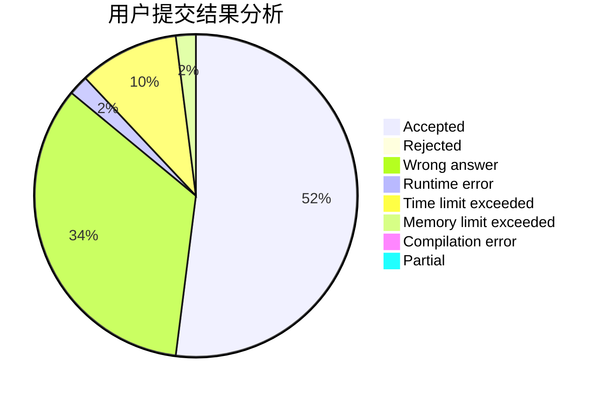
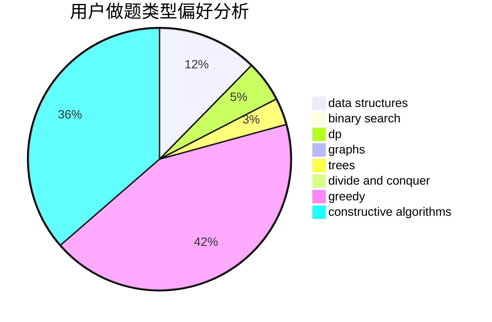
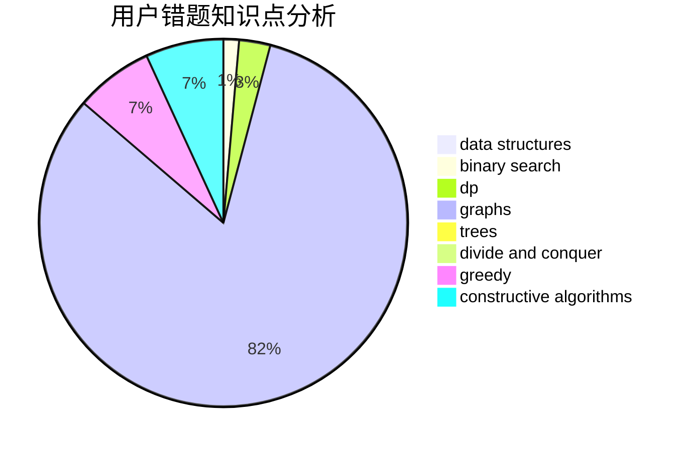

# auto_mowu_machine

<!-- tabs:start -->

#### **用户提交结果分析**

#### **用户做题类型偏好分析**

#### **用户错题知识点分析**

<!-- tabs:end -->
# 推荐题目
[1383B](https://codeforces.com/contest/1383/problem/B)		bitmasks,
                        constructive algorithms,
                        dp,
                        games,
                        greedy,
                        math		  
[1092E](https://codeforces.com/contest/1092/problem/E)		constructive algorithms,
                        dfs and similar,
                        greedy,
                        trees		  
[916B](https://codeforces.com/contest/916/problem/B)		bitmasks,
                        greedy,
                        math		  
[13352](https://codeforces.com/contest/1335/problem/2)		dsu,graphs,sortings,trees		  
[1312A](https://codeforces.com/contest/1312/problem/A)		geometry,
                        greedy,
                        math,
                        number theory		  
[1109E](https://codeforces.com/contest/1109/problem/E)		data structures,
                        number theory		  
[514D](https://codeforces.com/contest/514/problem/D)		binary search,
                        data structures,
                        two pointers		  
[494A](https://codeforces.com/contest/494/problem/A)		greedy		  
[11292](https://codeforces.com/contest/1129/problem/2)		dsu,graphs,sortings,trees		  
[1131G](https://codeforces.com/contest/1131/problem/G)		data structures,
                        dp,
                        two pointers		  
