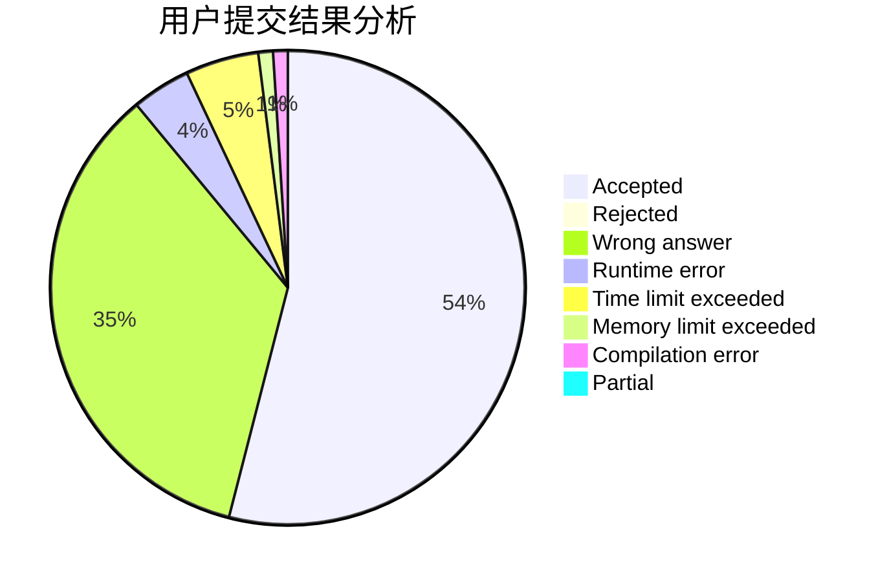
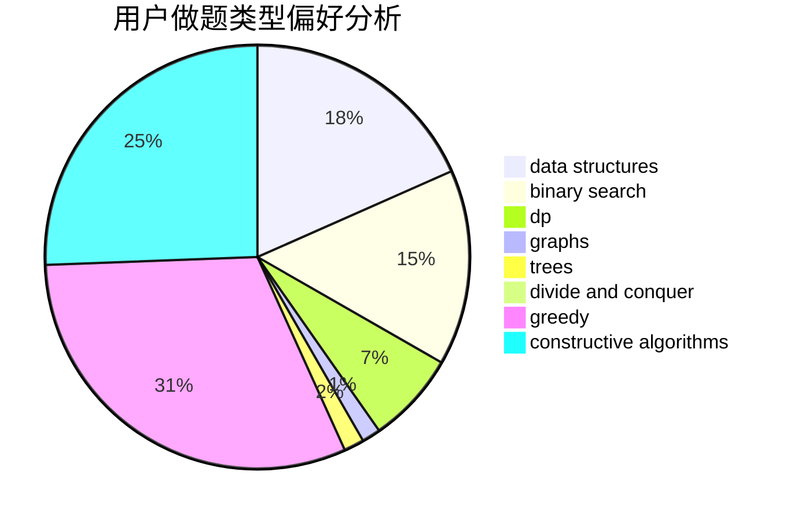
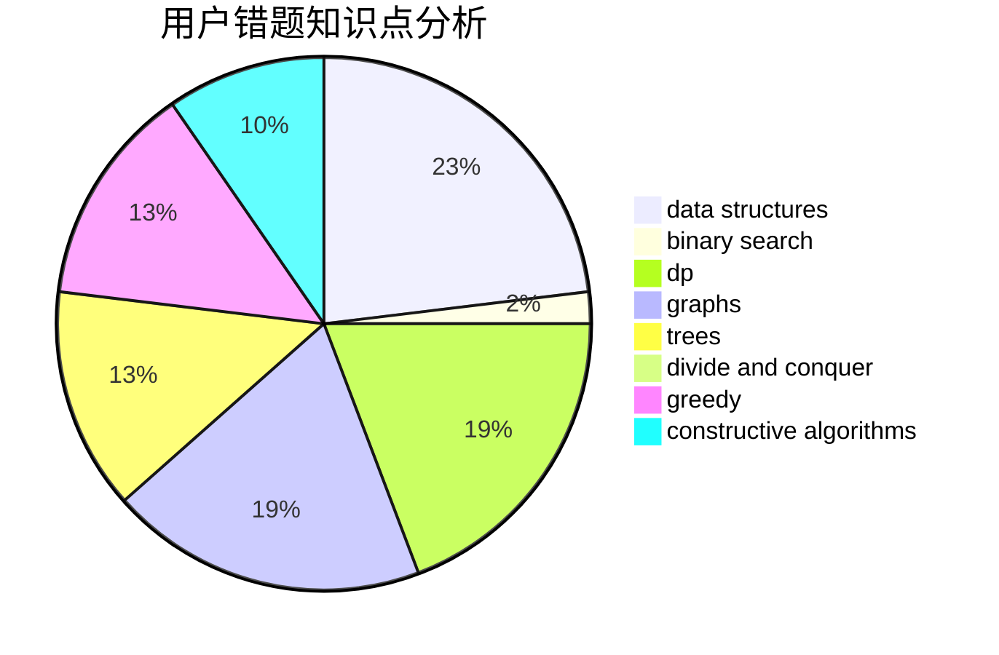

# axiomofchoice

<!-- tabs:start -->

#### **用户提交结果分析**

#### **用户做题类型偏好分析**

#### **用户错题知识点分析**

<!-- tabs:end -->
# 推荐题目
[438B](https://codeforces.com/contest/438/problem/B)		dsu,graphs,sortings,trees		  
[1437C](https://codeforces.com/contest/1437/problem/C)		dp,
                        flows,
                        graph matchings,
                        greedy,
                        math,
                        sortings		  
[633A](https://codeforces.com/contest/633/problem/A)		brute force,
                        math,
                        number theory		  
[916C](https://codeforces.com/contest/916/problem/C)		constructive algorithms,
                        graphs,
                        shortest paths		  
[611F](https://codeforces.com/contest/611/problem/F)		binary search,
                        implementation		  
[156D](https://codeforces.com/contest/156/problem/D)		combinatorics,
                        graphs		  
[612B](https://codeforces.com/contest/612/problem/B)		implementation,
                        math		  
[981F](https://codeforces.com/contest/981/problem/F)		binary search,
                        graph matchings,
                        greedy		  
[54B](https://codeforces.com/contest/54/problem/B)		hashing,
                        implementation		  
[1234D](https://codeforces.com/contest/1234/problem/D)		data structures		  
