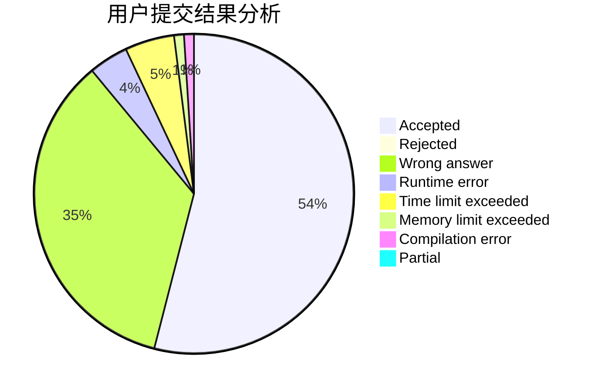
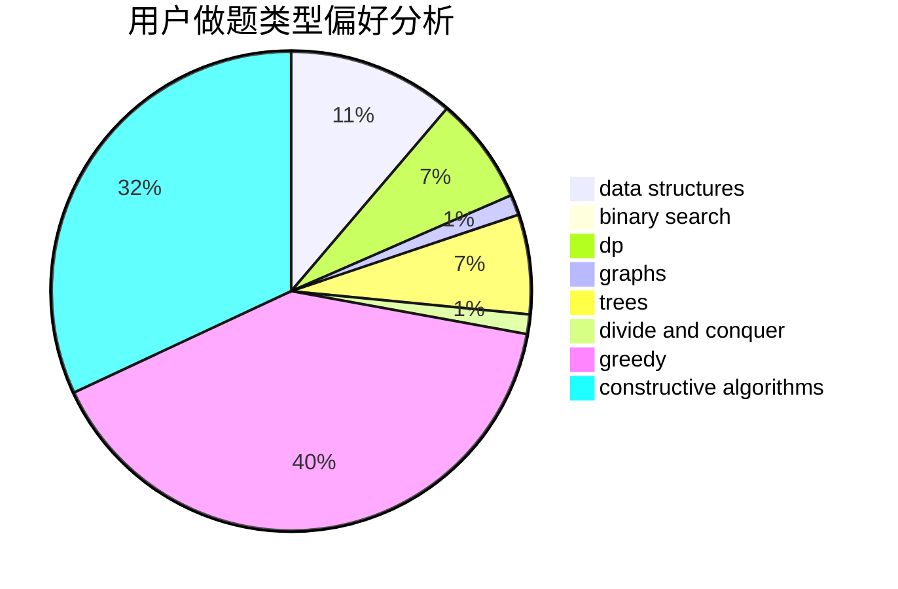
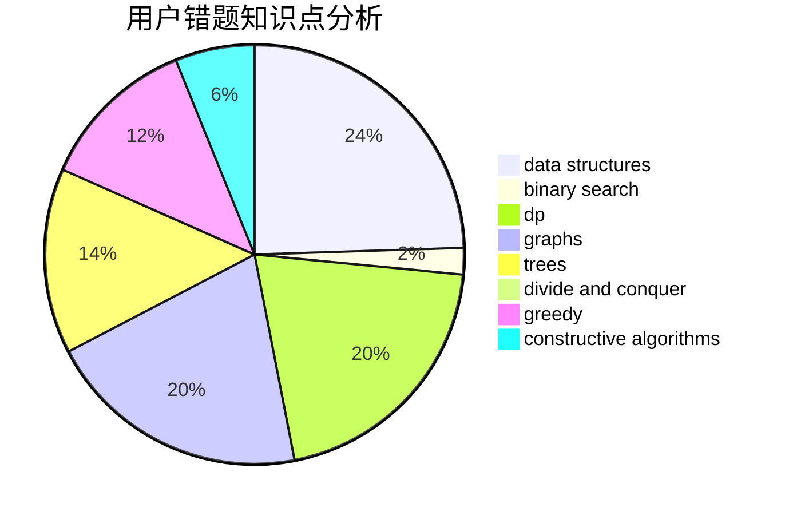

# axiomofchoice

<!-- tabs:start -->

#### **用户提交结果分析**

#### **用户做题类型偏好分析**

#### **用户错题知识点分析**

<!-- tabs:end -->
# 推荐题目
[45G](https://codeforces.com/contest/45/problem/G)		number theory		  
[14472](https://codeforces.com/contest/1447/problem/2)		dsu,graphs,sortings,trees		  
[665C](https://codeforces.com/contest/665/problem/C)		dp,
                        greedy,
                        strings		  
[936D](https://codeforces.com/contest/936/problem/D)		dp,
                        greedy		  
[630J](https://codeforces.com/contest/630/problem/J)		math,
                        number theory		  
[1772](https://codeforces.com/contest/177/problem/2)		dsu,graphs,sortings,trees		  
[631D](https://codeforces.com/contest/631/problem/D)		data structures,
                        hashing,
                        implementation,
                        string suffix structures,
                        strings		  
[997A](https://codeforces.com/contest/997/problem/A)		brute force,
                        greedy,
                        implementation,
                        math		  
[575B](https://codeforces.com/contest/575/problem/B)		dfs and similar,
                        graphs,
                        trees		  
[1240A](https://codeforces.com/contest/1240/problem/A)		dsu,graphs,sortings,trees		  
