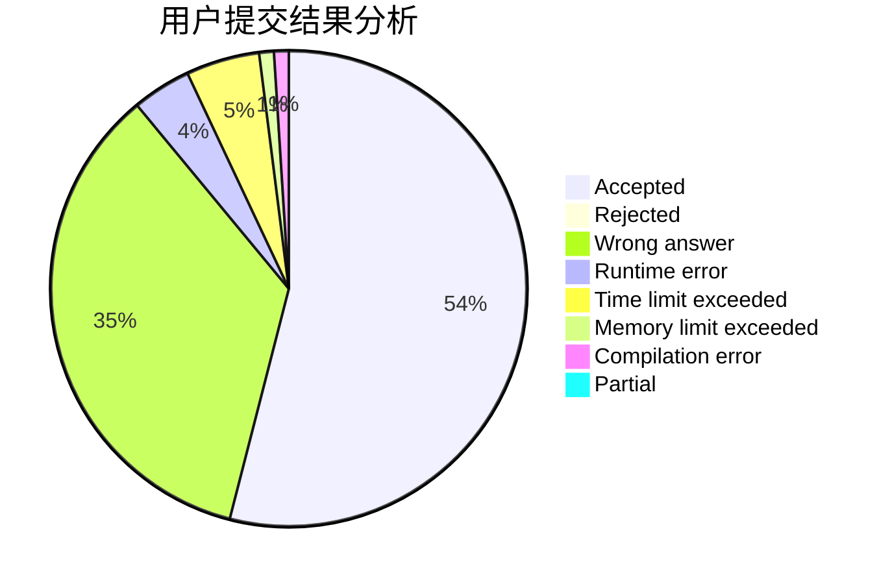
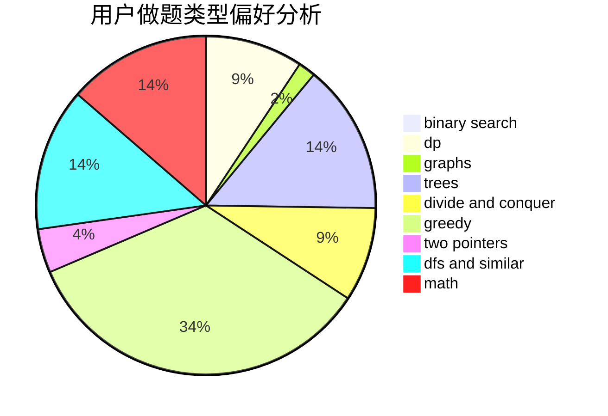

# axiomofchoice

<!-- tabs:start -->

#### **用户提交结果分析**

#### **用户做题类型偏好分析**

<!-- tabs:end -->
# 推荐题目
[45G](https://codeforces.com/contest/45/problem/G)
[14472](https://codeforces.com/contest/1447/problem/2)
[665C](https://codeforces.com/contest/665/problem/C)
[936D](https://codeforces.com/contest/936/problem/D)
[630J](https://codeforces.com/contest/630/problem/J)
[1772](https://codeforces.com/contest/177/problem/2)
[631D](https://codeforces.com/contest/631/problem/D)
[997A](https://codeforces.com/contest/997/problem/A)
[575B](https://codeforces.com/contest/575/problem/B)
[1240A](https://codeforces.com/contest/1240/problem/A)
