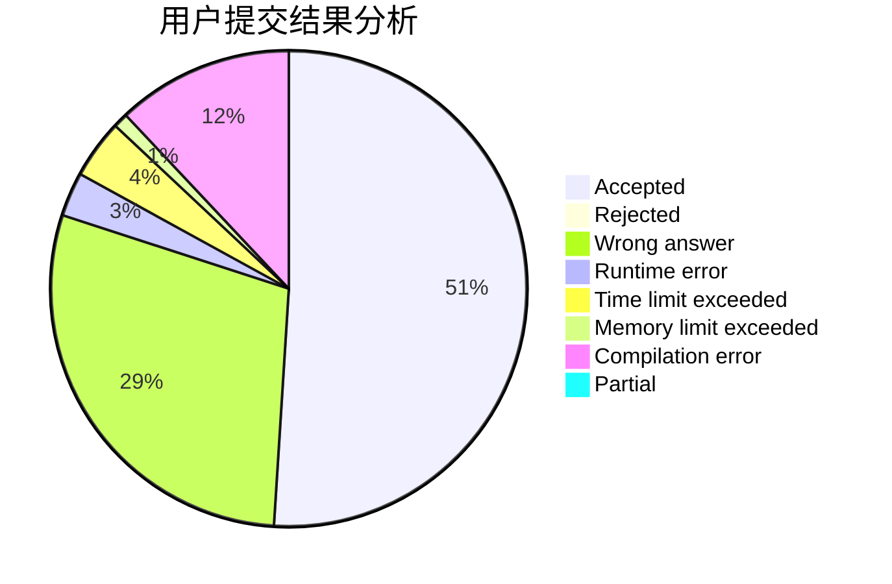
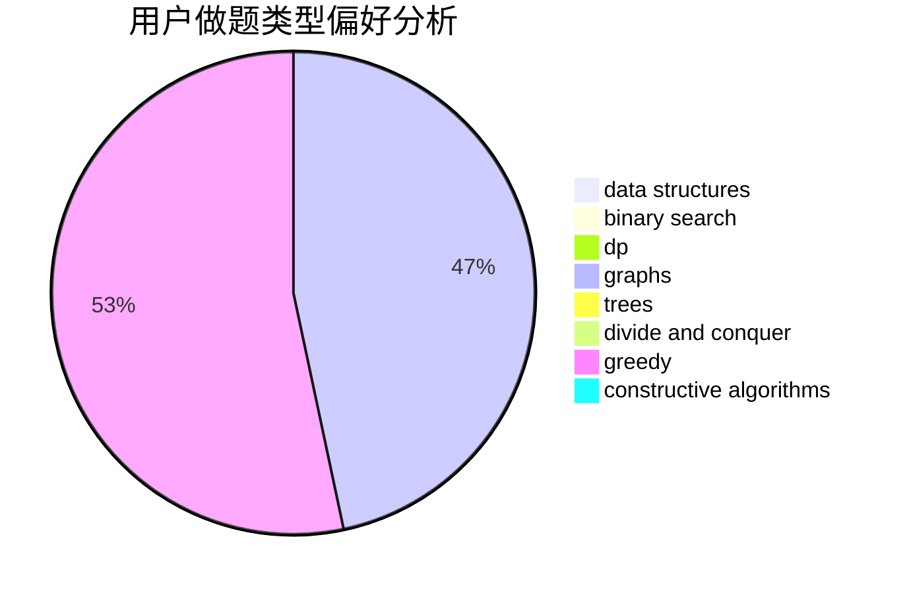
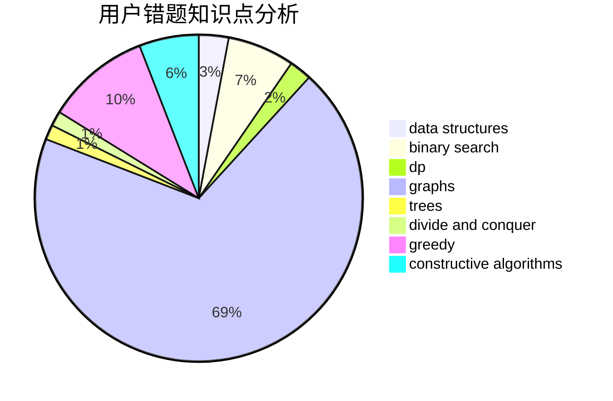

# axp

<!-- tabs:start -->

#### **用户提交结果分析**

#### **用户做题类型偏好分析**

#### **用户错题知识点分析**

<!-- tabs:end -->
# 推荐题目
[865D](https://codeforces.com/contest/865/problem/D)		constructive algorithms,
                        data structures,
                        greedy		  
[93C](https://codeforces.com/contest/93/problem/C)		brute force,
                        implementation		  
[1239C](https://codeforces.com/contest/1239/problem/C)		data structures,
                        greedy,
                        implementation		  
[1054A](https://codeforces.com/contest/1054/problem/A)		implementation		  
[1207F](https://codeforces.com/contest/1207/problem/F)		brute force,
                        data structures,
                        implementation		  
[1095D](https://codeforces.com/contest/1095/problem/D)		implementation		  
[1500C](https://codeforces.com/contest/1500/problem/C)		bitmasks,
                        brute force,
                        constructive algorithms,
                        greedy,
                        two pointers		  
[1071B](https://codeforces.com/contest/1071/problem/B)		dsu,graphs,sortings,trees		  
[1482E](https://codeforces.com/contest/1482/problem/E)		data structures,
                        divide and conquer,
                        dp		  
[1489D](https://codeforces.com/contest/1489/problem/D)		dsu,graphs,sortings,trees		  
