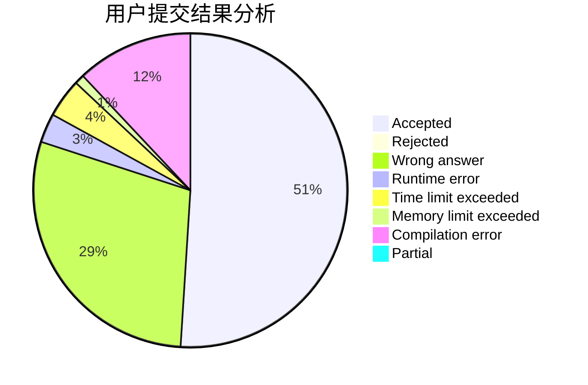
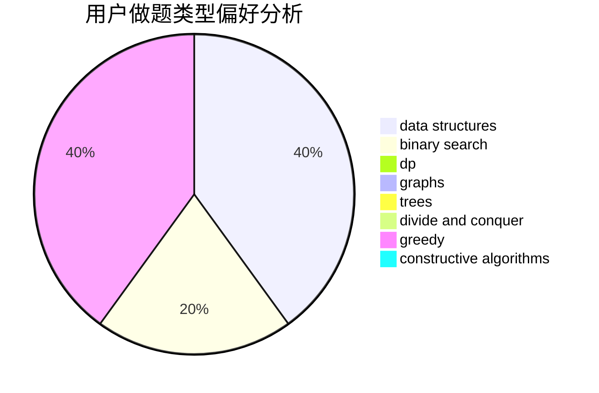
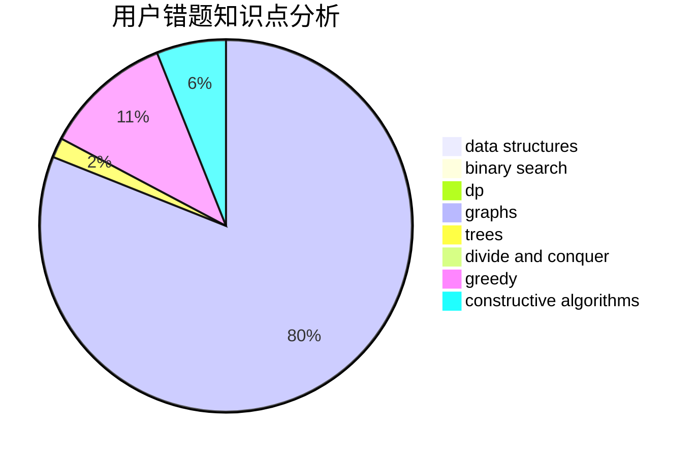

# axp

<!-- tabs:start -->

#### **用户提交结果分析**

#### **用户做题类型偏好分析**

#### **用户错题知识点分析**

<!-- tabs:end -->
# 推荐题目
[886A](https://codeforces.com/contest/886/problem/A)		brute force		  
[961C](https://codeforces.com/contest/961/problem/C)		bitmasks,
                        brute force,
                        implementation		  
[1244E](https://codeforces.com/contest/1244/problem/E)		binary search,
                        constructive algorithms,
                        greedy,
                        sortings,
                        ternary search,
                        two pointers		  
[1054D](https://codeforces.com/contest/1054/problem/D)		greedy,
                        implementation		  
[1213B](https://codeforces.com/contest/1213/problem/B)		data structures,
                        implementation		  
[1096A](https://codeforces.com/contest/1096/problem/A)		greedy,
                        implementation,
                        math		  
[1510I](https://codeforces.com/contest/1510/problem/I)		greedy,
                        interactive,
                        math,
                        probabilities		  
[1072A](https://codeforces.com/contest/1072/problem/A)		dsu,graphs,sortings,trees		  
[1490C](https://codeforces.com/contest/1490/problem/C)		binary search,
                        brute force,
                        brute force,
                        math		  
[1497B](https://codeforces.com/contest/1497/problem/B)		constructive algorithms,
                        greedy,
                        math		  
