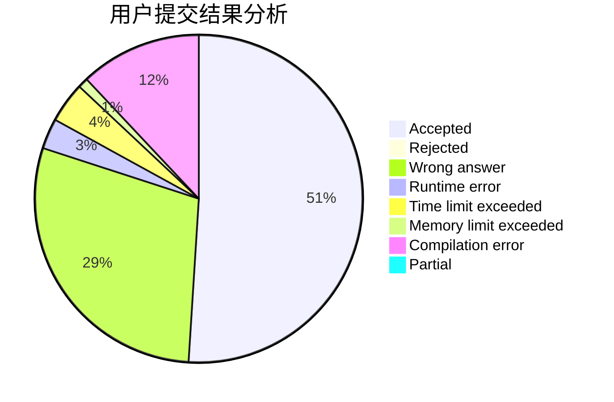
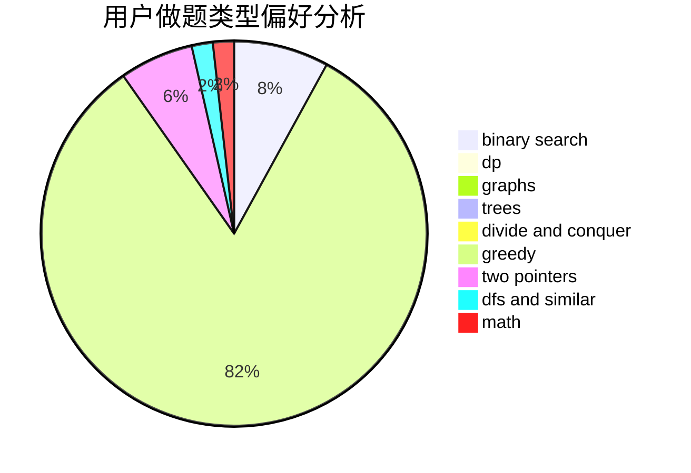

# axp

<!-- tabs:start -->

#### **用户提交结果分析**

#### **用户做题类型偏好分析**

<!-- tabs:end -->
# 推荐题目
[886A](https://codeforces.com/contest/886/problem/A)
[961C](https://codeforces.com/contest/961/problem/C)
[1244E](https://codeforces.com/contest/1244/problem/E)
[1054D](https://codeforces.com/contest/1054/problem/D)
[1213B](https://codeforces.com/contest/1213/problem/B)
[1096A](https://codeforces.com/contest/1096/problem/A)
[1510I](https://codeforces.com/contest/1510/problem/I)
[1072A](https://codeforces.com/contest/1072/problem/A)
[1490C](https://codeforces.com/contest/1490/problem/C)
[1497B](https://codeforces.com/contest/1497/problem/B)
