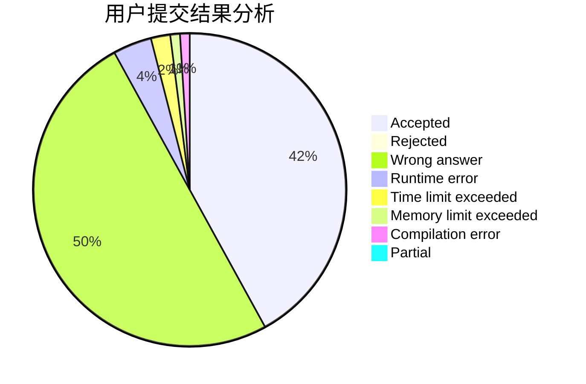
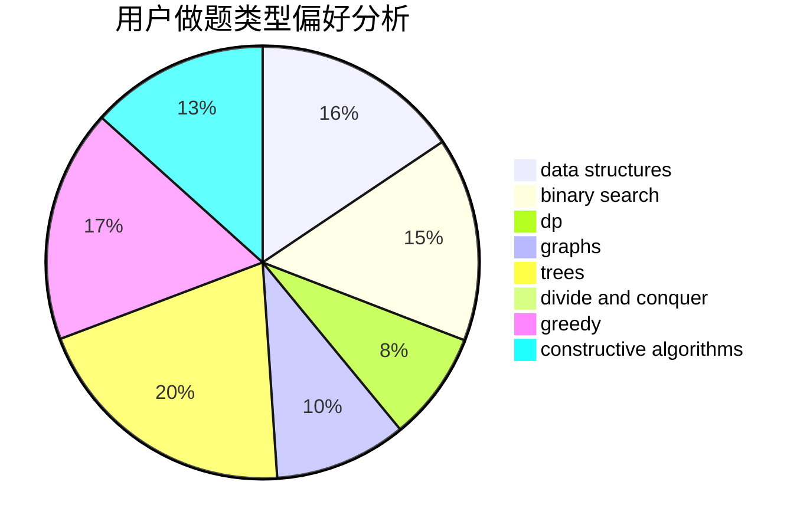
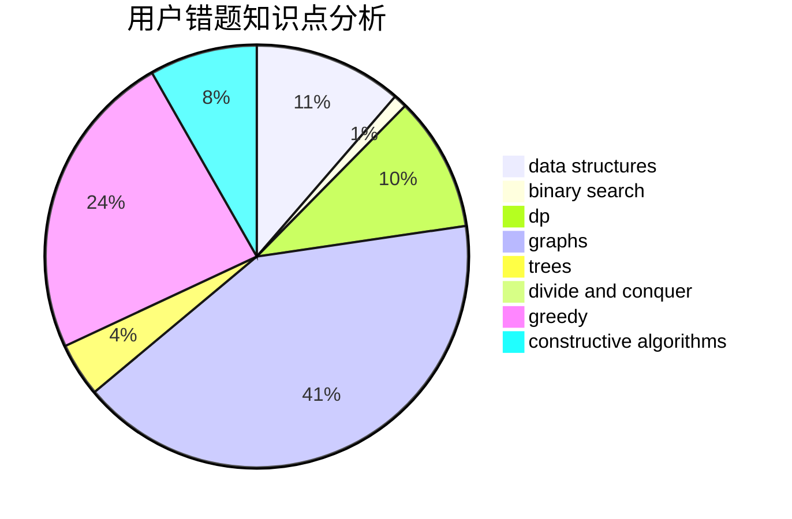

# axs7384

<!-- tabs:start -->

#### **用户提交结果分析**

#### **用户做题类型偏好分析**

#### **用户错题知识点分析**

<!-- tabs:end -->
# 推荐题目
[1477E](https://codeforces.com/contest/1477/problem/E)		data structures,
                        greedy		  
[920A](https://codeforces.com/contest/920/problem/A)		implementation		  
[768C](https://codeforces.com/contest/768/problem/C)		brute force,
                        dp,
                        implementation,
                        sortings		  
[820D](https://codeforces.com/contest/820/problem/D)		dsu,graphs,sortings,trees		  
[364D](https://codeforces.com/contest/364/problem/D)		brute force,
                        math,
                        probabilities		  
[22B](https://codeforces.com/contest/22/problem/B)		brute force,
                        dp		  
[1077F2](https://codeforces.com/contest/1077F/problem/2)		data structures,
                        dp		  
[955C](https://codeforces.com/contest/955/problem/C)		binary search,
                        math,
                        number theory		  
[861A](https://codeforces.com/contest/861/problem/A)		dsu,graphs,sortings,trees		  
[1480D1](https://codeforces.com/contest/1480D/problem/1)		dsu,graphs,sortings,trees		  
