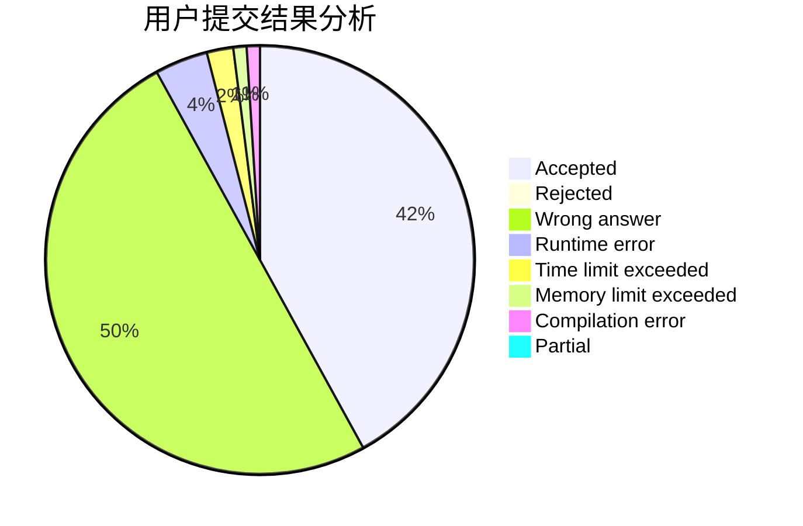
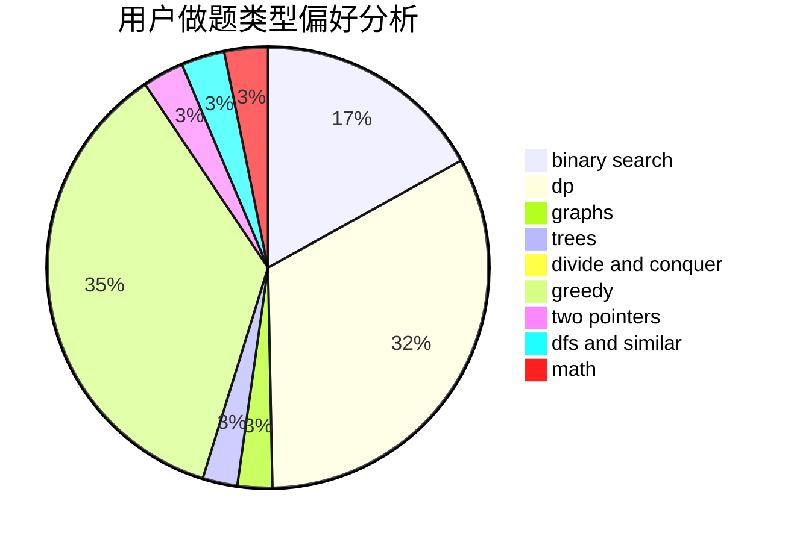

# axs7384

<!-- tabs:start -->

#### **用户提交结果分析**

#### **用户做题类型偏好分析**

<!-- tabs:end -->
# 推荐题目
[1486B](https://codeforces.com/contest/1486/problem/B)
[940A](https://codeforces.com/contest/940/problem/A)
[788B](https://codeforces.com/contest/788/problem/B)
[840D](https://codeforces.com/contest/840/problem/D)
[392A](https://codeforces.com/contest/392/problem/A)
[24E](https://codeforces.com/contest/24/problem/E)
[1078C](https://codeforces.com/contest/1078/problem/C)
[977C](https://codeforces.com/contest/977/problem/C)
[879A](https://codeforces.com/contest/879/problem/A)
[1488H](https://codeforces.com/contest/1488/problem/H)
