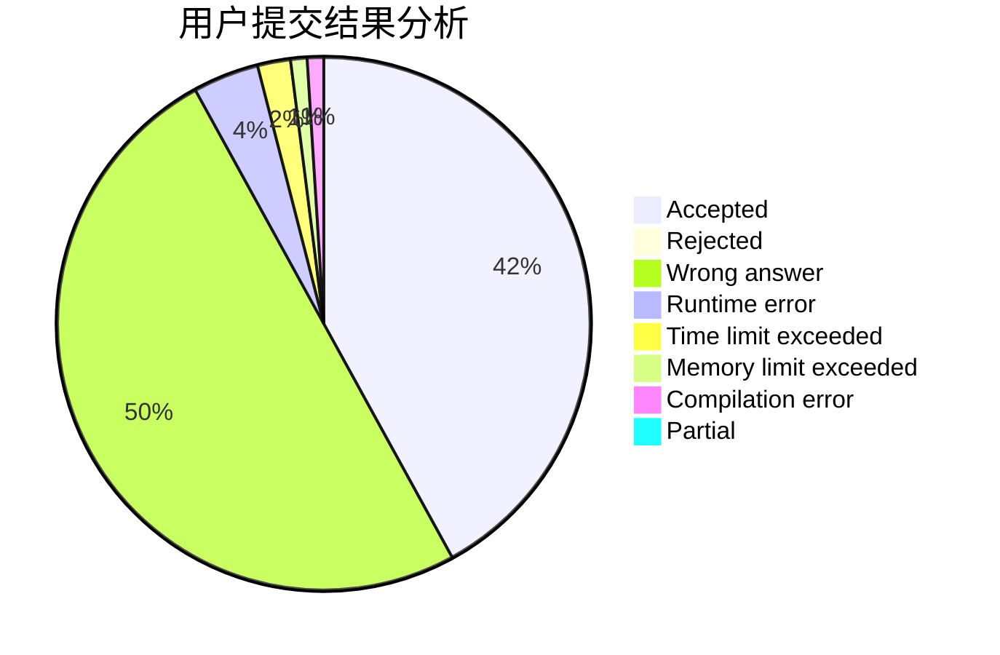
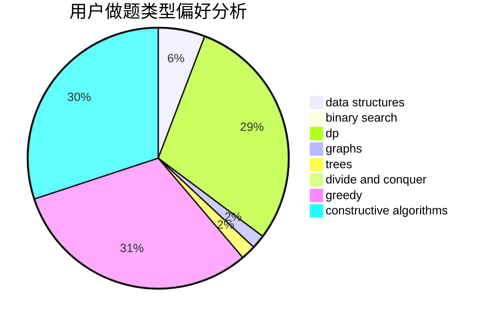
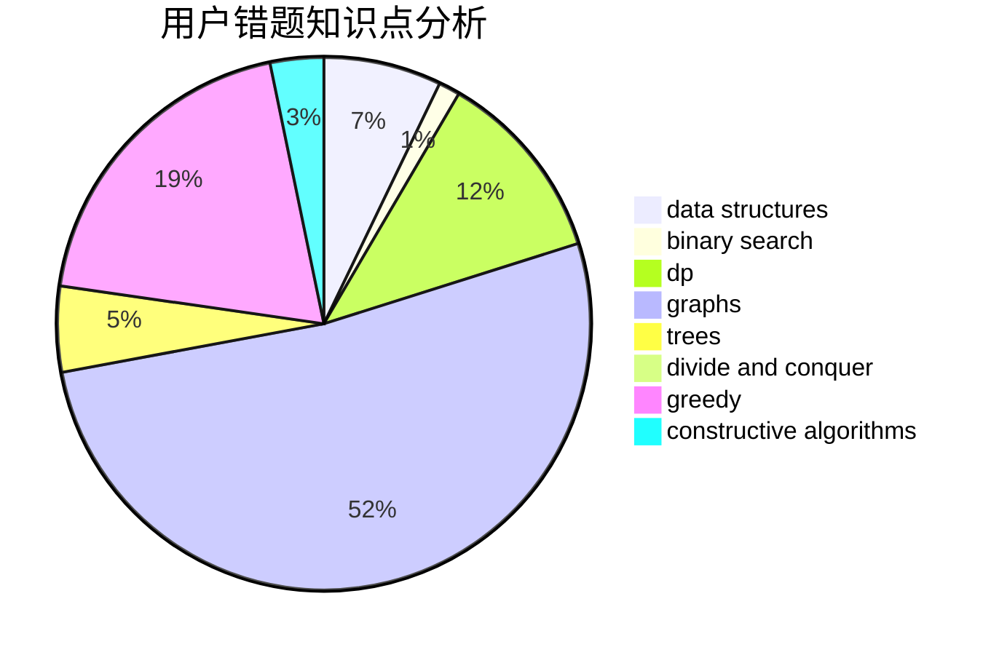

# axs7384

<!-- tabs:start -->

#### **用户提交结果分析**

#### **用户做题类型偏好分析**

#### **用户错题知识点分析**

<!-- tabs:end -->
# 推荐题目
[1486B](https://codeforces.com/contest/1486/problem/B)		binary search,
                        geometry,
                        shortest paths,
                        sortings		  
[940A](https://codeforces.com/contest/940/problem/A)		brute force,
                        greedy,
                        sortings		  
[788B](https://codeforces.com/contest/788/problem/B)		combinatorics,
                        constructive algorithms,
                        dfs and similar,
                        dsu,
                        graphs		  
[840D](https://codeforces.com/contest/840/problem/D)		data structures,
                        probabilities		  
[392A](https://codeforces.com/contest/392/problem/A)		math		  
[24E](https://codeforces.com/contest/24/problem/E)		binary search		  
[1078C](https://codeforces.com/contest/1078/problem/C)		dsu,graphs,sortings,trees		  
[977C](https://codeforces.com/contest/977/problem/C)		sortings		  
[879A](https://codeforces.com/contest/879/problem/A)		implementation		  
[1488H](https://codeforces.com/contest/1488/problem/H)		*special problem,
                        combinatorics,
                        data structures		  
