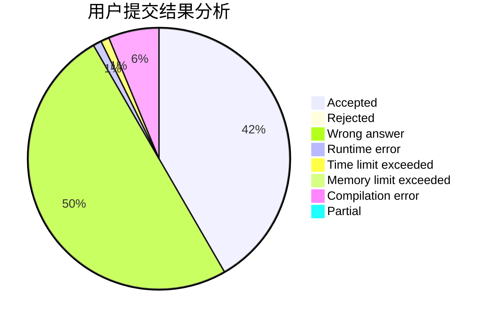
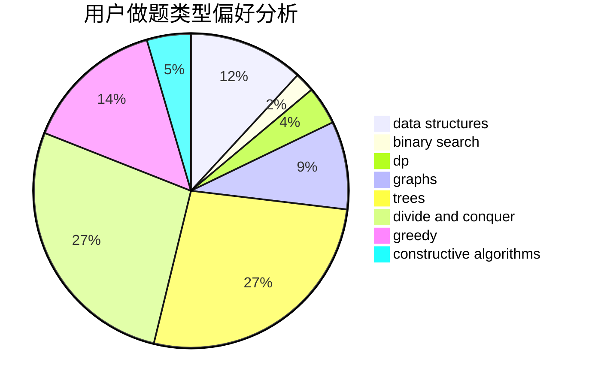
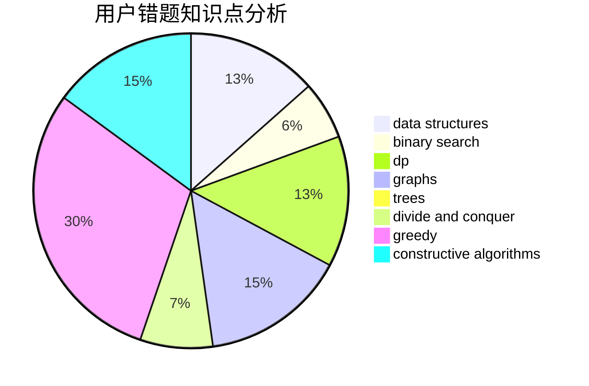

# aya_uchida

<!-- tabs:start -->

#### **用户提交结果分析**

#### **用户做题类型偏好分析**

#### **用户错题知识点分析**

<!-- tabs:end -->
# 推荐题目
[1146B](https://codeforces.com/contest/1146/problem/B)		implementation,
                        strings		  
[1113C](https://codeforces.com/contest/1113/problem/C)		dsu,graphs,sortings,trees		  
[1154D](https://codeforces.com/contest/1154/problem/D)		greedy		  
[478B](https://codeforces.com/contest/478/problem/B)		combinatorics,
                        constructive algorithms,
                        greedy,
                        math		  
[677A](https://codeforces.com/contest/677/problem/A)		implementation		  
[1336F](https://codeforces.com/contest/1336/problem/F)		data structures,
                        divide and conquer,
                        graphs,
                        trees		  
[899E](https://codeforces.com/contest/899/problem/E)		data structures,
                        dsu,
                        flows,
                        implementation,
                        two pointers		  
[1481B](https://codeforces.com/contest/1481/problem/B)		brute force,
                        greedy,
                        implementation		  
[486B](https://codeforces.com/contest/486/problem/B)		greedy,
                        hashing,
                        implementation		  
[542E](https://codeforces.com/contest/542/problem/E)		graphs,
                        shortest paths		  
