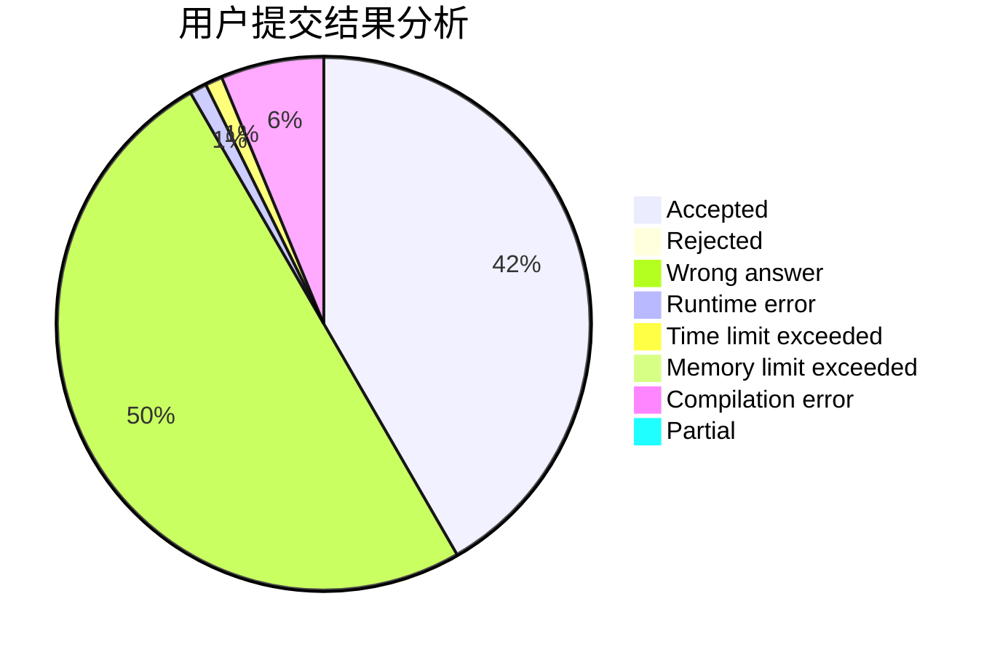
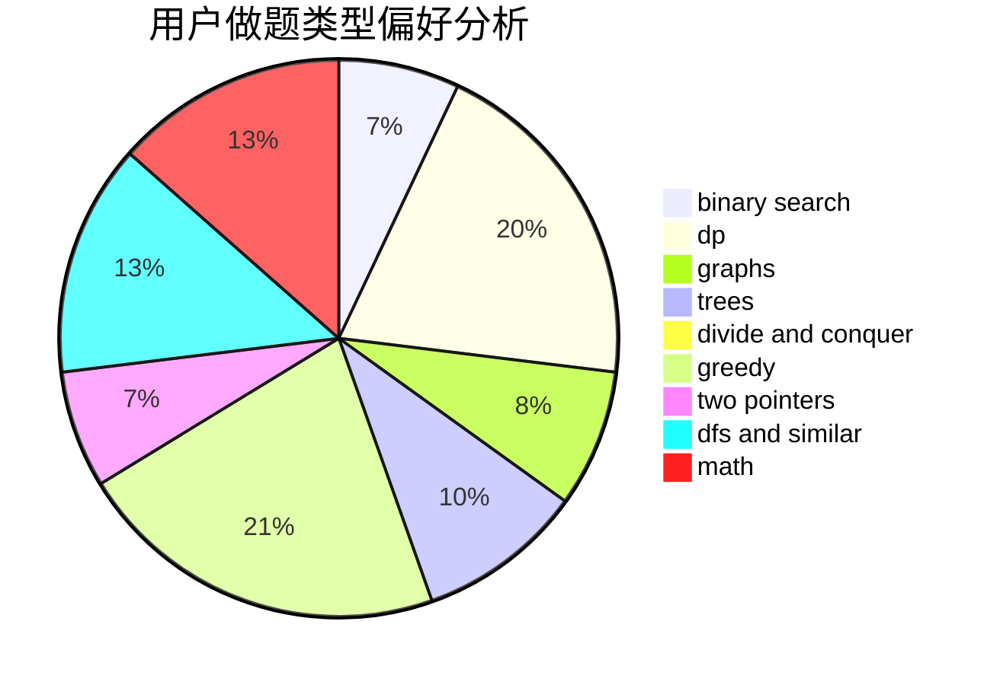

# aya_uchida

<!-- tabs:start -->

#### **用户提交结果分析**

#### **用户做题类型偏好分析**

<!-- tabs:end -->
# 推荐题目
[1148B](https://codeforces.com/contest/1148/problem/B)
[1114A](https://codeforces.com/contest/1114/problem/A)
[1156D](https://codeforces.com/contest/1156/problem/D)
[498B](https://codeforces.com/contest/498/problem/B)
[701A](https://codeforces.com/contest/701/problem/A)
[1344B](https://codeforces.com/contest/1344/problem/B)
[915E](https://codeforces.com/contest/915/problem/E)
[1489D](https://codeforces.com/contest/1489/problem/D)
[506E](https://codeforces.com/contest/506/problem/E)
[567A](https://codeforces.com/contest/567/problem/A)
