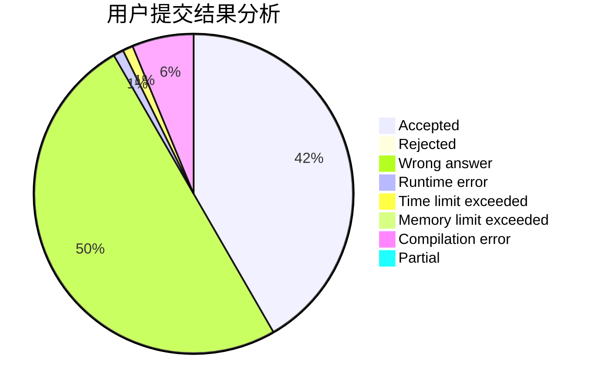
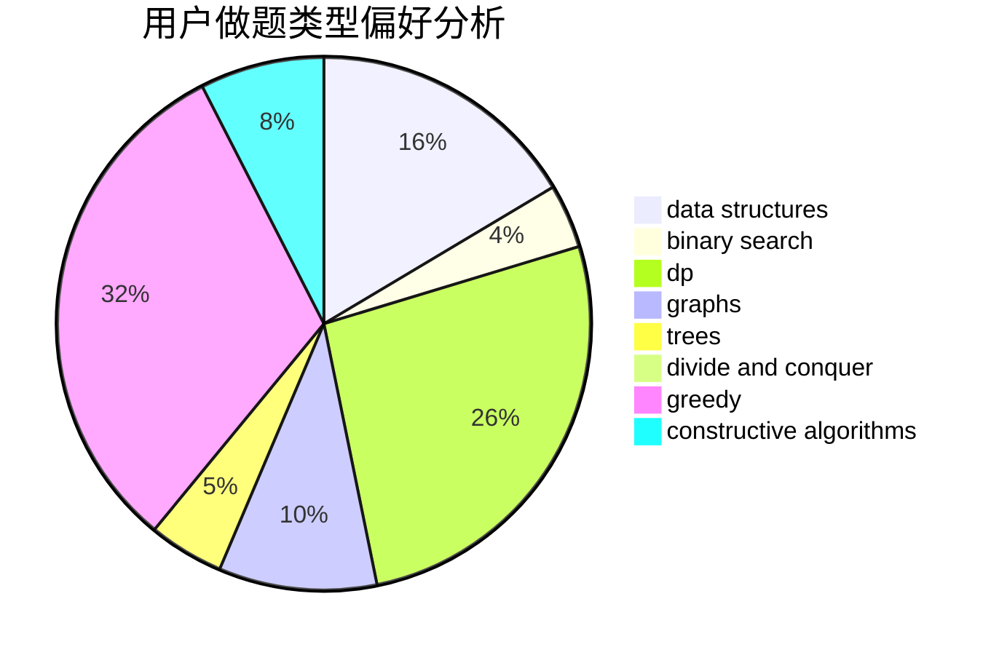
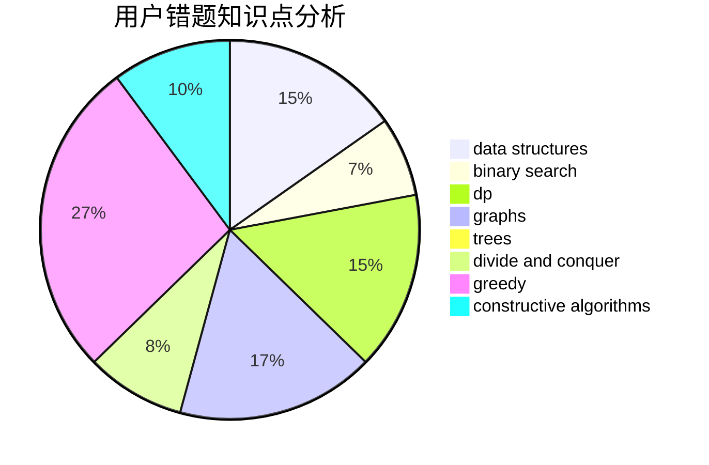

# aya_uchida

<!-- tabs:start -->

#### **用户提交结果分析**

#### **用户做题类型偏好分析**

#### **用户错题知识点分析**

<!-- tabs:end -->
# 推荐题目
[1148B](https://codeforces.com/contest/1148/problem/B)		binary search,
                        brute force,
                        two pointers		  
[1114A](https://codeforces.com/contest/1114/problem/A)		brute force,
                        greedy,
                        implementation		  
[1156D](https://codeforces.com/contest/1156/problem/D)		dfs and similar,
                        divide and conquer,
                        dp,
                        dsu,
                        trees		  
[498B](https://codeforces.com/contest/498/problem/B)		dp,
                        probabilities,
                        two pointers		  
[701A](https://codeforces.com/contest/701/problem/A)		greedy,
                        implementation		  
[1344B](https://codeforces.com/contest/1344/problem/B)		constructive algorithms,
                        dfs and similar,
                        dsu,
                        graphs		  
[915E](https://codeforces.com/contest/915/problem/E)		data structures,
                        implementation,
                        sortings		  
[1489D](https://codeforces.com/contest/1489/problem/D)		dsu,graphs,sortings,trees		  
[506E](https://codeforces.com/contest/506/problem/E)		combinatorics,
                        dp,
                        matrices,
                        strings		  
[567A](https://codeforces.com/contest/567/problem/A)		greedy,
                        implementation		  
