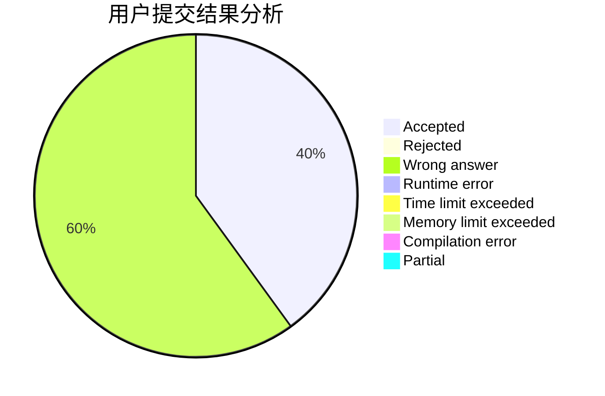
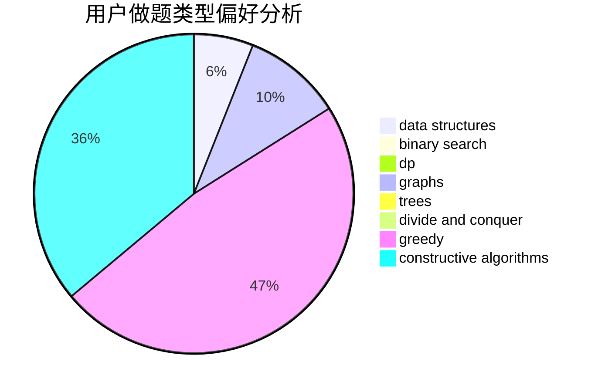

# ayatsuji_tsukasa

<!-- tabs:start -->

#### **用户提交结果分析**

#### **用户做题类型偏好分析**

#### **用户错题知识点分析**

<!-- tabs:end -->
# 推荐题目
[1485E](https://codeforces.com/contest/1485/problem/E)		dfs and similar,
                        dp,
                        greedy,
                        trees		  
[314C](https://codeforces.com/contest/314/problem/C)		data structures,
                        dp		  
[782A](https://codeforces.com/contest/782/problem/A)		dsu,graphs,sortings,trees		  
[730J](https://codeforces.com/contest/730/problem/J)		dp		  
[1040A](https://codeforces.com/contest/1040/problem/A)		greedy		  
[870B](https://codeforces.com/contest/870/problem/B)		greedy		  
[98D](https://codeforces.com/contest/98/problem/D)		constructive algorithms		  
[1252L](https://codeforces.com/contest/1252/problem/L)		flows,
                        graphs		  
[55C](https://codeforces.com/contest/55/problem/C)		games		  
[992A](https://codeforces.com/contest/992/problem/A)		implementation,
                        sortings		  
