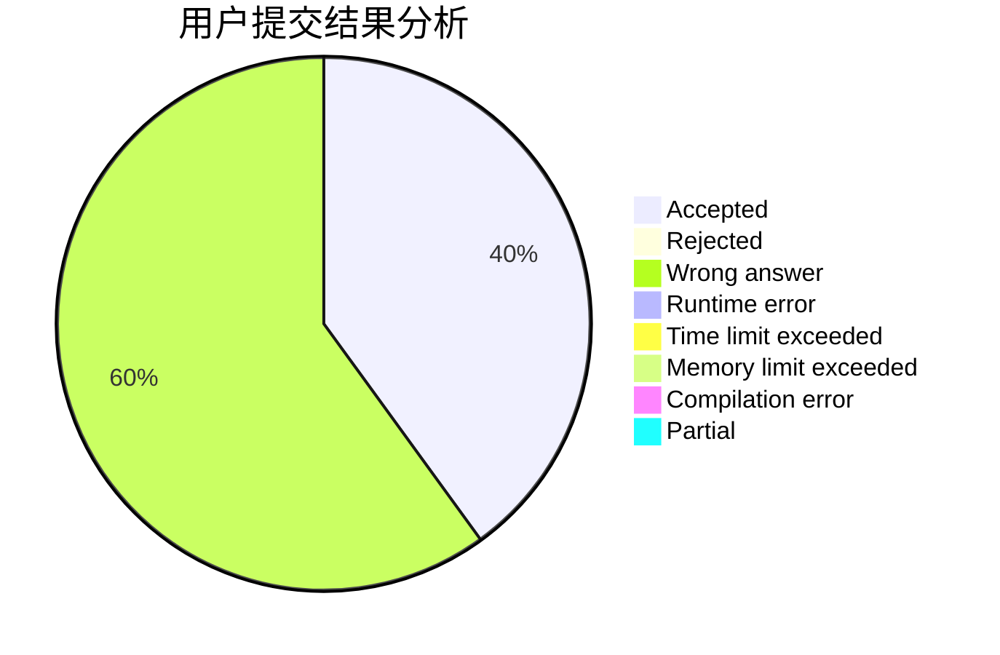
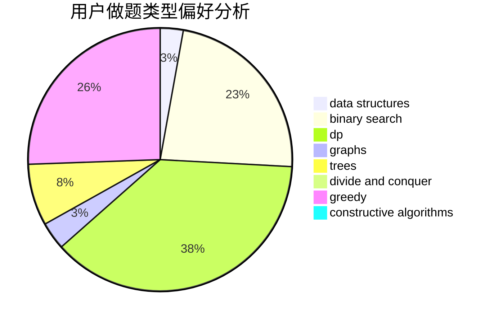

# ayatsuji_tsukasa

<!-- tabs:start -->

#### **用户提交结果分析**

#### **用户做题类型偏好分析**

#### **用户错题知识点分析**

<!-- tabs:end -->
# 推荐题目
[1476G](https://codeforces.com/contest/1476/problem/G)		data structures,
                        hashing,
                        sortings,
                        two pointers		  
[297D](https://codeforces.com/contest/297/problem/D)		constructive algorithms		  
[763C](https://codeforces.com/contest/763/problem/C)		brute force,
                        implementation,
                        math,
                        number theory		  
[710F](https://codeforces.com/contest/710/problem/F)		brute force,
                        data structures,
                        hashing,
                        interactive,
                        string suffix structures,
                        strings		  
[103C](https://codeforces.com/contest/103/problem/C)		constructive algorithms,
                        greedy		  
[852A](https://codeforces.com/contest/852/problem/A)		brute force,
                        implementation,
                        math		  
[975E](https://codeforces.com/contest/975/problem/E)		geometry		  
[1249C1](https://codeforces.com/contest/1249C/problem/1)		brute force,
                        greedy,
                        implementation		  
[538H](https://codeforces.com/contest/538/problem/H)		2-sat,
                        data structures,
                        dfs and similar,
                        greedy		  
[978C](https://codeforces.com/contest/978/problem/C)		binary search,
                        implementation,
                        two pointers		  
