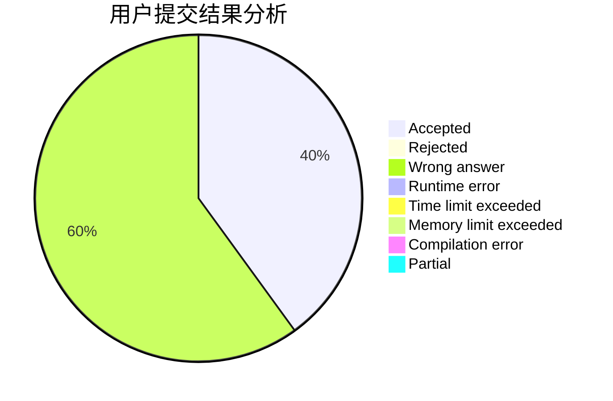
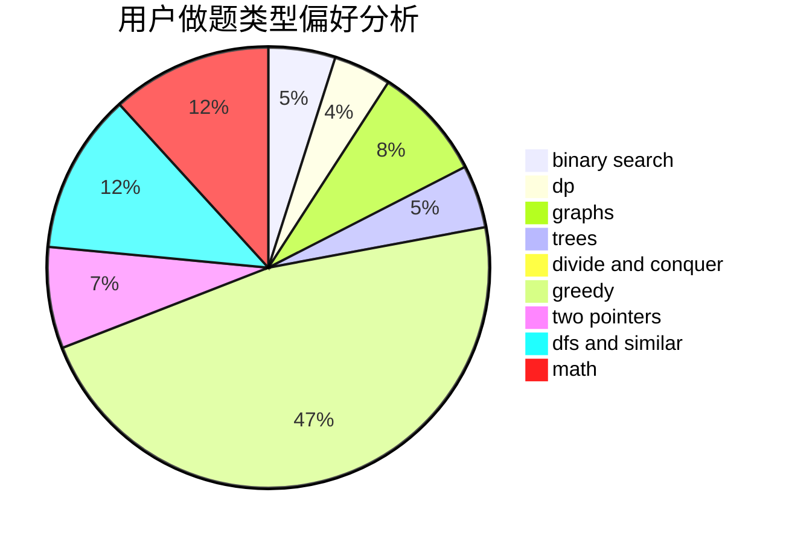

# ayatsuji_tsukasa

<!-- tabs:start -->

#### **用户提交结果分析**

#### **用户做题类型偏好分析**

<!-- tabs:end -->
# 推荐题目
[1485E](https://codeforces.com/contest/1485/problem/E)
[314C](https://codeforces.com/contest/314/problem/C)
[782A](https://codeforces.com/contest/782/problem/A)
[730J](https://codeforces.com/contest/730/problem/J)
[1040A](https://codeforces.com/contest/1040/problem/A)
[870B](https://codeforces.com/contest/870/problem/B)
[98D](https://codeforces.com/contest/98/problem/D)
[1252L](https://codeforces.com/contest/1252/problem/L)
[55C](https://codeforces.com/contest/55/problem/C)
[992A](https://codeforces.com/contest/992/problem/A)
