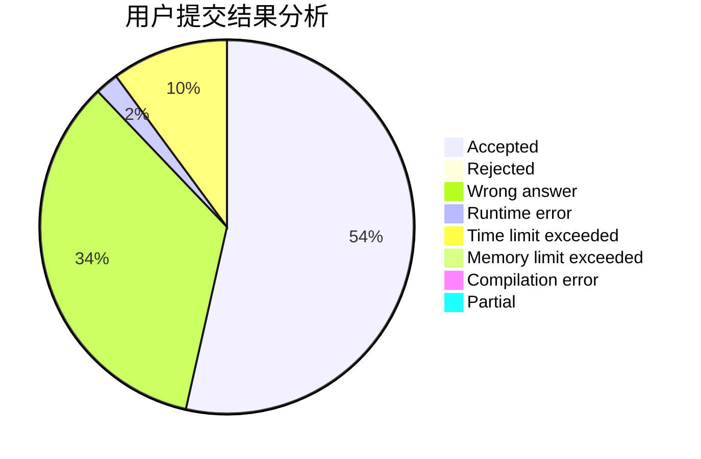
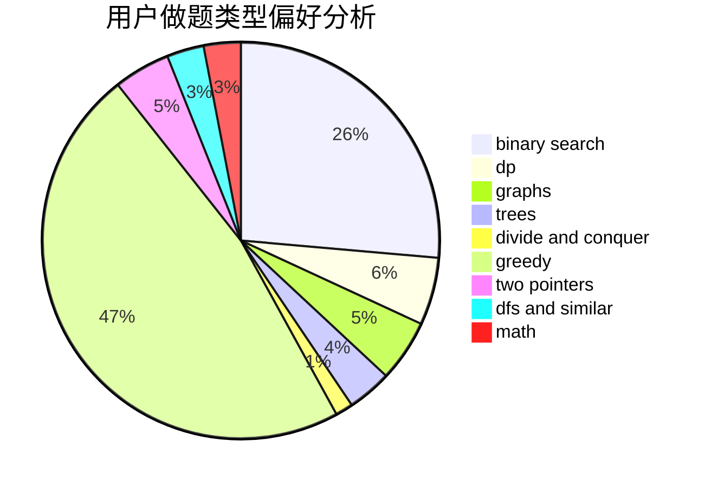

# b6e0

<!-- tabs:start -->

#### **用户提交结果分析**

#### **用户做题类型偏好分析**

<!-- tabs:end -->
# 推荐题目
[388C](https://codeforces.com/contest/388/problem/C)
[1090D](https://codeforces.com/contest/1090/problem/D)
[758B](https://codeforces.com/contest/758/problem/B)
[1138A](https://codeforces.com/contest/1138/problem/A)
[800B](https://codeforces.com/contest/800/problem/B)
[975D](https://codeforces.com/contest/975/problem/D)
[1000C](https://codeforces.com/contest/1000/problem/C)
[319B](https://codeforces.com/contest/319/problem/B)
[261B](https://codeforces.com/contest/261/problem/B)
[472A](https://codeforces.com/contest/472/problem/A)
