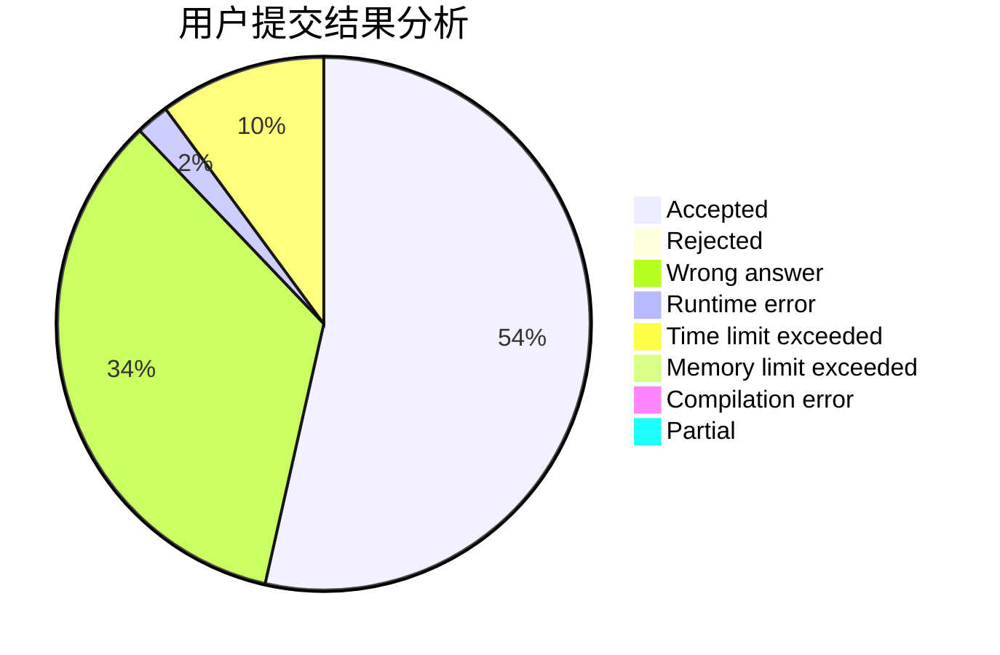
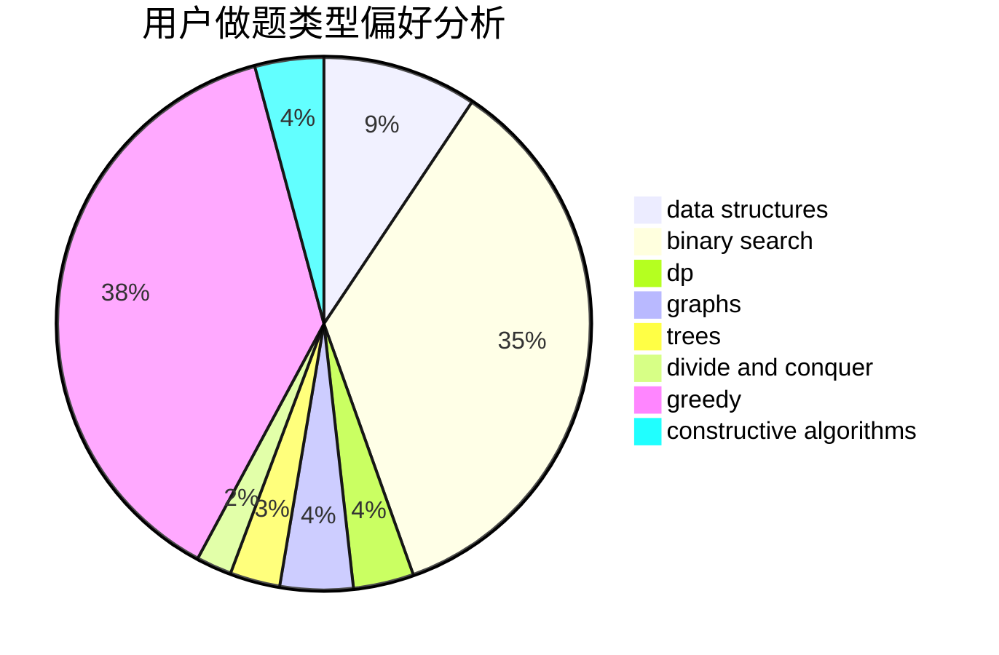
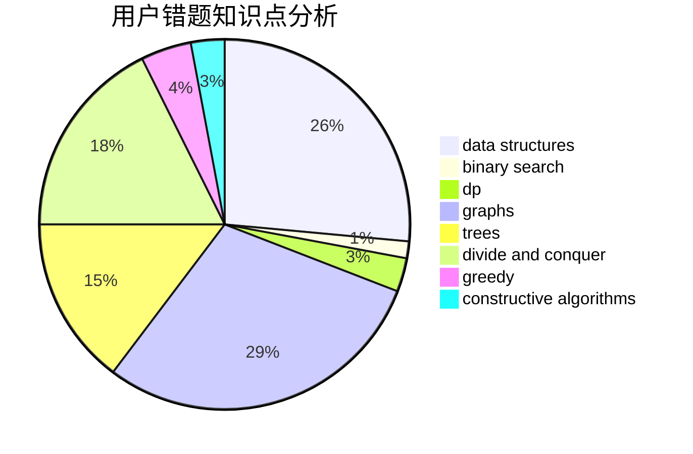

# b6e0

<!-- tabs:start -->

#### **用户提交结果分析**

#### **用户做题类型偏好分析**

#### **用户错题知识点分析**

<!-- tabs:end -->
# 推荐题目
[388C](https://codeforces.com/contest/388/problem/C)		games,
                        greedy,
                        sortings		  
[1090D](https://codeforces.com/contest/1090/problem/D)		constructive algorithms		  
[758B](https://codeforces.com/contest/758/problem/B)		brute force,
                        implementation,
                        number theory		  
[1138A](https://codeforces.com/contest/1138/problem/A)		binary search,
                        greedy,
                        implementation		  
[800B](https://codeforces.com/contest/800/problem/B)		dsu,graphs,sortings,trees		  
[975D](https://codeforces.com/contest/975/problem/D)		geometry,
                        math		  
[1000C](https://codeforces.com/contest/1000/problem/C)		data structures,
                        implementation,
                        sortings		  
[319B](https://codeforces.com/contest/319/problem/B)		data structures,
                        implementation		  
[261B](https://codeforces.com/contest/261/problem/B)		dp,
                        math,
                        probabilities		  
[472A](https://codeforces.com/contest/472/problem/A)		math,
                        number theory		  
