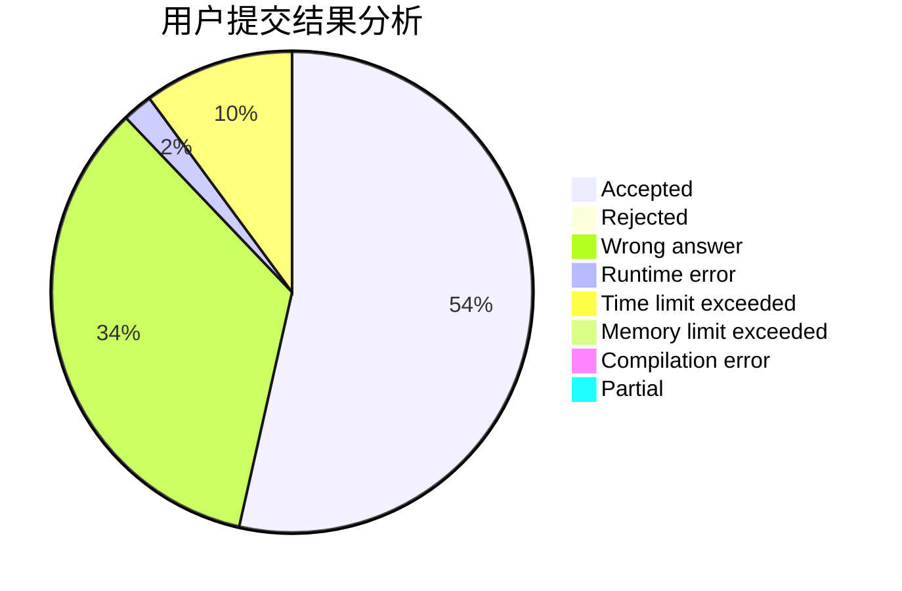
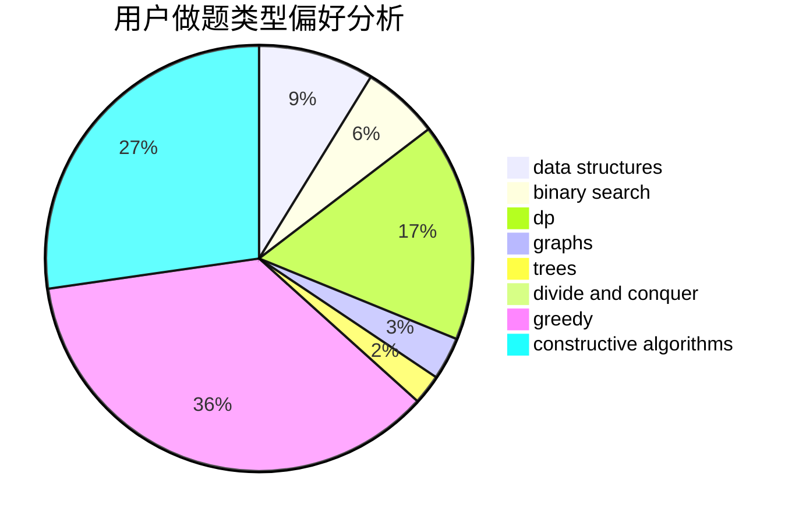
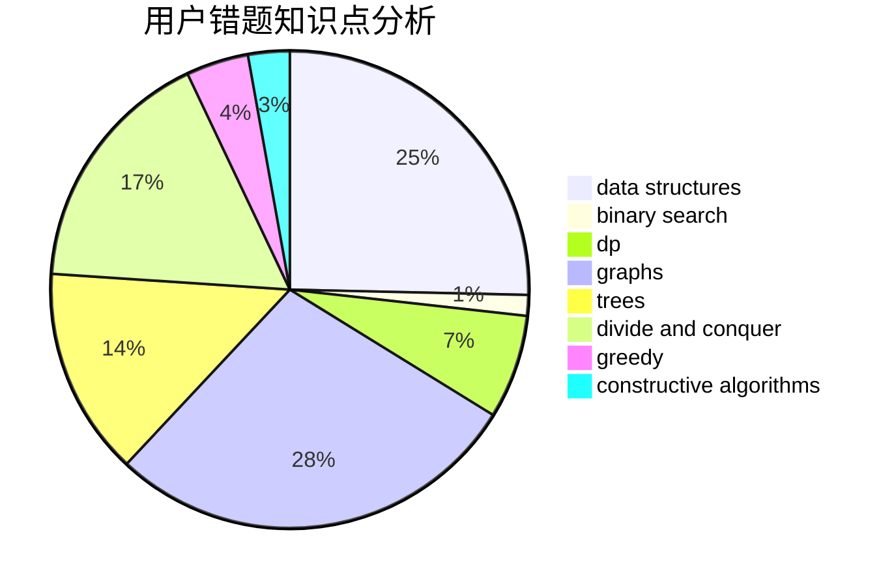

# b6e0

<!-- tabs:start -->

#### **用户提交结果分析**

#### **用户做题类型偏好分析**

#### **用户错题知识点分析**

<!-- tabs:end -->
# 推荐题目
[360B](https://codeforces.com/contest/360/problem/B)		binary search,
                        dp		  
[108C](https://codeforces.com/contest/108/problem/C)		dsu,graphs,sortings,trees		  
[736D](https://codeforces.com/contest/736/problem/D)		math,
                        matrices		  
[1133F1](https://codeforces.com/contest/1133F/problem/1)		graphs		  
[782C](https://codeforces.com/contest/782/problem/C)		dsu,graphs,sortings,trees		  
[952E](https://codeforces.com/contest/952/problem/E)		nan		  
[1000C](https://codeforces.com/contest/1000/problem/C)		data structures,
                        implementation,
                        sortings		  
[300D](https://codeforces.com/contest/300/problem/D)		dp,
                        fft		  
[23E](https://codeforces.com/contest/23/problem/E)		dp		  
[44G](https://codeforces.com/contest/44/problem/G)		data structures,
                        implementation		  
