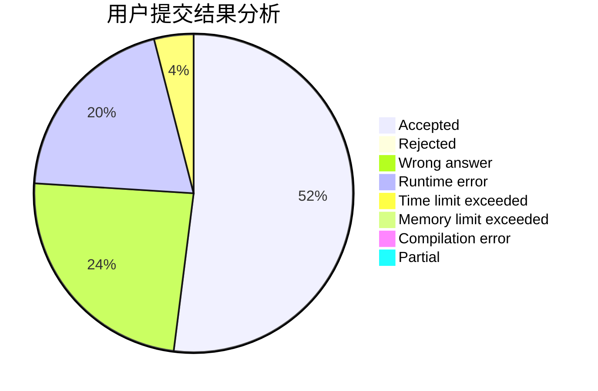
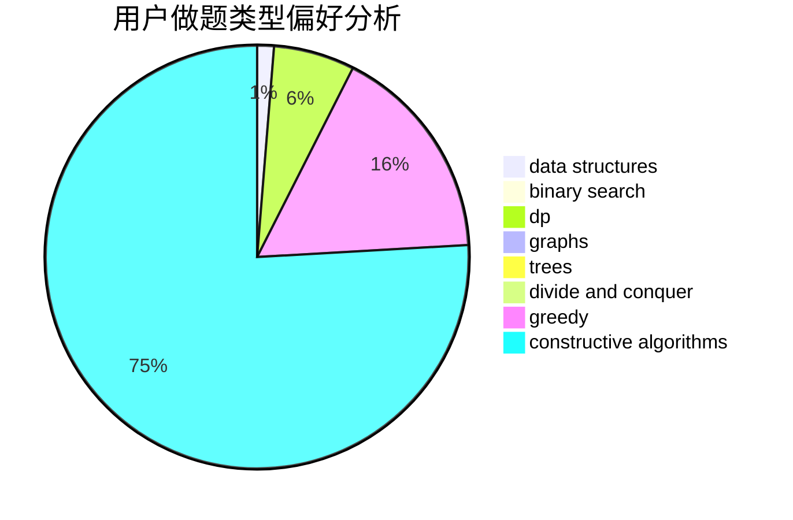

# bO_Od

<!-- tabs:start -->

#### **用户提交结果分析**

#### **用户做题类型偏好分析**

#### **用户错题知识点分析**

<!-- tabs:end -->
# 推荐题目
[1501E](https://codeforces.com/contest/1501/problem/E)		dsu,graphs,sortings,trees		  
[156C](https://codeforces.com/contest/156/problem/C)		combinatorics,
                        dp		  
[864C](https://codeforces.com/contest/864/problem/C)		greedy,
                        implementation,
                        math		  
[6C](https://codeforces.com/contest/6/problem/C)		greedy,
                        two pointers		  
[1506A](https://codeforces.com/contest/1506/problem/A)		math		  
[1506B](https://codeforces.com/contest/1506/problem/B)		greedy,
                        implementation		  
[1254E](https://codeforces.com/contest/1254/problem/E)		combinatorics,
                        dfs and similar,
                        dsu,
                        trees		  
[289B](https://codeforces.com/contest/289/problem/B)		brute force,
                        dp,
                        implementation,
                        sortings,
                        ternary search		  
[815E](https://codeforces.com/contest/815/problem/E)		binary search,
                        constructive algorithms,
                        implementation		  
[1206B](https://codeforces.com/contest/1206/problem/B)		dp,
                        implementation		  
