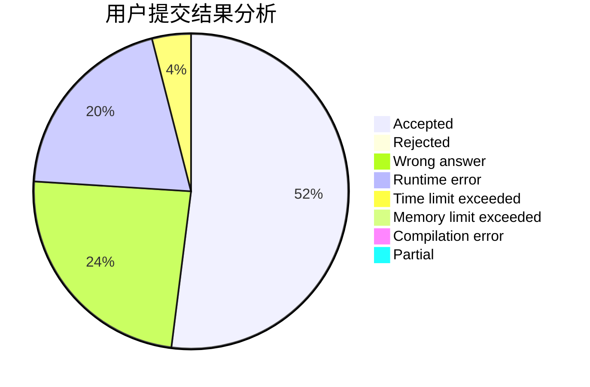
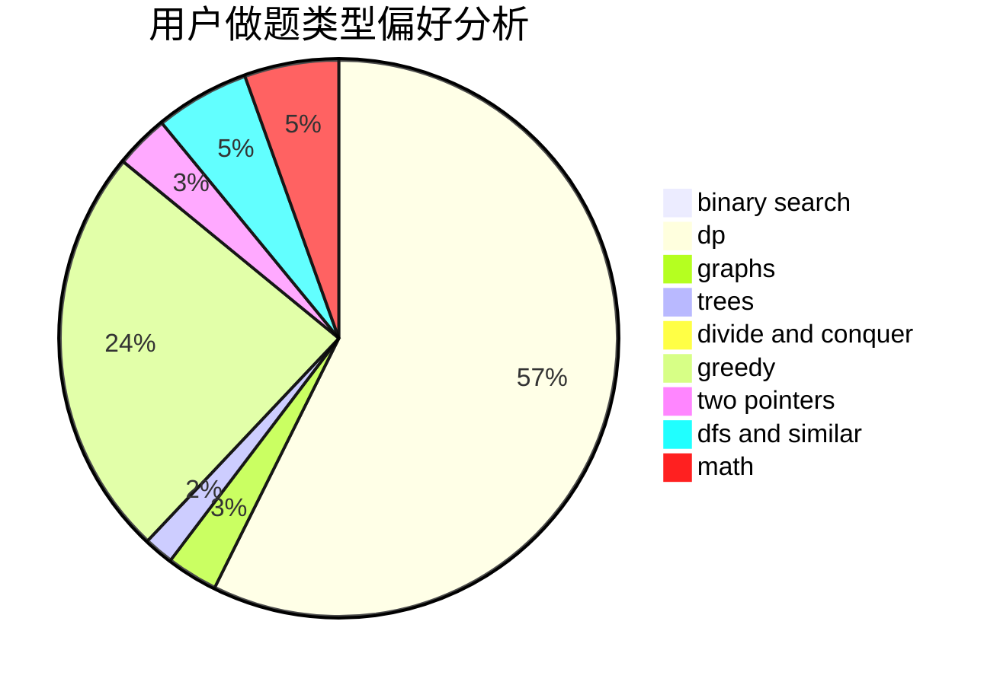

# bO_Od

<!-- tabs:start -->

#### **用户提交结果分析**

#### **用户做题类型偏好分析**

<!-- tabs:end -->
# 推荐题目
[1511F](https://codeforces.com/contest/1511/problem/F)
[1771](https://codeforces.com/contest/177/problem/1)
[883M](https://codeforces.com/contest/883/problem/M)
[717E](https://codeforces.com/contest/717/problem/E)
[157B](https://codeforces.com/contest/157/problem/B)
[157C](https://codeforces.com/contest/157/problem/C)
[12622](https://codeforces.com/contest/1262/problem/2)
[303B](https://codeforces.com/contest/303/problem/B)
[835A](https://codeforces.com/contest/835/problem/A)
[1210C](https://codeforces.com/contest/1210/problem/C)
