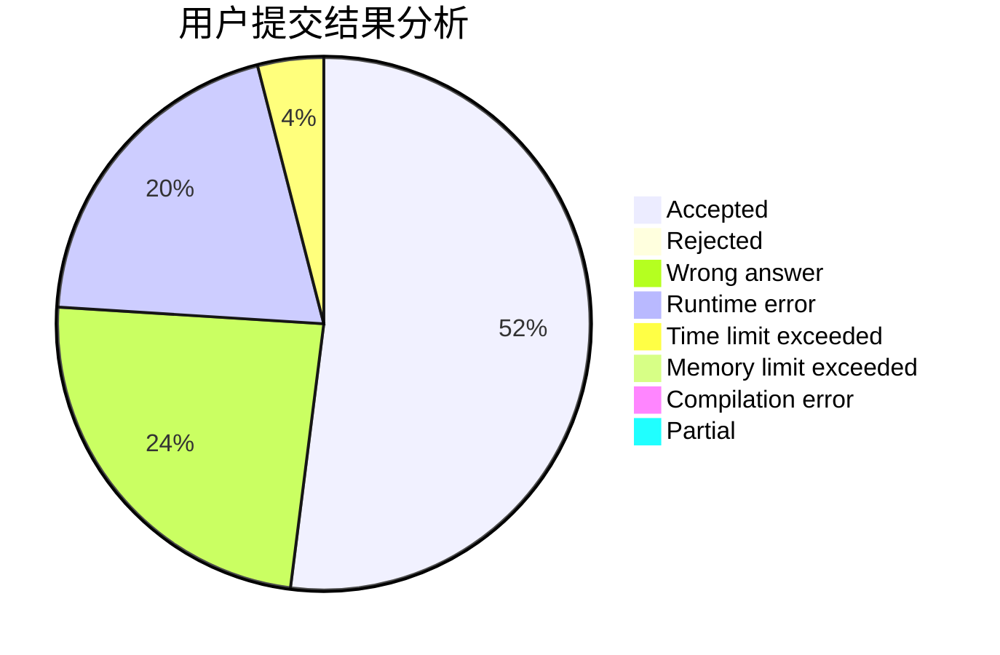
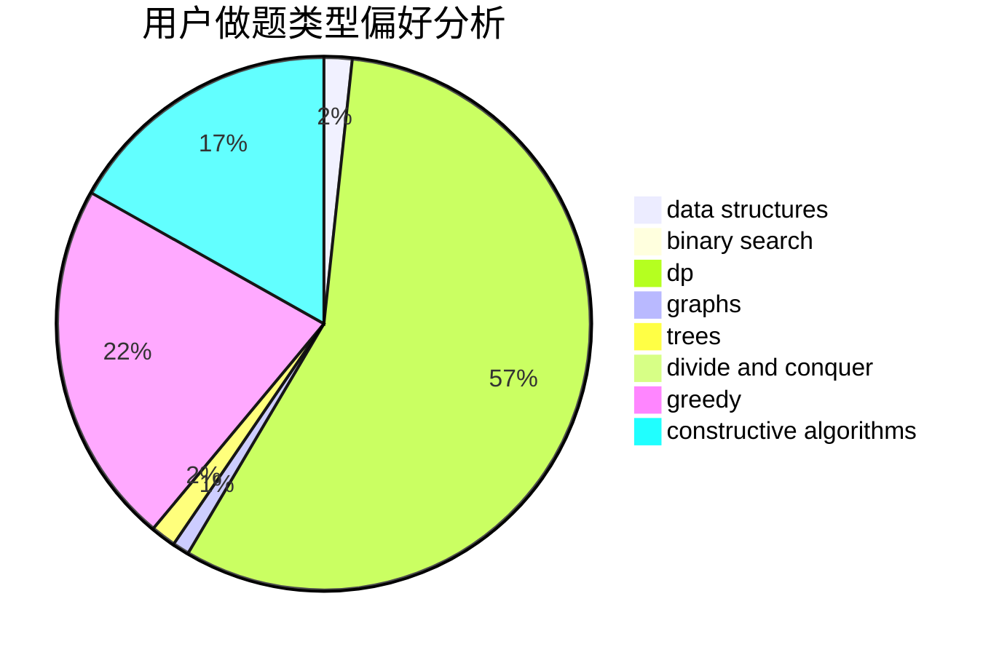
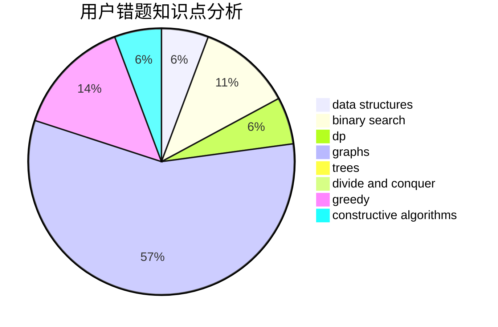

# bO_Od

<!-- tabs:start -->

#### **用户提交结果分析**

#### **用户做题类型偏好分析**

#### **用户错题知识点分析**

<!-- tabs:end -->
# 推荐题目
[1511F](https://codeforces.com/contest/1511/problem/F)		brute force,
                        data structures,
                        dp,
                        matrices,
                        string suffix structures,
                        strings		  
[1771](https://codeforces.com/contest/177/problem/1)		dsu,graphs,sortings,trees		  
[883M](https://codeforces.com/contest/883/problem/M)		greedy,
                        math		  
[717E](https://codeforces.com/contest/717/problem/E)		dfs and similar		  
[157B](https://codeforces.com/contest/157/problem/B)		geometry,
                        sortings		  
[157C](https://codeforces.com/contest/157/problem/C)		dsu,graphs,sortings,trees		  
[12622](https://codeforces.com/contest/1262/problem/2)		dsu,graphs,sortings,trees		  
[303B](https://codeforces.com/contest/303/problem/B)		implementation,
                        math		  
[835A](https://codeforces.com/contest/835/problem/A)		math		  
[1210C](https://codeforces.com/contest/1210/problem/C)		math,
                        number theory,
                        trees		  
