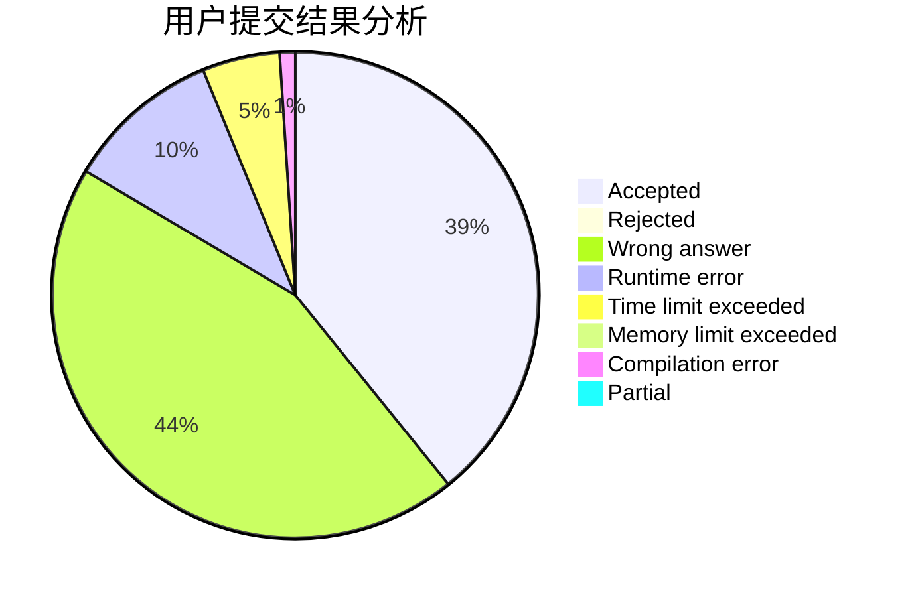
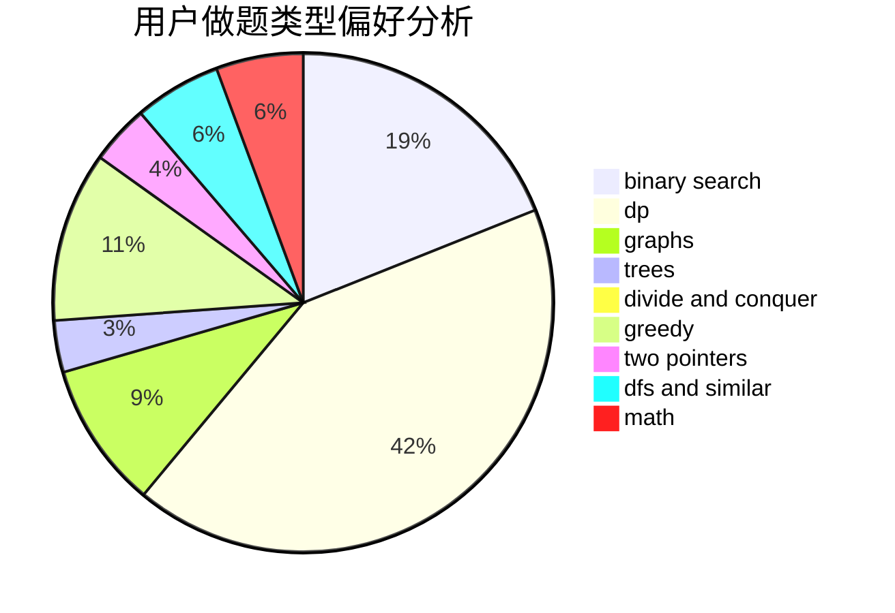

# An_Account

<!-- tabs:start -->

#### **用户提交结果分析**

#### **用户做题类型偏好分析**

<!-- tabs:end -->
# 推荐题目
[1270C](https://codeforces.com/contest/1270/problem/C)
[1227B](https://codeforces.com/contest/1227/problem/B)
[339A](https://codeforces.com/contest/339/problem/A)
[339B](https://codeforces.com/contest/339/problem/B)
[33D](https://codeforces.com/contest/33/problem/D)
[341C](https://codeforces.com/contest/341/problem/C)
[290B](https://codeforces.com/contest/290/problem/B)
[33A](https://codeforces.com/contest/33/problem/A)
[263C](https://codeforces.com/contest/263/problem/C)
[1250C](https://codeforces.com/contest/1250/problem/C)
