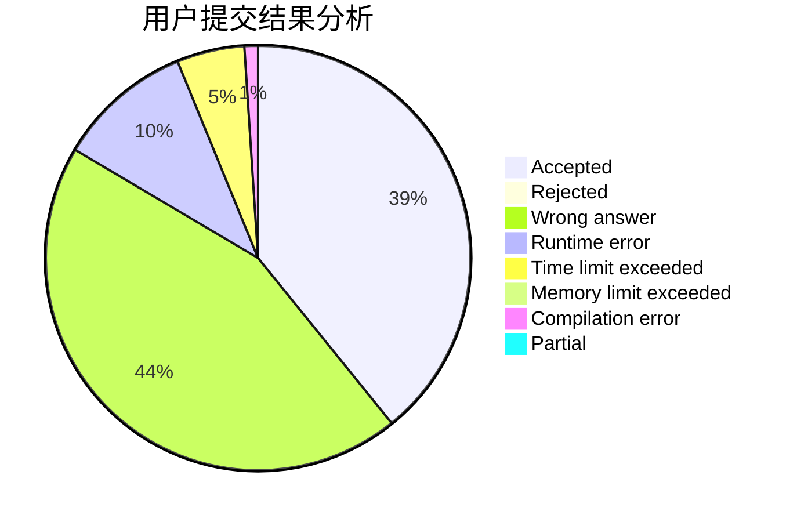
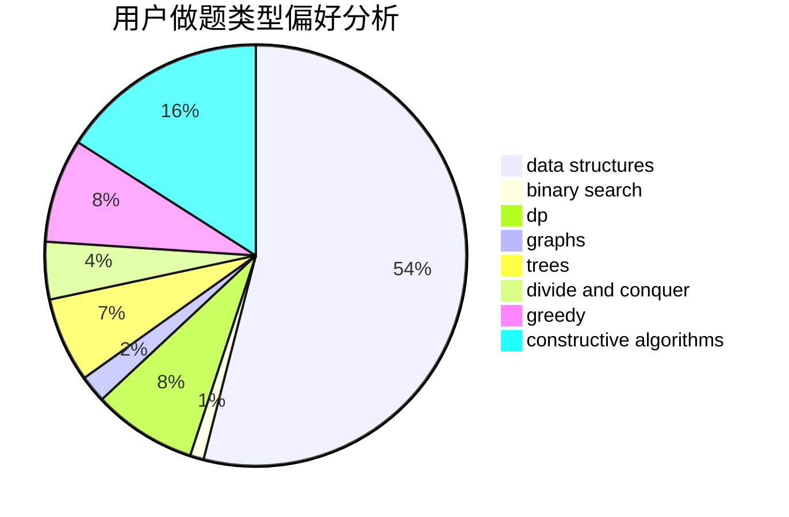
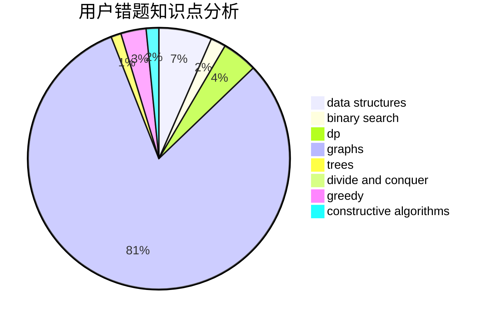

# An_Account

<!-- tabs:start -->

#### **用户提交结果分析**

#### **用户做题类型偏好分析**

#### **用户错题知识点分析**

<!-- tabs:end -->
# 推荐题目
[1264D2](https://codeforces.com/contest/1264D/problem/2)		combinatorics,
                        probabilities		  
[121D](https://codeforces.com/contest/121/problem/D)		binary search,
                        implementation,
                        two pointers		  
[314B](https://codeforces.com/contest/314/problem/B)		binary search,
                        dfs and similar,
                        strings		  
[314C](https://codeforces.com/contest/314/problem/C)		data structures,
                        dp		  
[316B2](https://codeforces.com/contest/316B/problem/2)		dfs and similar,
                        dp		  
[316C2](https://codeforces.com/contest/316C/problem/2)		flows,
                        graph matchings		  
[275B](https://codeforces.com/contest/275/problem/B)		constructive algorithms,
                        implementation		  
[316A2](https://codeforces.com/contest/316A/problem/2)		math		  
[241E](https://codeforces.com/contest/241/problem/E)		graphs,
                        shortest paths		  
[1245A](https://codeforces.com/contest/1245/problem/A)		math,
                        number theory		  
