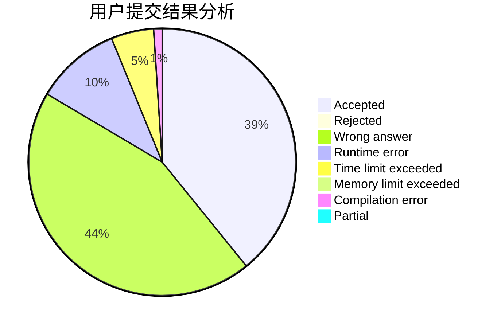
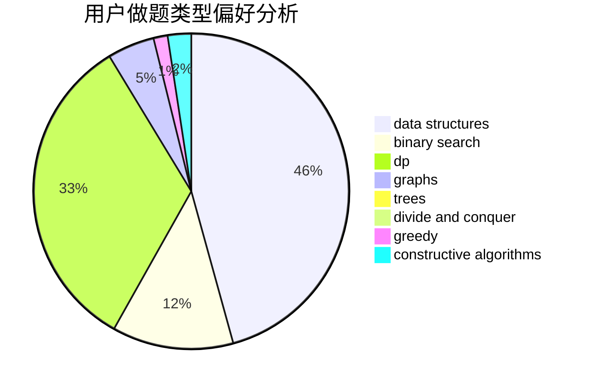
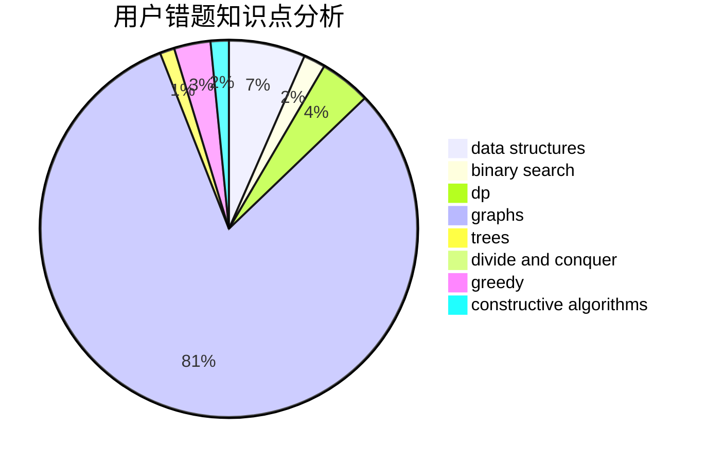

# An_Account

<!-- tabs:start -->

#### **用户提交结果分析**

#### **用户做题类型偏好分析**

#### **用户错题知识点分析**

<!-- tabs:end -->
# 推荐题目
[1270C](https://codeforces.com/contest/1270/problem/C)		bitmasks,
                        constructive algorithms,
                        math		  
[1227B](https://codeforces.com/contest/1227/problem/B)		constructive algorithms		  
[339A](https://codeforces.com/contest/339/problem/A)		greedy,
                        implementation,
                        sortings,
                        strings		  
[339B](https://codeforces.com/contest/339/problem/B)		implementation		  
[33D](https://codeforces.com/contest/33/problem/D)		geometry,
                        graphs,
                        shortest paths,
                        sortings		  
[341C](https://codeforces.com/contest/341/problem/C)		dsu,graphs,sortings,trees		  
[290B](https://codeforces.com/contest/290/problem/B)		*special problem,
                        implementation		  
[33A](https://codeforces.com/contest/33/problem/A)		greedy,
                        implementation		  
[263C](https://codeforces.com/contest/263/problem/C)		brute force,
                        dfs and similar,
                        implementation		  
[1250C](https://codeforces.com/contest/1250/problem/C)		data structures		  
