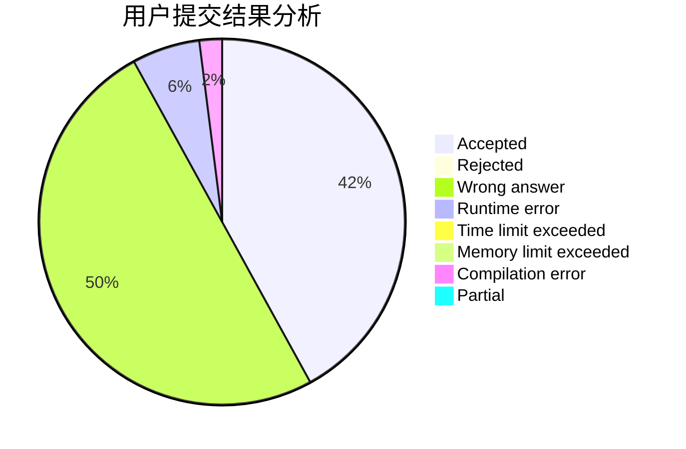
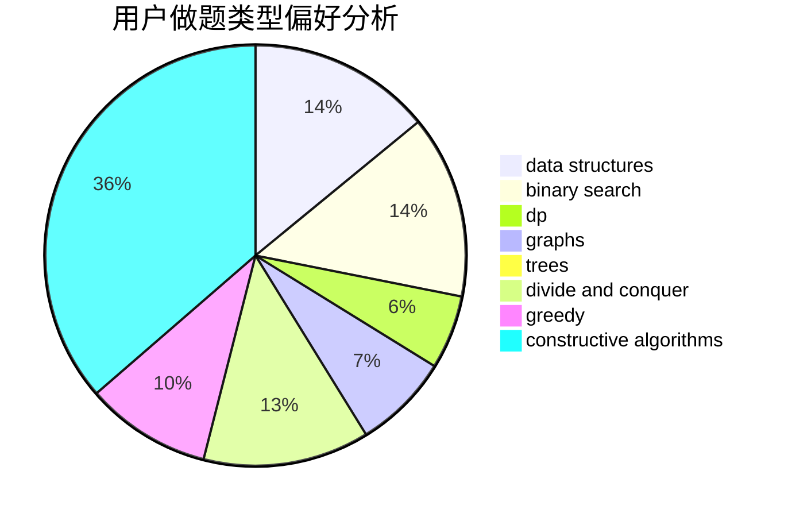
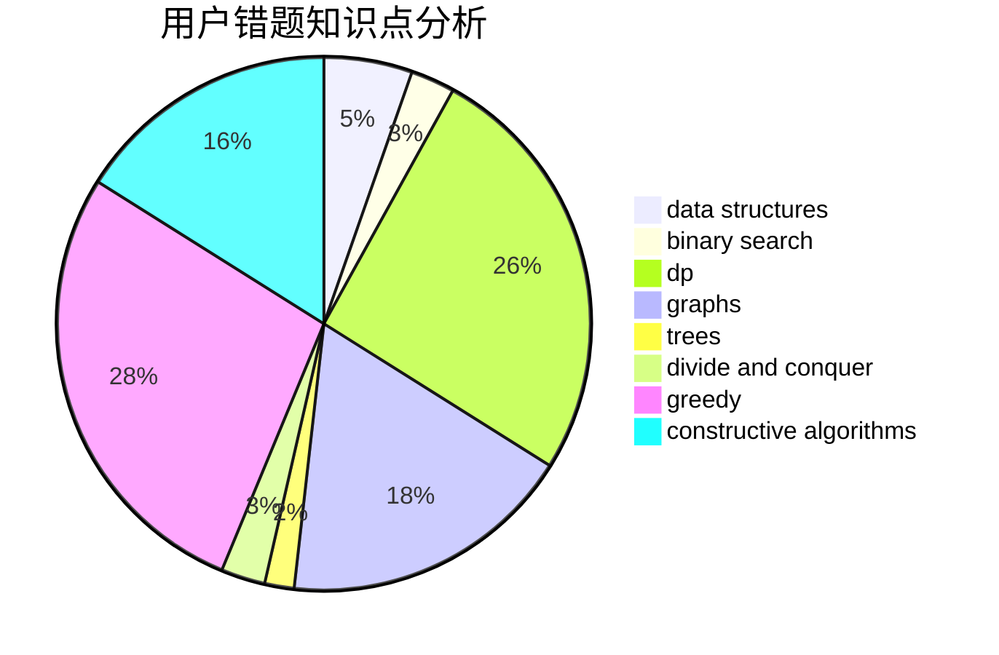

# backcloud
<!-- tabs:start -->
#### **用户提交结果分析**

#### **用户做题类型偏好分析**

#### **用户错题知识点分析**

<!-- tabs:end -->
# 推荐题目
[Heidi and Library (medium)](http://codeforces.com/problemset/problem/802/B)		data structures,
                        greedy		  
[New Year Transportation](http://codeforces.com/problemset/problem/500/A)		dfs and similar,
                        graphs,
                        implementation		  
[Color the Carpet](http://codeforces.com/problemset/problem/297/D)		constructive algorithms		  
[Intellectual Inquiry](http://codeforces.com/problemset/problem/645/E)		dp,
                        greedy,
                        strings		  
[Shaass and Painter Robot](http://codeforces.com/problemset/problem/294/D)		brute force,
                        implementation,
                        number theory		  
[Rescue Nibel!](http://codeforces.com/problemset/problem/1420/D)		combinatorics,
                        data structures,
                        sortings		  
[Radio stations](http://codeforces.com/problemset/problem/762/E)		binary search,
                        data structures		  
[LIS of Sequence](http://codeforces.com/problemset/problem/486/E)		data structures,
                        dp,
                        greedy,
                        hashing,
                        math		  
[Pigeon d'Or](http://codeforces.com/problemset/problem/1145/D)		implementation		  
[Ultimate Weirdness of an Array](http://codeforces.com/problemset/problem/671/C)		data structures,
                        number theory		  
<!-- tabs:start -->
#### **data structures**
[Heidi and Library (medium)](http://codeforces.com/problemset/problem/802/B)		data structures,
                        greedy		  
[New Year Transportation](http://codeforces.com/problemset/problem/1420/D)		combinatorics,
                        data structures,
                        sortings		  
[Color the Carpet](http://codeforces.com/problemset/problem/762/E)		binary search,
                        data structures		  
[Intellectual Inquiry](http://codeforces.com/problemset/problem/486/E)		data structures,
                        dp,
                        greedy,
                        hashing,
                        math		  
[Shaass and Painter Robot](http://codeforces.com/problemset/problem/671/C)		data structures,
                        number theory		  
[Rescue Nibel!](http://codeforces.com/problemset/problem/808/B)		data structures,
                        implementation,
                        math		  
[Radio stations](http://codeforces.com/problemset/problem/622/C)		data structures,
                        implementation		  
[LIS of Sequence](http://codeforces.com/problemset/problem/1023/D)		constructive algorithms,
                        data structures		  
[Pigeon d'Or](https://codeforces.com/contest/966/problem/E)		data structures,
                        trees		  
[Ultimate Weirdness of an Array](http://codeforces.com/problemset/problem/1416/D)		data structures,
                        dsu,
                        graphs,
                        implementation,
                        trees		  
#### **binary search**
[Heidi and Library (medium)](http://codeforces.com/problemset/problem/762/E)		binary search,
                        data structures		  
[New Year Transportation](http://codeforces.com/problemset/problem/729/C)		binary search,
                        greedy,
                        sortings		  
[Color the Carpet](http://codeforces.com/problemset/problem/1427/H)		binary search,
                        games,
                        geometry,
                        ternary search		  
[Intellectual Inquiry](http://codeforces.com/problemset/problem/883/D)		binary search,
                        dp,
                        math		  
[Shaass and Painter Robot](http://codeforces.com/problemset/problem/1450/D)		binary search,
                        data structures,
                        greedy,
                        implementation,
                        two pointers		  
[Rescue Nibel!](http://codeforces.com/problemset/problem/1492/C)		binary search,
                        data structures,
                        dp,
                        greedy,
                        two pointers		  
[Radio stations](http://codeforces.com/problemset/problem/1463/D)		binary search,
                        constructive algorithms,
                        greedy,
                        two pointers		  
[LIS of Sequence](http://codeforces.com/problemset/problem/1490/G)		binary search,
                        data structures,
                        math		  
[Pigeon d'Or](http://codeforces.com/problemset/problem/1479/D)		binary search,
                        bitmasks,
                        brute force,
                        data structures,
                        probabilities,
                        trees		  
[Ultimate Weirdness of an Array](http://codeforces.com/problemset/problem/1436/E)		binary search,
                        data structures,
                        two pointers		  
#### **dp**
[Heidi and Library (medium)](http://codeforces.com/problemset/problem/645/E)		dp,
                        greedy,
                        strings		  
[New Year Transportation](http://codeforces.com/problemset/problem/486/E)		data structures,
                        dp,
                        greedy,
                        hashing,
                        math		  
[Color the Carpet](http://codeforces.com/problemset/problem/1151/F)		combinatorics,
                        dp,
                        matrices,
                        probabilities		  
[Intellectual Inquiry](http://codeforces.com/problemset/problem/414/B)		combinatorics,
                        dp,
                        number theory		  
[Shaass and Painter Robot](http://codeforces.com/problemset/problem/1082/F)		dp,
                        strings,
                        trees		  
[Rescue Nibel!](http://codeforces.com/problemset/problem/546/D)		constructive algorithms,
                        dp,
                        math,
                        number theory		  
[Radio stations](http://codeforces.com/problemset/problem/883/D)		binary search,
                        dp,
                        math		  
[LIS of Sequence](http://codeforces.com/problemset/problem/158/E)		*special problem,
                        dp,
                        sortings		  
[Pigeon d'Or](http://codeforces.com/problemset/problem/1492/C)		binary search,
                        data structures,
                        dp,
                        greedy,
                        two pointers		  
[Ultimate Weirdness of an Array](https://codeforces.com/contest/1457/problem/C)		brute force,
                        dp,
                        implementation		  
#### **graph**
[Heidi and Library (medium)](http://codeforces.com/problemset/problem/500/A)		dfs and similar,
                        graphs,
                        implementation		  
[New Year Transportation](https://codeforces.com/contest/1020/problem/E)		constructive algorithms,
                        graphs		  
[Color the Carpet](http://codeforces.com/problemset/problem/41/E)		constructive algorithms,
                        graphs,
                        greedy		  
[Intellectual Inquiry](http://codeforces.com/problemset/problem/1416/D)		data structures,
                        dsu,
                        graphs,
                        implementation,
                        trees		  
[Shaass and Painter Robot](http://codeforces.com/problemset/problem/1487/C)		brute force,
                        constructive algorithms,
                        dfs and similar,
                        graphs,
                        greedy,
                        implementation,
                        math		  
[Rescue Nibel!](http://codeforces.com/problemset/problem/1437/C)		dp,
                        flows,
                        graph matchings,
                        greedy,
                        math,
                        sortings		  
[Radio stations](http://codeforces.com/problemset/problem/1470/D)		constructive algorithms,
                        dfs and similar,
                        graph matchings,
                        graphs,
                        greedy		  
[LIS of Sequence](http://codeforces.com/problemset/problem/1476/C)		dp,
                        graphs,
                        greedy		  
[Pigeon d'Or](http://codeforces.com/problemset/problem/1304/D)		constructive algorithms,
                        graphs,
                        greedy,
                        two pointers		  
[Ultimate Weirdness of an Array](http://codeforces.com/problemset/problem/1475/C)		combinatorics,
                        graphs,
                        math		  
#### **trees**
[Heidi and Library (medium)](http://codeforces.com/problemset/problem/1082/F)		dp,
                        strings,
                        trees		  
[New Year Transportation](https://codeforces.com/contest/966/problem/E)		data structures,
                        trees		  
[Color the Carpet](http://codeforces.com/problemset/problem/1416/D)		data structures,
                        dsu,
                        graphs,
                        implementation,
                        trees		  
[Intellectual Inquiry](http://codeforces.com/problemset/problem/821/C)		data structures,
                        greedy,
                        trees		  
[Shaass and Painter Robot](http://codeforces.com/problemset/problem/1479/D)		binary search,
                        bitmasks,
                        brute force,
                        data structures,
                        probabilities,
                        trees		  
[Rescue Nibel!](http://codeforces.com/problemset/problem/1511/C)		brute force,
                        data structures,
                        implementation,
                        trees		  
[Radio stations](http://codeforces.com/problemset/problem/1499/F)		combinatorics,
                        dfs and similar,
                        dp,
                        trees		  
[LIS of Sequence](http://codeforces.com/problemset/problem/1491/E)		brute force,
                        dfs and similar,
                        divide and conquer,
                        number theory,
                        trees		  
[Pigeon d'Or](http://codeforces.com/problemset/problem/1466/D)		data structures,
                        greedy,
                        sortings,
                        trees		  
[Ultimate Weirdness of an Array](http://codeforces.com/problemset/problem/1495/D)		combinatorics,
                        dfs and similar,
                        graphs,
                        math,
                        shortest paths,
                        trees		  
#### **divide and conquer**
[Heidi and Library (medium)](http://codeforces.com/problemset/problem/1461/D)		binary search,
                        brute force,
                        data structures,
                        divide and conquer,
                        implementation,
                        sortings		  
[New Year Transportation](http://codeforces.com/problemset/problem/1466/G)		combinatorics,
                        divide and conquer,
                        hashing,
                        math,
                        string suffix structures,
                        strings		  
[Color the Carpet](http://codeforces.com/problemset/problem/1490/D)		dfs and similar,
                        divide and conquer,
                        implementation		  
[Intellectual Inquiry](https://codeforces.com/contest/1483/problem/C)		data structures,
                        divide and conquer,
                        dp		  
[Shaass and Painter Robot](http://codeforces.com/problemset/problem/1491/E)		brute force,
                        dfs and similar,
                        divide and conquer,
                        number theory,
                        trees		  
[Rescue Nibel!](http://codeforces.com/problemset/problem/1303/G)		data structures,
                        divide and conquer,
                        geometry,
                        trees		  
[Radio stations](http://codeforces.com/problemset/problem/1494/D)		constructive algorithms,
                        data structures,
                        dfs and similar,
                        divide and conquer,
                        dsu,
                        greedy,
                        sortings,
                        trees		  
[LIS of Sequence](http://codeforces.com/problemset/problem/1482/E)		data structures,
                        divide and conquer,
                        dp		  
[Pigeon d'Or](http://codeforces.com/problemset/problem/566/C)		dfs and similar,
                        divide and conquer,
                        trees		  
[Ultimate Weirdness of an Array](http://codeforces.com/problemset/problem/1428/F)		binary search,
                        data structures,
                        divide and conquer,
                        dp,
                        two pointers		  
#### **greedy**
[Heidi and Library (medium)](http://codeforces.com/problemset/problem/802/B)		data structures,
                        greedy		  
[New Year Transportation](http://codeforces.com/problemset/problem/645/E)		dp,
                        greedy,
                        strings		  
[Color the Carpet](http://codeforces.com/problemset/problem/486/E)		data structures,
                        dp,
                        greedy,
                        hashing,
                        math		  
[Intellectual Inquiry](https://codeforces.com/contest/298/problem/D)		constructive algorithms,
                        greedy		  
[Shaass and Painter Robot](http://codeforces.com/problemset/problem/41/E)		constructive algorithms,
                        graphs,
                        greedy		  
[Rescue Nibel!](http://codeforces.com/problemset/problem/729/C)		binary search,
                        greedy,
                        sortings		  
[Radio stations](http://codeforces.com/problemset/problem/58/A)		greedy,
                        strings		  
[LIS of Sequence](http://codeforces.com/problemset/problem/821/C)		data structures,
                        greedy,
                        trees		  
[Pigeon d'Or](http://codeforces.com/problemset/problem/1492/E)		brute force,
                        constructive algorithms,
                        dfs and similar,
                        greedy,
                        implementation		  
[Ultimate Weirdness of an Array](http://codeforces.com/problemset/problem/1450/D)		binary search,
                        data structures,
                        greedy,
                        implementation,
                        two pointers		  
#### **constructive algorithms**
[Heidi and Library (medium)](http://codeforces.com/problemset/problem/297/D)		constructive algorithms		  
[New Year Transportation](https://codeforces.com/contest/1020/problem/E)		constructive algorithms,
                        graphs		  
[Color the Carpet](http://codeforces.com/problemset/problem/581/D)		bitmasks,
                        brute force,
                        constructive algorithms,
                        geometry,
                        implementation,
                        math		  
[Intellectual Inquiry](https://codeforces.com/contest/298/problem/D)		constructive algorithms,
                        greedy		  
[Shaass and Painter Robot](http://codeforces.com/problemset/problem/41/E)		constructive algorithms,
                        graphs,
                        greedy		  
[Rescue Nibel!](http://codeforces.com/problemset/problem/1023/D)		constructive algorithms,
                        data structures		  
[Radio stations](http://codeforces.com/problemset/problem/488/B)		brute force,
                        constructive algorithms,
                        math		  
[LIS of Sequence](http://codeforces.com/problemset/problem/7/A)		brute force,
                        constructive algorithms		  
[Pigeon d'Or](http://codeforces.com/problemset/problem/546/D)		constructive algorithms,
                        dp,
                        math,
                        number theory		  
[Ultimate Weirdness of an Array](http://codeforces.com/problemset/problem/1492/E)		brute force,
                        constructive algorithms,
                        dfs and similar,
                        greedy,
                        implementation		  
#### **sortings**
[Heidi and Library (medium)](http://codeforces.com/problemset/problem/1420/D)		combinatorics,
                        data structures,
                        sortings		  
[New Year Transportation](http://codeforces.com/problemset/problem/729/C)		binary search,
                        greedy,
                        sortings		  
[Color the Carpet](http://codeforces.com/problemset/problem/158/E)		*special problem,
                        dp,
                        sortings		  
[Intellectual Inquiry](https://codeforces.com/contest/1496/problem/C)		geometry,
                        greedy,
                        math,
                        sortings		  
[Shaass and Painter Robot](http://codeforces.com/problemset/problem/1495/A)		geometry,
                        greedy,
                        math,
                        sortings		  
[Rescue Nibel!](http://codeforces.com/problemset/problem/1497/A)		brute force,
                        data structures,
                        greedy,
                        sortings		  
[Radio stations](http://codeforces.com/problemset/problem/1427/A)		math,
                        sortings		  
[LIS of Sequence](http://codeforces.com/problemset/problem/1461/D)		binary search,
                        brute force,
                        data structures,
                        divide and conquer,
                        implementation,
                        sortings		  
[Pigeon d'Or](http://codeforces.com/problemset/problem/1437/C)		dp,
                        flows,
                        graph matchings,
                        greedy,
                        math,
                        sortings		  
[Ultimate Weirdness of an Array](http://codeforces.com/problemset/problem/1473/A)		greedy,
                        implementation,
                        math,
                        sortings		  
<!-- tabs:end -->
