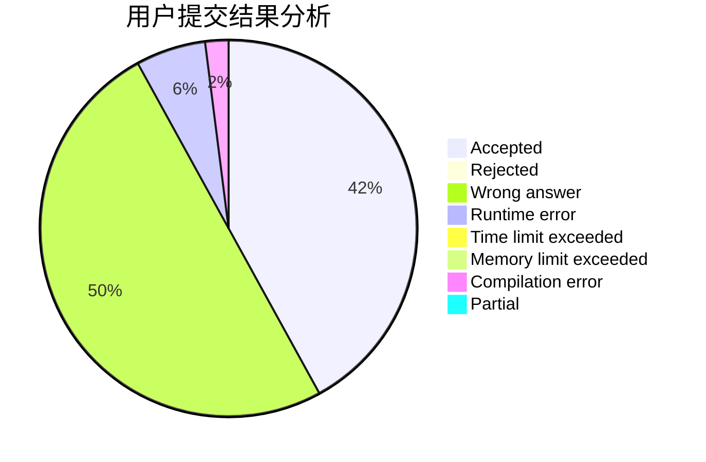
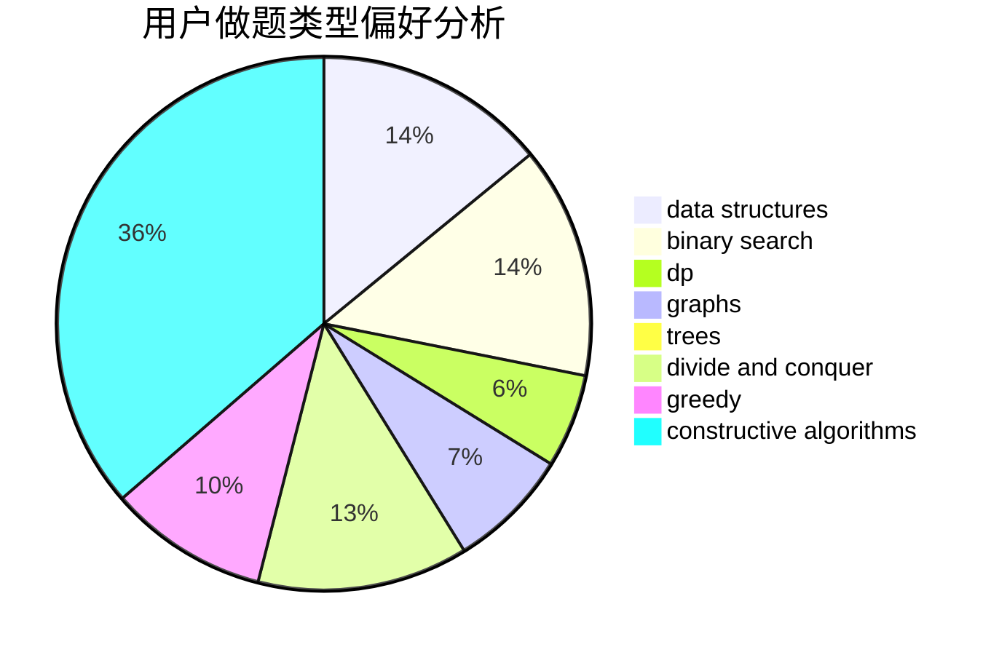
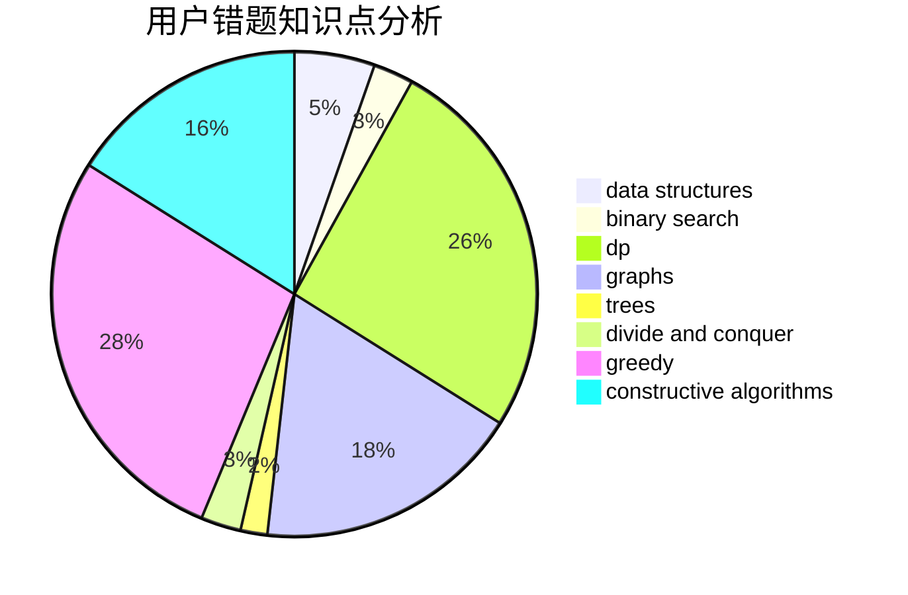

# backcloud

<!-- tabs:start -->

#### **用户提交结果分析**

#### **用户做题类型偏好分析**

#### **用户错题知识点分析**

<!-- tabs:end -->
# 推荐题目
[802B](https://codeforces.com/contest/802/problem/B)		data structures,
                        greedy		  
[645E](https://codeforces.com/contest/645/problem/E)		dp,
                        greedy,
                        strings		  
[297D](https://codeforces.com/contest/297/problem/D)		constructive algorithms		  
[500A](https://codeforces.com/contest/500/problem/A)		dfs and similar,
                        graphs,
                        implementation		  
[762E](https://codeforces.com/contest/762/problem/E)		binary search,
                        data structures		  
[581D](https://codeforces.com/contest/581/problem/D)		bitmasks,
                        brute force,
                        constructive algorithms,
                        geometry,
                        implementation,
                        math		  
[414B](https://codeforces.com/contest/414/problem/B)		combinatorics,
                        dp,
                        number theory		  
[1505C](https://codeforces.com/contest/1505/problem/C)		implementation		  
[1082F](https://codeforces.com/contest/1082/problem/F)		dp,
                        strings,
                        trees		  
[1141E](https://codeforces.com/contest/1141/problem/E)		math		  
