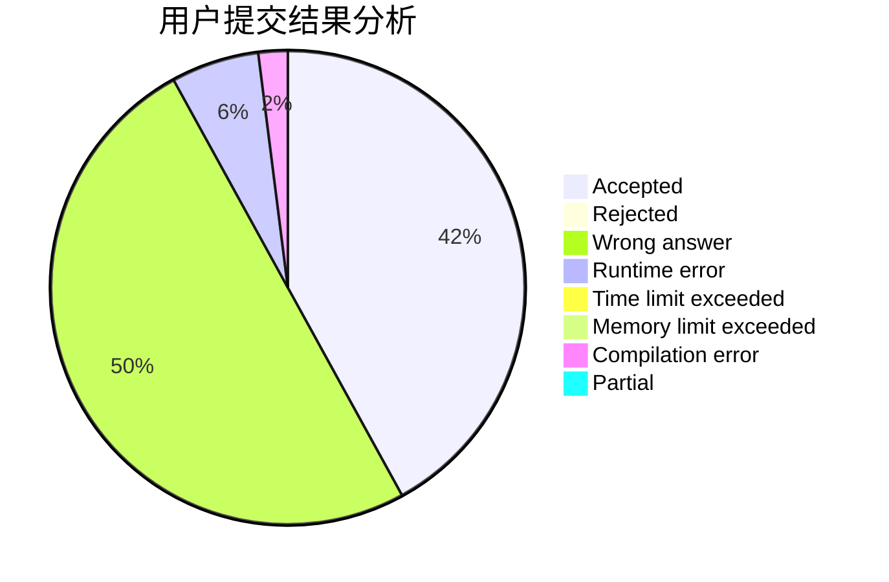
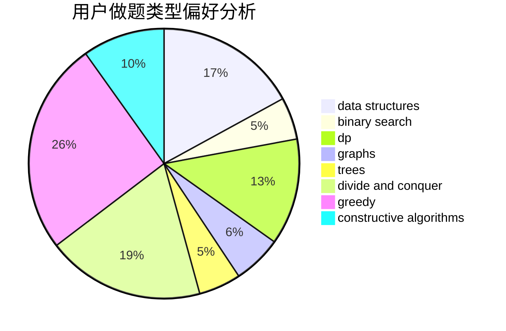
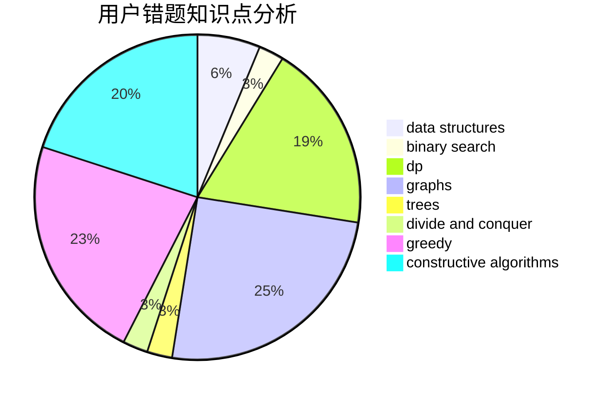

# backcloud

<!-- tabs:start -->

#### **用户提交结果分析**

#### **用户做题类型偏好分析**

#### **用户错题知识点分析**

<!-- tabs:end -->
# 推荐题目
[817A](https://codeforces.com/contest/817/problem/A)		implementation,
                        math,
                        number theory		  
[672A](https://codeforces.com/contest/672/problem/A)		implementation		  
[314C](https://codeforces.com/contest/314/problem/C)		data structures,
                        dp		  
[521A](https://codeforces.com/contest/521/problem/A)		dsu,graphs,sortings,trees		  
[781C](https://codeforces.com/contest/781/problem/C)		dsu,graphs,sortings,trees		  
[602A](https://codeforces.com/contest/602/problem/A)		brute force,
                        implementation		  
[439D](https://codeforces.com/contest/439/problem/D)		binary search,
                        sortings,
                        ternary search,
                        two pointers		  
[152D](https://codeforces.com/contest/152/problem/D)		brute force		  
[1083B](https://codeforces.com/contest/1083/problem/B)		greedy,
                        strings		  
[1143E](https://codeforces.com/contest/1143/problem/E)		dsu,graphs,sortings,trees		  
